# Design Workflow Skills — 可自訂設計工作流程包

**交付狀態：** [每個 skill 已驗證與仍在測試的範圍](docs/RELEASE-STATUS.md)。UI Inspect 本機主要流程已測，DevTools 擴充套件尚未交付。

## 誰做什麼？先用配合 AI 的 Skill 版

**DOM 太多層？** 新增「精簡／完整 DOM」與「複製結構檢查需求」，只收合工具內的顯示，不刪網頁節點。[中英逐步圖解](ui-element-inspector/references/dom-structure.md)。

**目前不會自動把需求傳給 AI。** 你先檢查內容，按「複製修改需求」，再貼到自己選的 AI 對話。

| 步驟 | 你做什麼 | AI／工具做什麼 |
|---|---|---|
| 開始 | 跟 AI 說：「用 ui-element-inspector 檢查這個專案，沿用已啟動的本機 server 和 port。」 | AI 先讀專案規則、確認網址，再協助暫時的開發接線；該 AI 環境要有必要的檔案／瀏覽器能力。 |
| 選取 | Hover 看名稱，點畫面或 DOM 名稱選取。 | 工具標示目標和目前頁面的同類，不猜原始碼檔名或 React 內部變數。 |
| 範圍 | 點右側刻度去第 1、2、3 個，勾選不修改的例外。 | 「同類」看完整群組，「本次」只看這次要複製修改的項目；重建群組前編號維持一致。 |
| 需求 | 填「第 3 個改橘色，第 2 個不要動」，檢查、複製、貼給 AI。 | 工具整理位置、範圍、例外和原文；**送到哪個對話由你決定。** |
| 修改 | 請 AI 依照剛剛的需求實作。 | AI 找真正的原始碼、依範圍修改與驗證；Inspector 本身不會改你的專案。 |
| 結束 | 關閉指認工具。 | AI 移除暫時接線，確認正式發布不含工具；不關掉別人的 server。 |

**本機網站已跑起來？** 沿用即可。不同 port 的 iframe 只能預覽，不能讀 DOM，請 AI 協助核准的專案接線。內建 `rwd-preview.html` 是示範工作區，不是任何網址貼上就能指認。

**已有線上網址？** 目前 Skill overlay 只限本機／file。另規劃的 Chrome／Edge／Firefox DevTools 擴充套件會在確認本頁範圍後直接檢查，**仍在開發，尚未作為驗證完成的版本交付。** 兩種方式都保留，這次先完成 Skill。

CSS 變數區列出可讀且匹配宣告內的 `var(--名稱)` 引用候選，可能被覆蓋，或缺少繼承、巢狀和無法讀取的樣式。不是完整 CSS 優先序分析；不收集任意變數值、React state 或網路請求內容。

[操作圖解](docs/VISUAL-GUIDE.md) · [詳細啟動與限制](ui-element-inspector/references/usage.md)


目前操作：移到預覽就開啟 Inspect，點一下才選取。[新版 RWD／Hover 圖解](docs/VISUAL-GUIDE.md)。下方影片仍為較早的介面。

## How to use · 使用快捷索引

### 最小安裝與建議搭配

只裝這次工作需要的 skills，**不必全部 14 個都裝**。依[資料夾複製安裝教學](docs/BEGINNER.zh-TW.md)操作，保留所選 skill 的 references、scripts 與隨附素材。

| 目標 | 主要 Skill | 真的需要才加 |
|---|---|---|
| 指認一個叫不出名字的 UI 元素 | `ui-element-inspector` | 要重用專案設定時才加 `optional-skill-profile` |
| 比對實作與核准設計 | `ui-design-review` | 要獨立無障礙檢查才加 `a11y-review`；要狀態／viewport 證據才加 `states-preview-loop` |
| 做一輪較完整的 UI 品質檢查 | `uiux-checks` | 只加這次真的有選到的專項檢查 |
| 做一個明確的 Figma 局部修改 | `figma-write` | 另行授權、具所需能力的 Figma connector/tool |
| 整套 Figma workflow 換品牌 | `figma-workflow-rebrand` | 某一步真的需要局部編修指引時才加 `figma-write` |
| 多個 agent 平行協作 | `multi-session-protocol` | 需要共用偏好時才加 `optional-skill-profile` |
| 對帳今天做了什麼 | `work-sync-daily` | 只接使用者核准的 Calendar／Jira／資料來源 |
| 草擬週報 | `work-report-weekly` | 需要時才接選定的 Calendar／資料來源 |
| 對帳內容製作狀態 | `content-pipeline-dashboard` | 只接核准的內容來源 |

**不要預設把 `uiux-checks` 和所有專項 Skill 一次全裝。** 先選一個主要 Skill，再加這次工作真的需要的檢查。

Python 3.11+ 在執行 Python 設定／profile helper、runner 時需要。Node.js（Node 22 已測）只在執行 rebrand 清單檢查器時需要；runtime 不是 skill，也不代表帳號授權。

## 為什麼這套 Skill 刻意讓 runtime 保持精簡

這個 repo 不是以「把每個 Skill 寫得越大越好」為目標，而是刻意處理幾個常見的 Agent Skill 痛點。

OpenAI 目前的 Skill 指南有兩個跟這裡直接相關的重點：**name／description 是 routing contract**，而長篇操作細節應透過 `references/`、`scripts/`、`assets/` 做 **progressive disclosure**，不要一開始就把全部內容塞進 context。可參考 [Build skills](https://developers.openai.com/plugins/build/skills) 與 [Skills](https://developers.openai.com/plugins/concepts/skills)。

| 常見痛點 | 這個 repo 的做法 |
|---|---|
| description 太泛，Skill 容易誤觸發 | 每個 Skill 的 description 都寫清楚「適合做什麼」，容易重疊的也補「不適合做什麼」。 |
| 裝太多 Skill 後彼此搶注意力 | README 改成推薦最小安裝組合，不再預設 14 個全部裝。協調型 Skill 也不要求所有專項 Skill 一起載入。 |
| 巨大的 `SKILL.md` 一啟用就吃掉大量 context | 長操作細節移到按需 reference。兩個原本最大的 `figma-workflow-rebrand`、`ui-element-inspector` 現在改成短版 routing／安全規則＋ execution runbook。 |
| 使用者分不清 Skill、connector、hook、登入的差別 | Skill 定義工作方法；connector/tool 才負責即時資料、登入授權和受控操作。安裝這個 repo 不會自動登入帳號，也不會自己建立背景排程。 |
| Skill 說「完成」但沒有證據 | 每個流程都區分 verified evidence、未驗證行為與缺少能力／受阻狀態。Runner 的 AI 步驟在真的由 agent 執行前會保持 `NOT_RUN`。 |
| 從網路複製公開 Skill，卻看不到它背後的安全假設 | 這個 repo 不打包第三方 Skill。安裝前應讀 `SKILL.md`、scripts 與權限需求；另見 [SECURITY.md](SECURITY.md) 和 [THIRD_PARTY.md](THIRD_PARTY.md)。 |

因此，**「Skill 越多越好」不是這個 repo 的目標**。只有當新流程有不同 trigger、input contract 或成功條件時，才新增 Skill；否則優先擴充既有 specialist 或 reference。

### 對人白話，AI 內部用精簡語意

給人看的說明與最後答案維持自然語言。**AI 對 AI／Skill 對 Skill 的交接可以改用固定語意欄位**，避免每一輪都重貼專案歷史、規章與整段 prompt。

例如：

```text
intent=review
scope=home.mobile
constraints=no-prod,no-push
facts=locale:zh-TW; target:save-button
unresolved=empty-state-copy
evidence=src/ui/save.tsx#L20-L44
state=partial
next=copy-review
```

共用的[精簡語意合約](optional-skill-profile/references/compact-semantic-handoff.md)使用 `intent`、`scope`、`facts`、`constraints`、`unresolved`、`evidence`、`state`、`next` 等固定欄位；空值與預設值不送。只有在語氣、授權、安全、法律或驗收條件會因壓縮而失真時，才保留必要原文。

這主要省的是**重複輸入 context 與重複格式提示**，不是宣稱固定能省幾成 token；應用代表性任務做前後量測。

### 到底該放 Skill、專案規則、hook 還是 connector？

| 你需要的是… | 比較適合放哪裡 |
|---|---|
| 只有符合某類任務才載入的可重複工作流程 | **Skill** |
| 同一專案幾乎每個任務都要遵守的規則 | 該 host 的專案指引，例如 **AGENTS.md / CLAUDE.md** |
| 某個 host 事件發生時一定要執行的 deterministic 動作 | 該 host 支援的 **hook／automation**，不要只靠文字 Skill |
| 帳號即時資料、登入授權、受控外部操作 | 已授權的 **connector / MCP tool**；Skill 只負責描述如何使用它完成流程 |

不同 AI host 的 discovery、hook 與 connector 能力不完全一樣。`SKILL.md` 可攜，不代表每個 host 的 runtime 功能完全相同。


| English | 繁體中文 | Français | 日本語 |
|---|---|---|---|
| [Start & shortcuts](docs/HOW-TO.en.md) | [啟動與快捷鍵](docs/HOW-TO.zh-TW.md) | [Démarrer et raccourcis](docs/HOW-TO.fr.md) | [使い方・ショートカット](docs/HOW-TO.ja.md) |

[安裝開始](docs/BEGINNER.zh-TW.md) · [設定與自訂 Script](docs/USAGE.zh-TW.md) · [每一步的圖](#step-by-step-pictures) · [鍵盤／Print Screen 快捷鍵](docs/HOW-TO.zh-TW.md#鍵盤與截圖快捷鍵)

[](docs/videos/inspector-zh-TW.webm)

**[▶ 看影片 · 約 20 秒](docs/videos/inspector-zh-TW.webm)** · [English video](docs/videos/inspector-en.webm) · [繁中影片](docs/videos/inspector-zh-TW.webm) · [Transcript / 文字步驟](docs/videos/README.md)

本機假資料實錄、無旁白；複製為 mock，未啟動原生截圖。GitHub 若無法播放，可下載 WebM。法文／日文提供操作介面與快速開始頁，完整 skill 教學與影片為中英版。


[18 個 skills 完整圖解 / All 18 skill guides](docs/SKILL-MAP.md) · [UI Inspect 畫面 / Screenshots](docs/VISUAL-GUIDE.md)


18 個通用 skills，支援首次選填設定、執行前顯示設定，以及單項／分階段／整批檢查。
這份通用包不含作者私人設定；安裝不會自動連接帳號或建立排程。

[English](README.md) · [繁中使用方法](docs/USAGE.zh-TW.md) ·
[資安規則](SECURITY.md) · [免費使用／禁止轉售授權](LICENSE)

## 常見平台搭配 / 搜尋與選 Skill

這些 Skills 適合放進 **Vercel、Supabase、Cloudflare、GitHub、Figma、Jira、Google Calendar、Google Drive、Gmail、React、Next.js、Vite、Codex、Claude Code** 等常見工作流程。平台名稱只是使用情境與 discoverability 關鍵字，不代表官方合作、內建 connector、預設帳號權限或已完成連線。

| 平台 / 技術 | 適合搭配的 Skills |
|---|---|
| Vercel、Cloudflare Pages、React、Next.js、Vite | `states-preview-loop`、`uiux-runtime-audit`、`ui-design-review`、`a11y-review`、`audit-fix-loop-no-preview` |
| Supabase、PostgreSQL、應用狀態 | `state-drift-review`、`ai-workflow-orchestrator`、`reliable-delivery`、`uiux-checks` |
| GitHub Issues / Pull Requests | `reliable-delivery`、`multi-session-protocol`、`ai-workflow-orchestrator`、`state-drift-review` |
| Figma、Canva、Design System | `figma-write`、`figma-workflow-rebrand`、`variant-review-loop`、`ui-design-review` |
| Jira、Google Calendar、Google Drive、Gmail | `work-sync-daily`、`work-report-weekly`、`content-pipeline-dashboard` |
| Codex、Claude Code 與其他支援 Skills 的 agents | `optional-skill-profile`、`ai-workflow-orchestrator`、`reliable-delivery`、`multi-session-protocol` |

## AI 相容性與省 token

**哪些 AI 能照著做。** 這裡每個 skill 都是不綁廠商的 Markdown：一份寫好的工作方法，有步驟、檢查和提示詞，不是某一家的 API。Codex、Claude Code、Gemini、Grok 或其他 agent，只要它的執行環境讀得到或載得進 skill 檔，而且具備該 skill 需要的能力（檔案、瀏覽器、connector），就能照著做。不是每個環境都會自己發現或安裝 skill。沒有原生發現機制的，相容方式就是手動：載入、貼上或匯入 skill 文字。依賴工具的 skill（Figma、瀏覽器、日曆、Gmail、Jira）不論在哪個環境，都要先有那個能力才會動。

**skill 怎麼讓 token 用得少。** 下面這些做法已經寫在 skill 裡：

- 只安裝或載入這次任務需要的 skill，其他的不進 context；
- 固定規則、標籤和已知事實先跑，語意分類排在後面；
- 有邊界的語意後備只處理規則解不開的意思；
- 多個 skill 合用時，前置檢查和偏好設定只做一次、共用；
- 輸入沒變，清單和證據就重複使用，不重做；
- skill 只要它需要的節點或資料範圍，不拿整個工作區；
- 工作分成有邊界的批次，附可續跑的收據和檢查點；
- 進度用精簡的方式回報，不重貼整份清單。

**沒有主張的事。** 這些設計是為了減少重複的 context、語意或模型呼叫，以及多餘的工具讀取。這個 repo 裡沒有任何量測 token 節省百分比的基準，所以不寫百分比。省多少會隨模型、環境、context 長度和任務而變，connector 的配額或速率限制跟模型 token 也是兩回事。

## 每個 skill 的兩句優點與完整教學

每篇都有：適用專案與階段、開始準備、Step 1／2／3、結束交接、自訂／optional 及中英可貼提示。點名稱進入獨立圖解，安裝到 AI 的 skill 資料夾後，`references/quickstart.md` 與流程圖也會一起保留。

| Skill / 圖解 | 兩句優點 |
|---|---|
| [optional-skill-profile](optional-skill-profile/references/quickstart.md) | 不用每次重複交代專案偏好，開始前仍能檢查與修改。個人設定留在專案外，降低誤把帳號或私人資訊公開的風險。 |
| [states-preview-loop](states-preview-loop/references/quickstart.md) | 把正常、空白、載入與錯誤狀態放在同一份檢查流程，較不容易漏掉邊界。明確確認 port 與程序，可減少誤停其他開發服務的風險。 |
| [ui-element-inspector](ui-element-inspector/references/quickstart.md) | 直接點畫面就能取得元素位置與容器，不必先學會寫 selector。把同類位置、例外和修改需求一起複製，讓交辦範圍更清楚。 |
| [ui-design-review](ui-design-review/references/quickstart.md) | 把視覺差異和功能問題分開，能更快決定先修哪裡。沿用既有元件和 token，減少修一處卻讓其他畫面變樣的風險。另外檢查作者自己的 UX 準則：相關內容上下排、正向按鈕在右、驗證與密碼訊息、元件與 token 統一（[清單](ui-design-review/references/ux-principles.md)）。 |
| [a11y-review](a11y-review/references/quickstart.md) | 提早找出鍵盤、焦點與標籤問題，讓更多人能使用介面。把實測與未驗分開，避免把掃描結果誤當完整合規證明。 |
| [uiux-checks](uiux-checks/references/quickstart.md) | 用一個協調流程串起多個檢查，避免相同設定與測試重複處理。依需求選範圍，讓小修改不必每次都變成整站重驗。 |
| [audit-fix-loop-no-preview](audit-fix-loop-no-preview/references/quickstart.md) | 沒有瀏覽器時也能整理來源證據，繼續處理可安全修的問題。把待驗的視覺與互動明列出來，方便之後接手而不誤判完成。 |
| [variant-review-loop](variant-review-loop/references/quickstart.md) | 穩定編號加上並列圖像，能清楚知道正在討論哪個方案。保留取捨與決策理由，減少反覆改回舊方向的混亂。 |
| [figma-write](figma-write/references/quickstart.md) | 先了解容器和變數再修改，較能保留既有設計系統的一致性。小批修改後讀回屬性與畫面，可提早發現尺寸或綁定錯誤。 |
| [figma-workflow-rebrand](figma-workflow-rebrand/references/quickstart.md) | 一次整理整套畫面的品牌對應，保留原本的流程與設計細節。逐一追蹤畫面、狀態與連結，減少只改首頁或漏掉彈窗的情況。 |
| [multi-session-protocol](multi-session-protocol/references/quickstart.md) | 精確劃分 owner 與檔案範圍，減少互相覆蓋工作的機會。交接附版本和驗證結果，讓接收者不必靠猜測理解進度。 |
| [content-pipeline-dashboard](content-pipeline-dashboard/references/quickstart.md) | 把稿件、圖片和語系進度放在同一張表，較容易看出阻擋點。區分草稿、已審與已公開，減少把私人交付誤當網站上線。 |
| [work-sync-daily](work-sync-daily/references/quickstart.md) | 先只讀對帳，能看出遺漏與重複，而不立即改動原始紀錄。用明確 before／after 表格批准更新，讓同步結果更可追蹤。 |
| [work-report-weekly](work-report-weekly/references/quickstart.md) | 依完成證據整理一週成果，減少從零回想與重寫的負擔。先交草稿再決定寄送，可降低未確認內容或收件對象就外傳的風險。 |
| [ai-workflow-orchestrator](ai-workflow-orchestrator/references/quickstart.md) | 先用規則、標籤與已知 facts 分流，只有 unresolved 才做 semantic classification，並留下 routing receipt。 |
| [state-drift-review](state-drift-review/references/quickstart.md) | 分開 canonical truth 與 mirror，分類 drift，以 read-back evidence 驗證最小修復。 |
| [uiux-runtime-audit](uiux-runtime-audit/references/quickstart.md) | 檢查實際可點擊性、狀態、手機／鍵盤與隱私，把有證據和未驗項目分開。 |
| [reliable-delivery](reliable-delivery/references/quickstart.md) | 把原始驗收條件帶過中斷與交接，避免把進度誤寫成完成。 |

## 新手從這裡開始

**連不連接，由你決定。** Skill 提供方法，不會替你登入 Google、Jira 或 Chrome；需要工具才由你安裝、登入並選擇授權範圍。填 email 不等於登入成功。若你選用 routine，先手動跑一遍，再驗證第一次排程執行及實際收件。看[白話連線與授權例子](SECURITY.md)，不必先理解後面的技術術語。

[前端／UIUX 新手教學](docs/BEGINNER.zh-TW.md)：安裝、第一個任務、可複製提問、
常見建置方法與疑難排解，另有 [English](docs/BEGINNER.en.md)。

在工具包資料夾執行快捷設定選單（Python 3.11+，Windows）：

```powershell
py -3 scripts/settings.py --workspace "你的專案完整路徑"
```

macOS／Linux 通常改用 `python3`。編號選項可改偏好、port、選擇性資料來源、
每階段的多個 skills 與自訂檢查指令。儲存前顯示差異，輸入 YES 才寫入。
檔案保存在專案外；選單不會自動跑檢查、連線、kill 或 push。

[多 skill 合用規則](optional-skill-profile/references/composition.md)：共用一次設定確認，
只有一位協調者，明確分配檔案範圍與驗收。宣告外部 skill 不等於安裝或通過安全審查。
Runner 可重複 `--phase`，依選取順序去重。先跑指令、AI 計畫另列，不自動交錯修補與重驗。

| 階段 | Skills |
|---|---|
| 開始 | `optional-skill-profile`、`multi-session-protocol` |
| 指認元素 | `ui-element-inspector`：Hover 看名稱／父容器，點選複製給 AI |
| 設計 | `variant-review-loop`、`figma-write` |
| 檢查 | `uiux-checks`、`states-preview-loop`、`ui-design-review`、`a11y-review` |
| 修補 | `audit-fix-loop-no-preview` |
| 工作整理 | `work-sync-daily`、`work-report-weekly`、`content-pipeline-dashboard` |

這個 repo 內有 18 個同層 Skill 資料夾，但**不需要 18 個全部安裝**。完整 checkout 可以保留做文件與測試；實際安裝時，只複製這次需要的 Skill 資料夾，並保留該 Skill 自己的 `references/`、`scripts/`、`assets/`。

`optional-skill-profile` 是選用。能搭配它的 Skill，在沒有安裝 profile 時必須退回 session-only，並清楚說明沒有保存。首次使用 profile 時才會詢問是否選填、是否保存；之後每次跑之前會顯示目前設定，可說「修改設定」「改 port」「切換帳號」「停用日曆」「這次不用」或「重設」。

個人 profile 存在作業系統使用者設定目錄、repo 外，不回寫 SKILL.md。可不保存，
不保存就不能保證下一個 session 記得。選填 email 不代表完成 OAuth，日曆連接也
不代表允許讀 Gmail、寄信、寫 Jira、改日曆或 push；這些分開決定。

## 一支 script 組合多項檢查

`scripts/review.py` 讀你自訂的 JSON，支援 `--phase`、多個 `--check` 或 `--all`。
預設只顯示計畫。看過指令、工作目錄與設定 SHA256 後，加入
`--execute --approve-config SHA256` 才執行；任一失敗就停止後續命令。

**指令測試與 AI 審查不同**：runner 可執行 lint／單元測試等，但不會自己召喚 AI、
連接 Google、開 browser 或讀 Figma。它列出的 skill 清單仍是 NOT_RUN，須交 agent
實際依序執行並回報證據，不能用程式 exit 0 冒充整體 review 完成。

## 取得套件

```sh
git clone https://github.com/karenya-lin/design-workflow-skills.git
cd design-workflow-skills
```

安裝或執行前先看[使用方法](docs/USAGE.zh-TW.md)。若已有同名私人 skill，先比較，不直接覆蓋。

目前版本採 **source-available：人人可免費使用、修改，也可放進自己的商業工作或產品使用；但不能把這套 Skill 本身或只是改名／薄包裝的版本拿去販售。** 授權為 MIT + Commons Clause；較早已發布的 MIT-only revision 仍保留原授權。第三方內容維持各自 upstream license。不附第三方 Nielsen skill、不附 TWG，也不提供客戶素材權利。
Nielsen 的來源／MIT 條件及 TWG 排除理由見 [第三方聲明](THIRD_PARTY.md)。

## 測試

`py -3 -m unittest discover -s tests -v` 使用暫存假資料，不連帳號、不啟動網站。
[測試範圍與人工驗收](docs/TESTING.md) 明列尚須由使用者環境確認的 AI／瀏覽器／OAuth 行為。

<a id="step-by-step-pictures"></a>

## 每個 skill 的 Step 1／2／3 圖解

點名稱快速跳轉，展開圖組後可點圖片看原尺寸。UI Inspect 是實際本機操作畫面；其他 skills 為本機排版的**教學示範**，不是 AI 或外部服務已執行的證據。

[a11y-review](#guide-a11y-review) · [audit-fix-loop-no-preview](#guide-audit-fix-loop-no-preview) · [content-pipeline-dashboard](#guide-content-pipeline-dashboard) · [figma-workflow-rebrand](#guide-figma-workflow-rebrand) · [figma-write](#guide-figma-write) · [multi-session-protocol](#guide-multi-session-protocol) · [optional-skill-profile](#guide-optional-skill-profile) · [states-preview-loop](#guide-states-preview-loop) · [ui-design-review](#guide-ui-design-review) · [ui-element-inspector](#guide-ui-element-inspector) · [uiux-checks](#guide-uiux-checks) · [variant-review-loop](#guide-variant-review-loop) · [work-report-weekly](#guide-work-report-weekly) · [work-sync-daily](#guide-work-sync-daily)

<a id="guide-a11y-review"></a>

<details>
<summary>a11y-review · 教學示範 · Step 1 → 2 → 3</summary>

[完整使用方式、選填與結束交接](a11y-review/references/quickstart.md)

| Step 1 | Step 2 | Step 3 |
|---|---|---|
| [](a11y-review/references/screenshots/step-01-zh-TW.png) | [](a11y-review/references/screenshots/step-02-zh-TW.png) | [](a11y-review/references/screenshots/step-03-zh-TW.png) |

</details>

<a id="guide-audit-fix-loop-no-preview"></a>

<details>
<summary>audit-fix-loop-no-preview · 教學示範 · Step 1 → 2 → 3</summary>

[完整使用方式、選填與結束交接](audit-fix-loop-no-preview/references/quickstart.md)

| Step 1 | Step 2 | Step 3 |
|---|---|---|
| [](audit-fix-loop-no-preview/references/screenshots/step-01-zh-TW.png) | [](audit-fix-loop-no-preview/references/screenshots/step-02-zh-TW.png) | [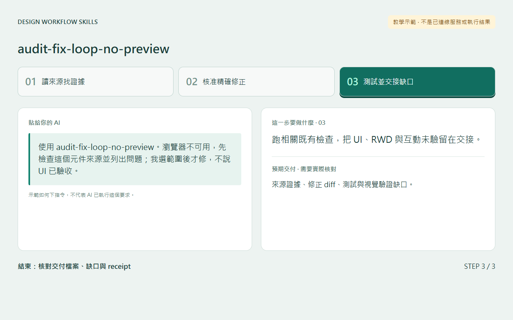](audit-fix-loop-no-preview/references/screenshots/step-03-zh-TW.png) |

</details>

<a id="guide-content-pipeline-dashboard"></a>

<details>
<summary>content-pipeline-dashboard · 教學示範 · Step 1 → 2 → 3</summary>

[完整使用方式、選填與結束交接](content-pipeline-dashboard/references/quickstart.md)

| Step 1 | Step 2 | Step 3 |
|---|---|---|
| [](content-pipeline-dashboard/references/screenshots/step-01-zh-TW.png) | [](content-pipeline-dashboard/references/screenshots/step-02-zh-TW.png) | [](content-pipeline-dashboard/references/screenshots/step-03-zh-TW.png) |

</details>

<a id="guide-figma-workflow-rebrand"></a>

<details>
<summary>figma-workflow-rebrand · 教學示範 · Step 1 → 2 → 3</summary>

[完整使用方式、選填與結束交接](figma-workflow-rebrand/references/quickstart.md)

| Step 1 | Step 2 | Step 3 |
|---|---|---|
| [](figma-workflow-rebrand/references/screenshots/step-01-zh-TW.png) | [](figma-workflow-rebrand/references/screenshots/step-02-zh-TW.png) | [](figma-workflow-rebrand/references/screenshots/step-03-zh-TW.png) |

</details>

<a id="guide-figma-write"></a>

<details>
<summary>figma-write · 教學示範 · Step 1 → 2 → 3</summary>

[完整使用方式、選填與結束交接](figma-write/references/quickstart.md)

| Step 1 | Step 2 | Step 3 |
|---|---|---|
| [](figma-write/references/screenshots/step-01-zh-TW.png) | [](figma-write/references/screenshots/step-02-zh-TW.png) | [](figma-write/references/screenshots/step-03-zh-TW.png) |

</details>

<a id="guide-multi-session-protocol"></a>

<details>
<summary>multi-session-protocol · 教學示範 · Step 1 → 2 → 3</summary>

[完整使用方式、選填與結束交接](multi-session-protocol/references/quickstart.md)

| Step 1 | Step 2 | Step 3 |
|---|---|---|
| [](multi-session-protocol/references/screenshots/step-01-zh-TW.png) | [](multi-session-protocol/references/screenshots/step-02-zh-TW.png) | [](multi-session-protocol/references/screenshots/step-03-zh-TW.png) |

</details>

<a id="guide-optional-skill-profile"></a>

<details>
<summary>optional-skill-profile · 教學示範 · Step 1 → 2 → 3</summary>

[完整使用方式、選填與結束交接](optional-skill-profile/references/quickstart.md)

| Step 1 | Step 2 | Step 3 |
|---|---|---|
| [](optional-skill-profile/references/screenshots/step-01-zh-TW.png) | [](optional-skill-profile/references/screenshots/step-02-zh-TW.png) | [](optional-skill-profile/references/screenshots/step-03-zh-TW.png) |

</details>

<a id="guide-states-preview-loop"></a>

<details>
<summary>states-preview-loop · 教學示範 · Step 1 → 2 → 3</summary>

[完整使用方式、選填與結束交接](states-preview-loop/references/quickstart.md)

| Step 1 | Step 2 | Step 3 |
|---|---|---|
| [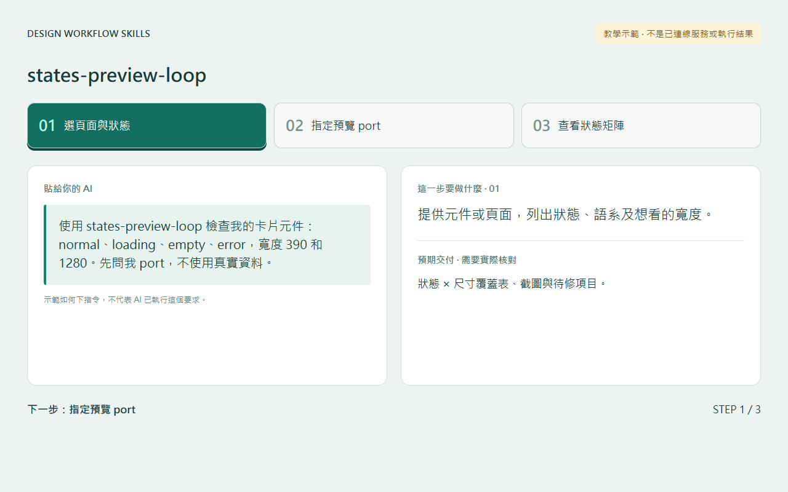](states-preview-loop/references/screenshots/step-01-zh-TW.png) | [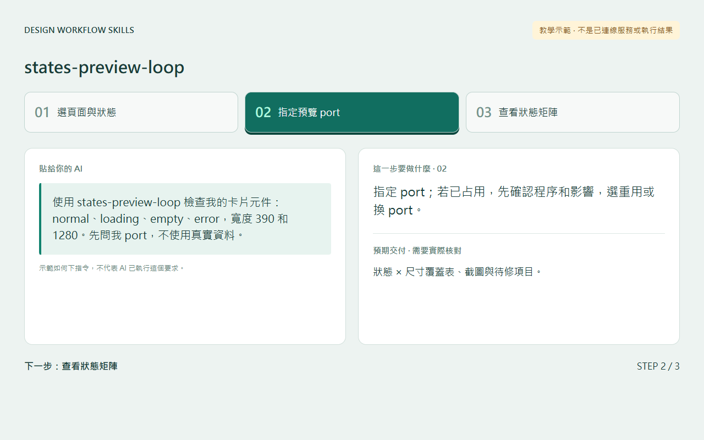](states-preview-loop/references/screenshots/step-02-zh-TW.png) | [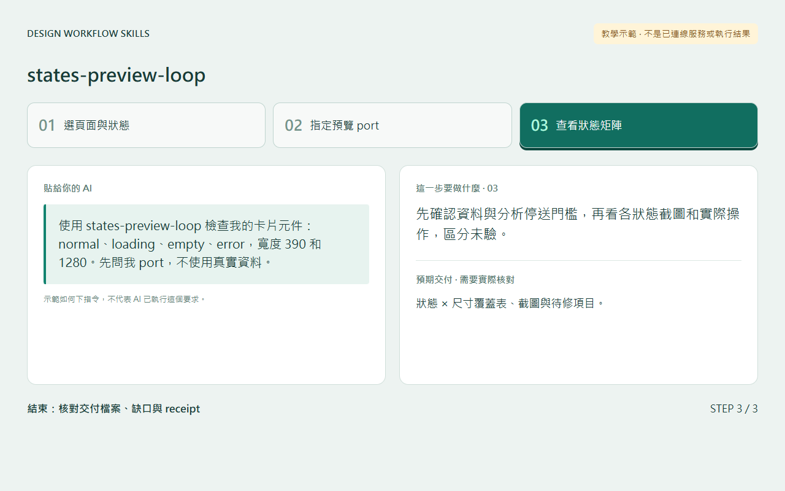](states-preview-loop/references/screenshots/step-03-zh-TW.png) |

</details>

<a id="guide-ui-design-review"></a>

<details>
<summary>ui-design-review · 教學示範 · Step 1 → 2 → 3</summary>

[完整使用方式、選填與結束交接](ui-design-review/references/quickstart.md) · [額外檢查的 UX 準則](ui-design-review/references/ux-principles.md)

| Step 1 | Step 2 | Step 3 |
|---|---|---|
| [](ui-design-review/references/screenshots/step-01-zh-TW.png) | [](ui-design-review/references/screenshots/step-02-zh-TW.png) | [](ui-design-review/references/screenshots/step-03-zh-TW.png) |

</details>

<a id="guide-ui-element-inspector"></a>

<details>
<summary>ui-element-inspector · 實際操作畫面 · Step 1 → 2 → 3</summary>

[完整使用方式、選填與結束交接](ui-element-inspector/references/quickstart.md)

| Step 1 | Step 2 | Step 3 |
|---|---|---|
| [](ui-element-inspector/references/screenshots/step-01-zh-TW.png) | [](ui-element-inspector/references/screenshots/step-02-zh-TW.png) | [](ui-element-inspector/references/screenshots/step-03-zh-TW.png) |

</details>

<a id="guide-uiux-checks"></a>

<details>
<summary>uiux-checks · 教學示範 · Step 1 → 2 → 3</summary>

[完整使用方式、選填與結束交接](uiux-checks/references/quickstart.md)

| Step 1 | Step 2 | Step 3 |
|---|---|---|
| [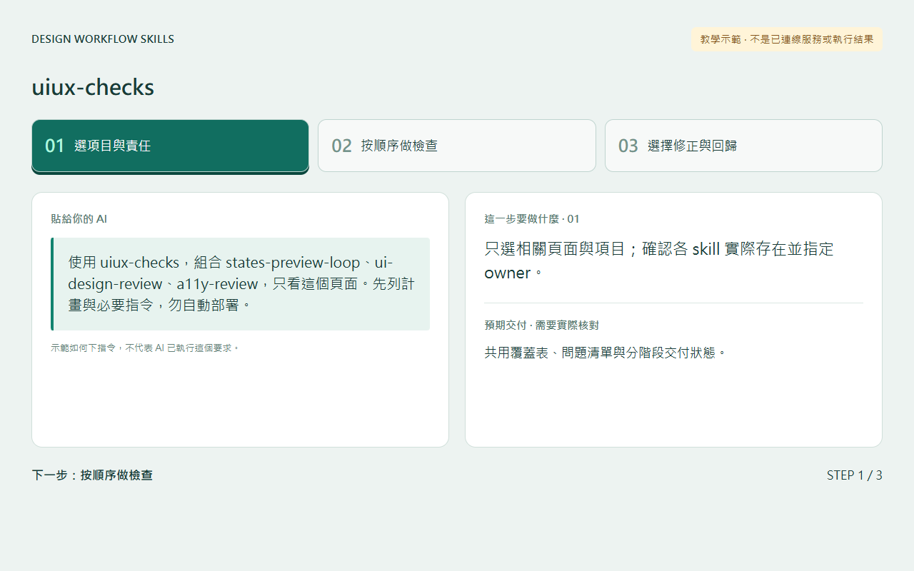](uiux-checks/references/screenshots/step-01-zh-TW.png) | [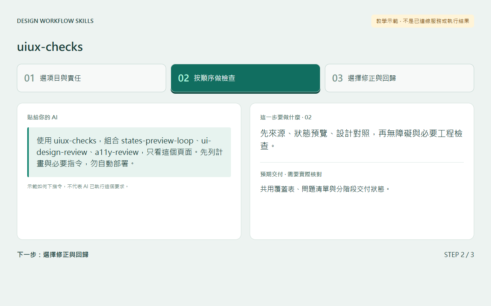](uiux-checks/references/screenshots/step-02-zh-TW.png) | [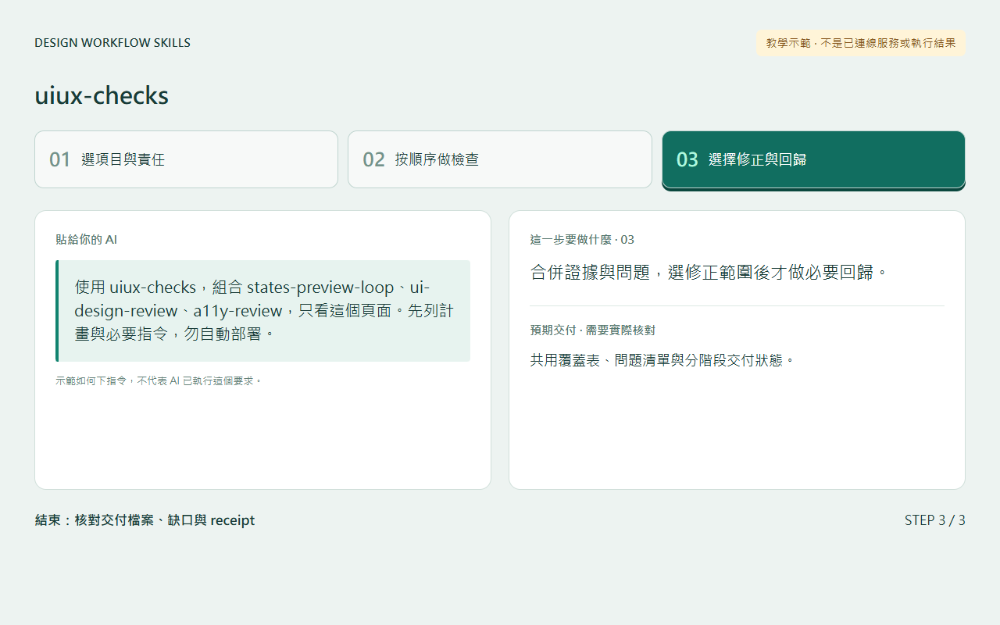](uiux-checks/references/screenshots/step-03-zh-TW.png) |

</details>

<a id="guide-variant-review-loop"></a>

<details>
<summary>variant-review-loop · 教學示範 · Step 1 → 2 → 3</summary>

[完整使用方式、選填與結束交接](variant-review-loop/references/quickstart.md)

| Step 1 | Step 2 | Step 3 |
|---|---|---|
| [](variant-review-loop/references/screenshots/step-01-zh-TW.png) | [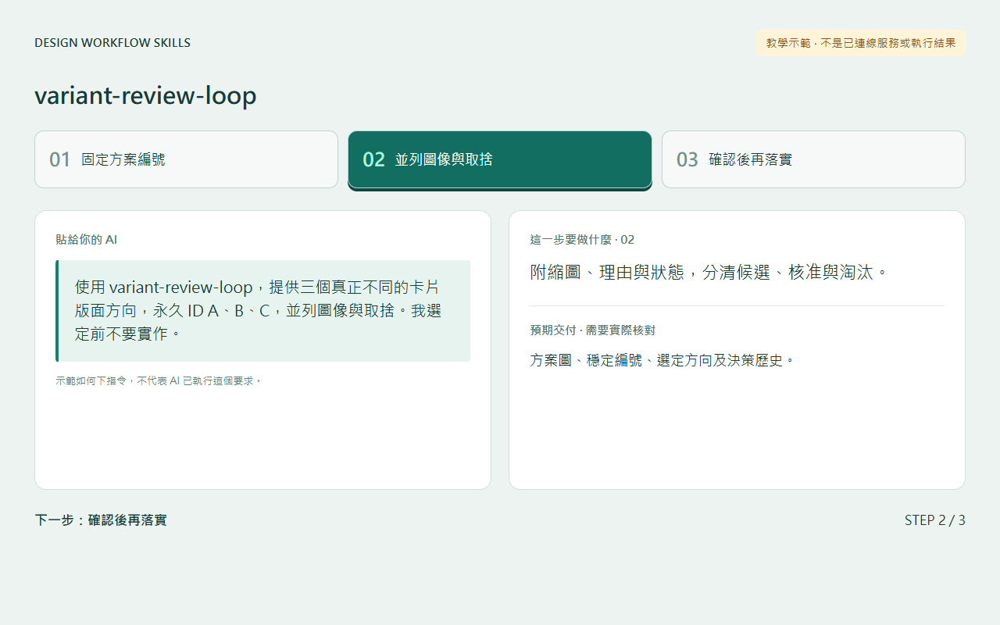](variant-review-loop/references/screenshots/step-02-zh-TW.png) | [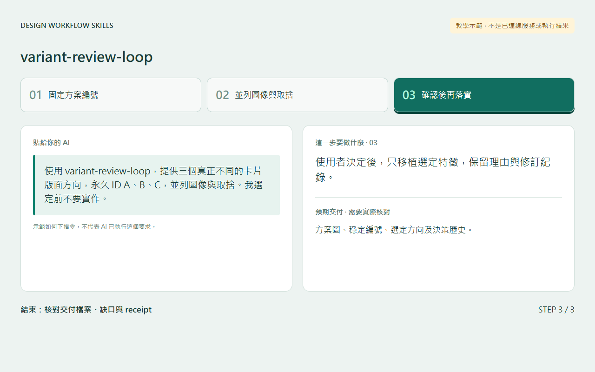](variant-review-loop/references/screenshots/step-03-zh-TW.png) |

</details>

<a id="guide-work-report-weekly"></a>

<details>
<summary>work-report-weekly · 教學示範 · Step 1 → 2 → 3</summary>

[完整使用方式、選填與結束交接](work-report-weekly/references/quickstart.md)

| Step 1 | Step 2 | Step 3 |
|---|---|---|
| [](work-report-weekly/references/screenshots/step-01-zh-TW.png) | [](work-report-weekly/references/screenshots/step-02-zh-TW.png) | [](work-report-weekly/references/screenshots/step-03-zh-TW.png) |

</details>

<a id="guide-work-sync-daily"></a>

<details>
<summary>work-sync-daily · 教學示範 · Step 1 → 2 → 3</summary>

[完整使用方式、選填與結束交接](work-sync-daily/references/quickstart.md)

| Step 1 | Step 2 | Step 3 |
|---|---|---|
| [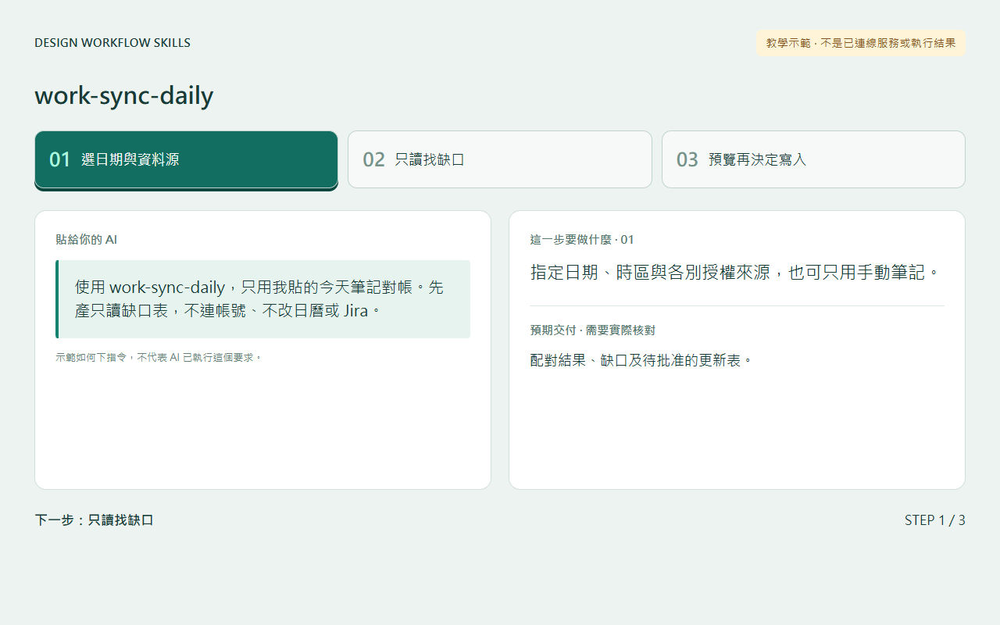](work-sync-daily/references/screenshots/step-01-zh-TW.png) | [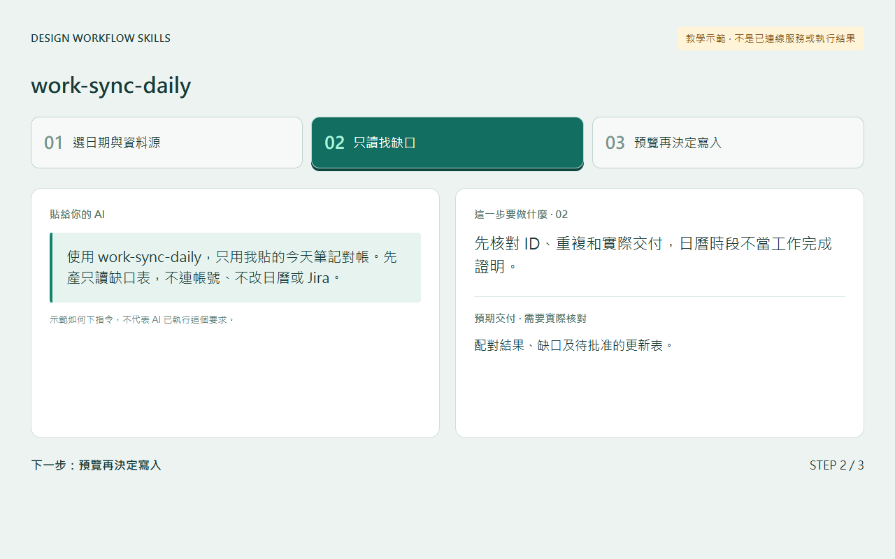](work-sync-daily/references/screenshots/step-02-zh-TW.png) | [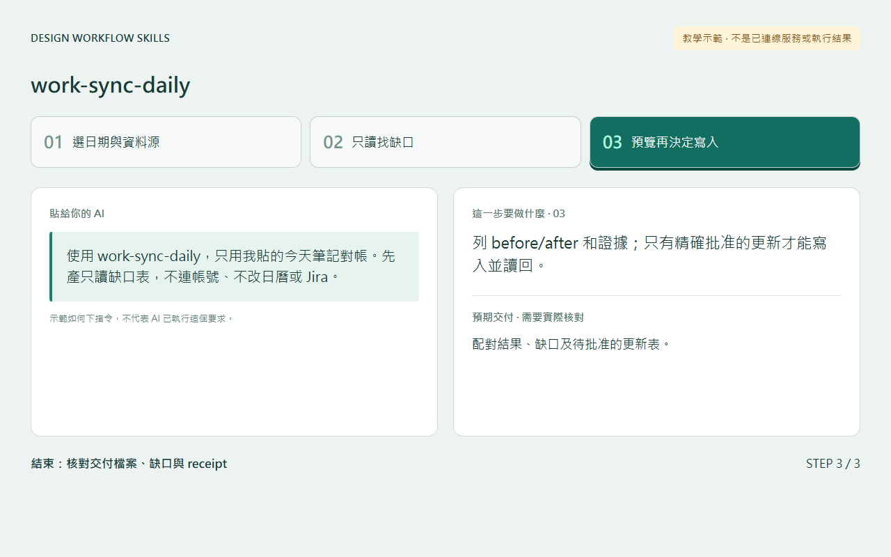](work-sync-daily/references/screenshots/step-03-zh-TW.png) |

</details>


## 公開 Skill 資安

新增公開 Skill 必須遵守 [Public Skill Sanitization](docs/PUBLIC-SKILL-SANITIZATION.md)：公開可重用的方法，不公開私人 repo／Issue、production URL、內部資料名稱、本機路徑、AI/provider 名冊與額度、原始 log／payload、憑證或可反推出內部拓樸的識別資訊。
