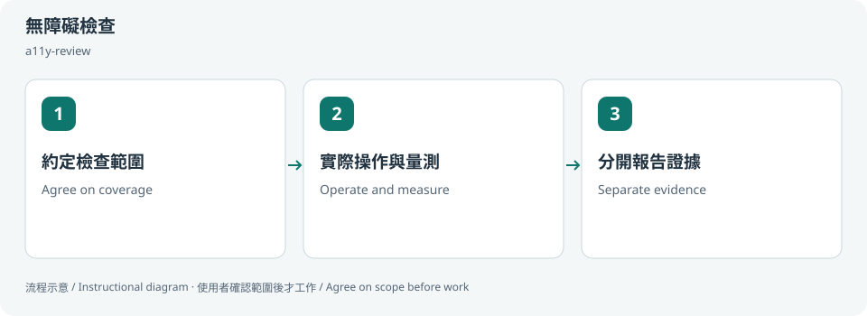
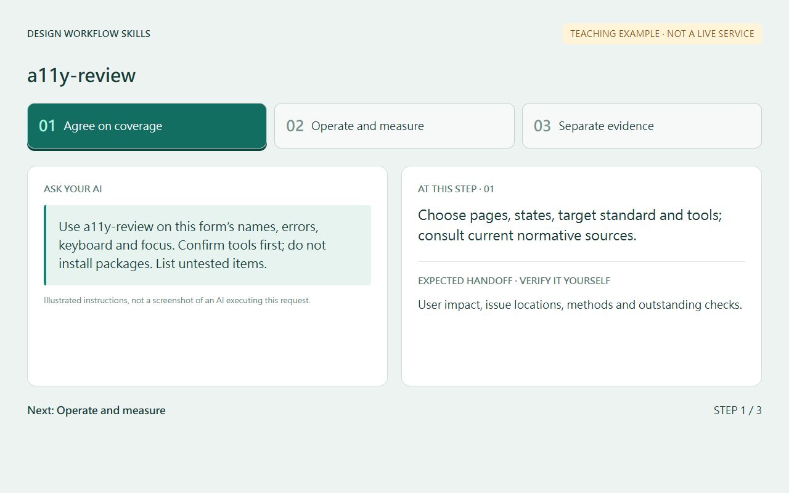
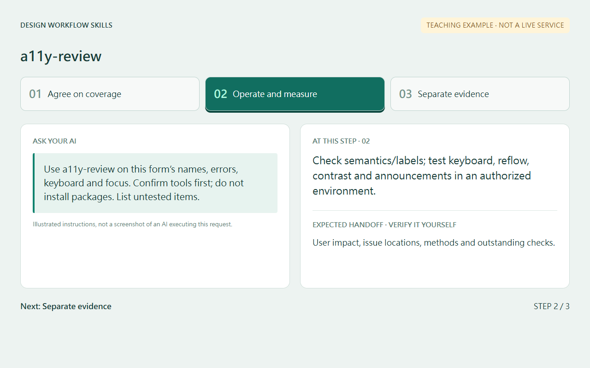
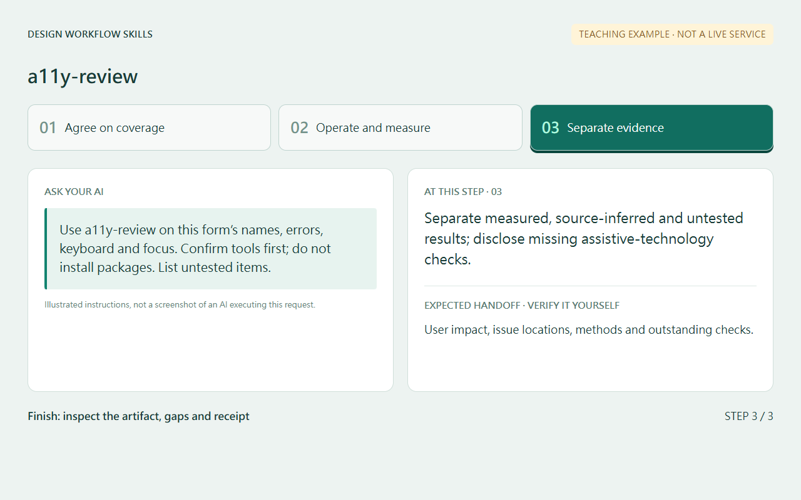
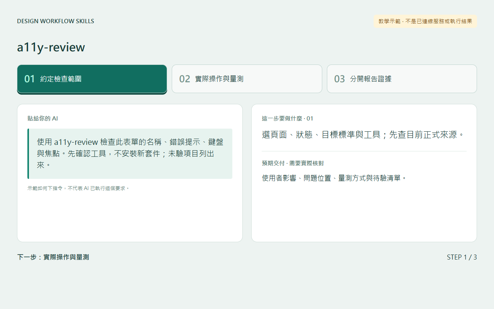
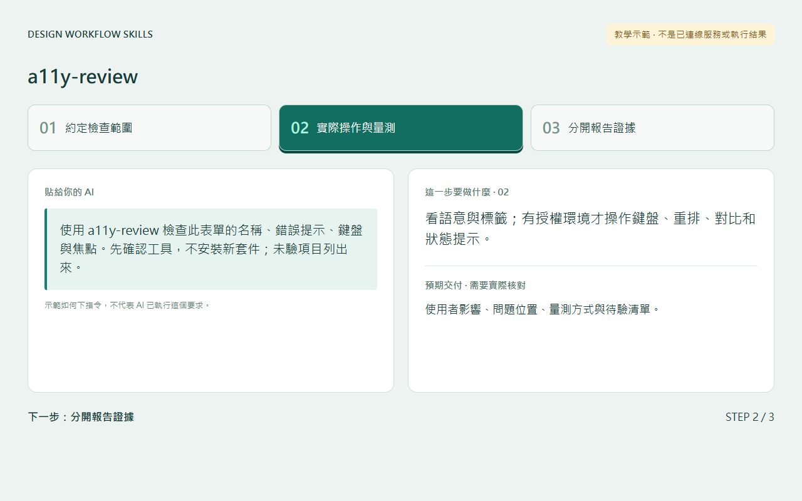
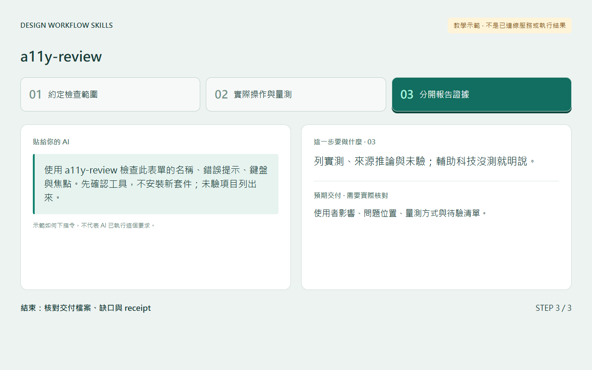

# 無障礙檢查 / Accessibility review

## 兩句優點 / Two benefits

提早找出鍵盤、焦點與標籤問題，讓更多人能使用介面。把實測與未驗分開，避免把掃描結果誤當完整合規證明。

Find keyboard, focus and labeling barriers early so more people can use the interface. Separating tested and untested results prevents scans from being mistaken for complete conformance evidence.

## 適用專案與階段 / Projects and stages

| 項目 / Item | 繁體中文 | English |
|---|---|---|
| 專案 / Projects | 網站、Web 表單、元件庫、設計系統；標準與操作需依實際平台確認。 | Websites, forms, component libraries and design systems; verify standards and operation for the actual platform. |
| 階段 / Stages | 設計確認、開發中、交付前與修正後。 | Design review, implementation, pre-delivery and regression. |

**流程示意圖，不是已執行的截圖或驗收證據。 / Instructional diagram, not an execution screenshot or acceptance result.**

**何時用 / When:** 檢查鍵盤、焦點、名稱、對比與重排等使用障礙。 When checking keyboard, focus, names, contrast and reflow.

## 啟動前 / Before starting

確認 AI 已載入本 skill，並請它回報實際 SKILL.md 路徑。需要本機檔案、瀏覽器或帳號工具時，先確認該 AI 環境真的提供；工具缺少就標未驗或採核准的只讀替代。

Confirm the agent has loaded this skill and reports its actual SKILL.md path. Check required file/browser/connector access in that host. Missing tools mean unverified work or an approved read-only alternative, not pretend execution.

## Step 1 → 2 → 3

### Step 1 · 約定檢查範圍 / Agree on coverage

選頁面、狀態、目標標準與工具；先查目前正式來源。

Choose pages, states, target standard and tools; consult current normative sources.

### Step 2 · 實際操作與量測 / Operate and measure

看語意與標籤；有授權環境才操作鍵盤、重排、對比和狀態提示。

Check semantics/labels; test keyboard, reflow, contrast and announcements in an authorized environment.

### Step 3 · 分開報告證據 / Separate evidence

列實測、來源推論與未驗；輔助科技沒測就明說。

Separate measured, source-inferred and untested results; disclose missing assistive-technology checks.

## 可直接貼給 AI / Copy this prompt

> 使用 a11y-review 檢查此表單的名稱、錯誤提示、鍵盤與焦點。先確認工具，不安裝新套件；未驗項目列出來。

> Use a11y-review on this form’s names, errors, keyboard and focus. Confirm tools first; do not install packages. List untested items.

## 你會拿到 / Expected output

使用者影響、問題位置、量測方式與待驗清單。

User impact, issue locations, methods and outstanding checks.

## 和其他 skill 合用 / Combine with others

可由 uiux-checks 協調，修正後只驗相關項目。

May be coordinated by uiux-checks; recheck affected behavior after fixes.

共用一次設定確認；多 skill 不會把權限疊加，也不能讓兩個 writer 同時改同一檔。

Reuse one settings preflight. Combining skills does not accumulate permissions or permit overlapping writers.

## 常見搭配平台 / Works well with

常見搭配：**Figma, GitHub, Vercel, Cloudflare Pages, React, Next.js**。這些名稱用來說明常見工作情境與提高 discoverability，不代表官方合作、內建 connector、預設帳號權限或已完成整合。

Common workflow companions: **Figma, GitHub, Vercel, Cloudflare Pages, React, Next.js**. These names describe common use cases and improve discoverability; they do not imply endorsement, bundled integrations, account access or verified connectivity.

## 自訂與選填 / Customize and optional

標準版本、頁面抽樣、狀態、鍵盤／對比／重排等項目及既有工具；缺工具可先做來源檢查。

Standard version, page/state samples, keyboard/contrast/reflow checks and existing tools; source review is possible when runtime tools are missing.

可用自然語言說「這次修改設定」「只用這次，不保存」「停止在草稿」。共用偏好可由原工具包的 `scripts/settings.py` 選單修改；此選單不會替你編輯第三方 skill，也不執行 runner。

Say “change settings for this run,” “use once without saving,” or “stop at the draft.” The toolkit's `scripts/settings.py` edits shared preferences; it does not edit third-party skills or execute the runner.

個別任務的節點、比較尺寸、標準與方案 ID 等參數通常在當次對話指定，不全是 profile 可保存的欄位。保存格式只接受 [已定義欄位](../../optional-skill-profile/references/fields.md)；沒有相符欄位就保留在當次範圍，不把它偽裝成永久設定。

Task-specific nodes, comparison dimensions, standards and variant IDs are generally supplied in the current conversation, not all persisted profile fields. Save only [supported fields](../../optional-skill-profile/references/fields.md); otherwise keep the choice session-scoped.

## 結束與交接 / Finish and hand off

1. 對照上方「你會拿到」確認交付，要求列出本輪版本／範圍、已做、未做與阻擋。 / Check the expected output above and request scope/revision, completed work, gaps and blockers.
2. 看實際檔案或 receipt；不能把計畫、啟動程序或 ACK 當成工作完成。 / Inspect actual artifacts/receipts; a plan, process launch or ACK alone is not completion.
3. 可以說「到這裡停止，只交摘要」。若有臨時預覽或 overlay，說明還在運作的資源；只處理本輪且獲准的資源，不關別人的服務。 / Say “stop here and summarize.” Disclose remaining preview/overlay resources; only handle resources owned and authorized for this run.
4. Git push、發布、寄送、更新紀錄或未來排程，都需要另外指定本次範圍。 / Git push, publishing, sending, record updates and future schedules require separate task scope.

## 邊界 / Limits

不是 PCI 資安驗證，也不是掃描通過就全站符合 WCAG。

Not PCI validation; a passing scan does not establish whole-site WCAG conformance.

[回到 skill 規則 / Skill instructions](../SKILL.md)

## 每步畫面 / Step pictures

本機排版的教學示範，不代表已連接帳號或完成操作。 / Locally rendered instructional examples, not live account or agent execution.

### English

| Step 1 | Step 2 | Step 3 |
|---|---|---|
|  |  |  |

### 繁體中文

| Step 1 | Step 2 | Step 3 |
|---|---|---|
|  |  |  |
