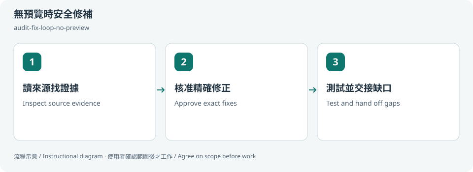

# 無預覽時安全修補 / Fix without a preview

## 兩句優點 / Two benefits

沒有瀏覽器時也能整理來源證據，繼續處理可安全修的問題。把待驗的視覺與互動明列出來，方便之後接手而不誤判完成。

Continue source-backed triage and safe fixes when a browser is unavailable. Explicit visual and interaction gaps make later handoff clearer without falsely marking completion.

## 適用專案與階段 / Projects and stages

| 項目 / Item | 繁體中文 | English |
|---|---|---|
| 專案 / Projects | 可存取原始碼與既有測試的前端或元件專案，尤其暫時不能開預覽時。 | Frontend or component projects with source and tests, especially when preview access is unavailable. |
| 階段 / Stages | 缺陷分流、受限環境修補與後續交接。 | Defect triage, fixes in restricted environments and handoff. |

**流程示意圖，不是已執行的截圖或驗收證據。 / Instructional diagram, not an execution screenshot or acceptance result.**

**何時用 / When:** 瀏覽器不可用，但仍可讀原始碼與跑既有測試時。 When a browser is unavailable but source and existing checks are accessible.

## 啟動前 / Before starting

確認 AI 已載入本 skill，並請它回報實際 SKILL.md 路徑。需要本機檔案、瀏覽器或帳號工具時，先確認該 AI 環境真的提供；工具缺少就標未驗或採核准的只讀替代。

Confirm the agent has loaded this skill and reports its actual SKILL.md path. Check required file/browser/connector access in that host. Missing tools mean unverified work or an approved read-only alternative, not pretend execution.

## Step 1 → 2 → 3

### Step 1 · 讀來源找證據 / Inspect source evidence

固定版本、讀規則與程式，標清實證問題及待確認疑點。

Fix the baseline, read rules/source, and separate proven issues from suspected patterns.

### Step 2 · 核准精確修正 / Approve exact fixes

列檔案與共用影響，使用者選擇修正範圍。

List files and shared impact; agree on the exact correction scope.

### Step 3 · 測試並交接缺口 / Test and hand off gaps

跑相關既有檢查，把 UI、RWD 與互動未驗留在交接。

Run relevant existing checks; explicitly hand off untested UI, RWD and interactions.

## 可直接貼給 AI / Copy this prompt

> 使用 audit-fix-loop-no-preview。瀏覽器不可用，先檢查這個元件來源並列出問題；我選範圍後才修，不說 UI 已驗收。

> Use audit-fix-loop-no-preview. The browser is unavailable: inspect this component and list findings first. Fix only my selected scope; do not claim visual acceptance.

## 你會拿到 / Expected output

來源證據、修正 diff、測試與視覺驗證缺口。

Source evidence, fix diff, checks and visual verification gaps.

## 和其他 skill 合用 / Combine with others

環境可用後接 states-preview-loop 與 ui-design-review。

Follow with states-preview-loop and ui-design-review when preview access returns.

共用一次設定確認；多 skill 不會把權限疊加，也不能讓兩個 writer 同時改同一檔。

Reuse one settings preflight. Combining skills does not accumulate permissions or permit overlapping writers.

## 常見搭配平台 / Works well with

常見搭配：**GitHub, Vercel, Cloudflare Pages, React, Next.js**。這些名稱用來說明常見工作情境與提高 discoverability，不代表官方合作、內建 connector、預設帳號權限或已完成整合。

Common workflow companions: **GitHub, Vercel, Cloudflare Pages, React, Next.js**. These names describe common use cases and improve discoverability; they do not imply endorsement, bundled integrations, account access or verified connectivity.

## 自訂與選填 / Customize and optional

來源範圍、問題優先序、允許修改檔案、lint／types／tests；不需要預覽，但會保留視覺缺口。

Source scope, priorities, allowed files and lint/types/tests; preview is not required, but visual gaps remain.

可用自然語言說「這次修改設定」「只用這次，不保存」「停止在草稿」。共用偏好可由原工具包的 `scripts/settings.py` 選單修改；此選單不會替你編輯第三方 skill，也不執行 runner。

Say “change settings for this run,” “use once without saving,” or “stop at the draft.” The toolkit's `scripts/settings.py` edits shared preferences; it does not edit third-party skills or execute the runner.

個別任務的節點、比較尺寸、標準與方案 ID 等參數通常在當次對話指定，不全是 profile 可保存的欄位。保存格式只接受 [已定義欄位](../../optional-skill-profile/references/fields.md)；沒有相符欄位就保留在當次範圍，不把它偽裝成永久設定。

Task-specific nodes, comparison dimensions, standards and variant IDs are generally supplied in the current conversation, not all persisted profile fields. Save only [supported fields](../../optional-skill-profile/references/fields.md); otherwise keep the choice session-scoped.

## 結束與交接 / Finish and hand off

1. 對照上方「你會拿到」確認交付，要求列出本輪版本／範圍、已做、未做與阻擋。 / Check the expected output above and request scope/revision, completed work, gaps and blockers.
2. 看實際檔案或 receipt；不能把計畫、啟動程序或 ACK 當成工作完成。 / Inspect actual artifacts/receipts; a plan, process launch or ACK alone is not completion.
3. 可以說「到這裡停止，只交摘要」。若有臨時預覽或 overlay，說明還在運作的資源；只處理本輪且獲准的資源，不關別人的服務。 / Say “stop here and summarize.” Disclose remaining preview/overlay resources; only handle resources owned and authorized for this run.
4. Git push、發布、寄送、更新紀錄或未來排程，都需要另外指定本次範圍。 / Git push, publishing, sending, record updates and future schedules require separate task scope.

## 邊界 / Limits

不得換工具繞過瀏覽器阻擋，也不把 HTTP 200 當互動通過。

Do not bypass browser restrictions or treat HTTP 200 as interaction verification.

[回到 skill 規則 / Skill instructions](../SKILL.md)

## 每步畫面 / Step pictures

本機排版的教學示範，不代表已連接帳號或完成操作。 / Locally rendered instructional examples, not live account or agent execution.

### English

| Step 1 | Step 2 | Step 3 |
|---|---|---|
|  |  |  |

### 繁體中文

| Step 1 | Step 2 | Step 3 |
|---|---|---|
|  |  |  |
