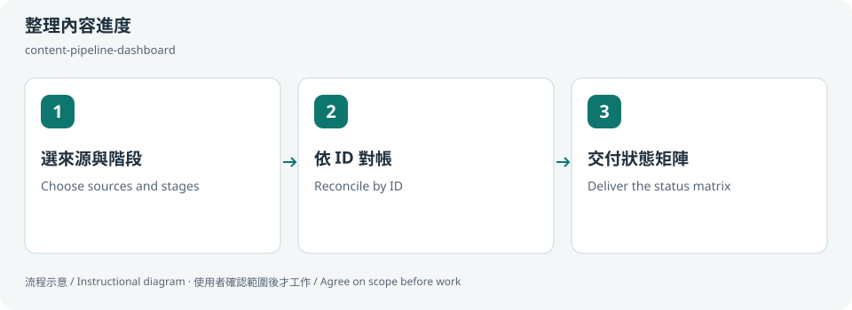
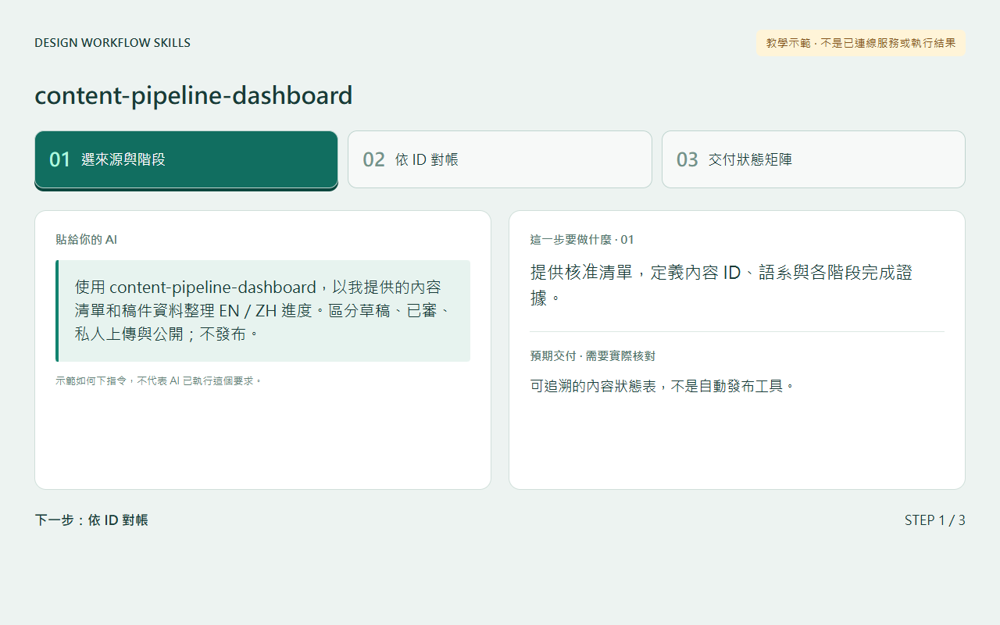
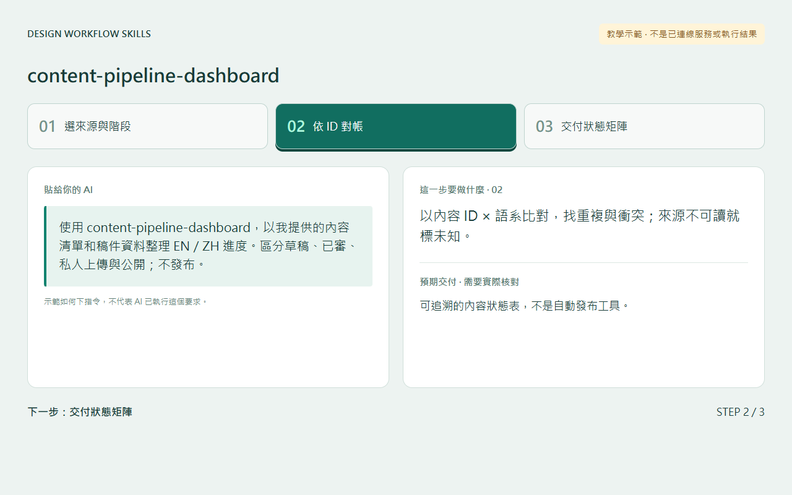
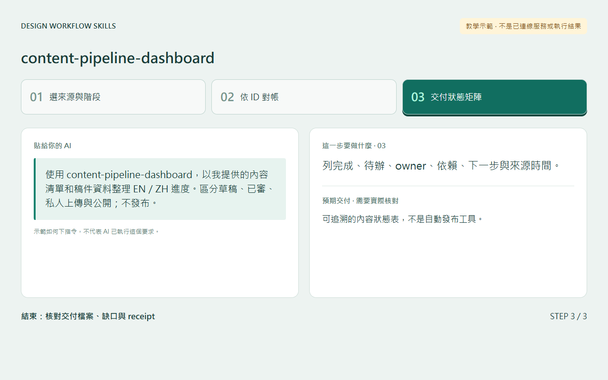

# 整理內容進度 / Track content readiness

## 兩句優點 / Two benefits

把稿件、圖片和語系進度放在同一張表，較容易看出阻擋點。區分草稿、已審與已公開，減少把私人交付誤當網站上線。

Put drafts, media and locale progress in one matrix to spot blockers. Separating draft, reviewed and public states prevents private delivery from being mistaken for publication.

## 適用專案與階段 / Projects and stages

| 項目 / Item | 繁體中文 | English |
|---|---|---|
| 專案 / Projects | 多語文章、內容網站、素材庫與有審稿／發布階段的內容專案。 | Multilingual articles, content sites, media libraries and review/publishing pipelines. |
| 階段 / Stages | 規劃、製作、審核、交付與狀態對帳。 | Planning, production, review, delivery and reconciliation. |

**流程示意圖，不是已執行的截圖或驗收證據。 / Instructional diagram, not an execution screenshot or acceptance result.**

**何時用 / When:** 文章、語系、圖片和審稿狀態散在不同地方時。 When content, locales, media and reviews need reconciliation.

## 啟動前 / Before starting

確認 AI 已載入本 skill，並請它回報實際 SKILL.md 路徑。需要本機檔案、瀏覽器或帳號工具時，先確認該 AI 環境真的提供；工具缺少就標未驗或採核准的只讀替代。

Confirm the agent has loaded this skill and reports its actual SKILL.md path. Check required file/browser/connector access in that host. Missing tools mean unverified work or an approved read-only alternative, not pretend execution.

## Step 1 → 2 → 3

### Step 1 · 選來源與階段 / Choose sources and stages

提供核准清單，定義內容 ID、語系與各階段完成證據。

Provide approved sources and define content ID, locale and completion evidence.

### Step 2 · 依 ID 對帳 / Reconcile by ID

以內容 ID × 語系比對，找重複與衝突；來源不可讀就標未知。

Join by content ID × locale, flag duplicates/conflicts, and mark inaccessible sources unknown.

### Step 3 · 交付狀態矩陣 / Deliver the status matrix

列完成、待辦、owner、依賴、下一步與來源時間。

List status, owner, dependency, next action and source timestamp.

## 可直接貼給 AI / Copy this prompt

> 使用 content-pipeline-dashboard，以我提供的內容清單和稿件資料整理 EN／ZH 進度。區分草稿、已審、私人上傳與公開；不發布。

> Use content-pipeline-dashboard with my inventory and drafts for EN/ZH. Separate drafted, reviewed, privately uploaded and public states; do not publish.

## 你會拿到 / Expected output

可追溯的內容狀態表，不是自動發布工具。

A traceable content matrix, not automatic publishing.

## 和其他 skill 合用 / Combine with others

接 work-report-weekly 彙整，或 multi-session-protocol 分清 owner。

Can feed work-report-weekly or use multi-session-protocol for ownership.

共用一次設定確認；多 skill 不會把權限疊加，也不能讓兩個 writer 同時改同一檔。

Reuse one settings preflight. Combining skills does not accumulate permissions or permit overlapping writers.

## 常見搭配平台 / Works well with

常見搭配：**GitHub, Google Drive, Figma, Vercel, Cloudflare Pages, Supabase**。這些名稱用來說明常見工作情境與提高 discoverability，不代表官方合作、內建 connector、預設帳號權限或已完成整合。

Common workflow companions: **GitHub, Google Drive, Figma, Vercel, Cloudflare Pages, Supabase**. These names describe common use cases and improve discoverability; they do not imply endorsement, bundled integrations, account access or verified connectivity.

## 自訂與選填 / Customize and optional

資料源、內容 ID、語系、階段、owner、完成證據與矩陣格式；可只用本機清單，不需連帳號。

Sources, IDs, locales, stages, owners, completion evidence and matrix format; local inventories need no account connection.

可用自然語言說「這次修改設定」「只用這次，不保存」「停止在草稿」。共用偏好可由原工具包的 `scripts/settings.py` 選單修改；此選單不會替你編輯第三方 skill，也不執行 runner。

Say “change settings for this run,” “use once without saving,” or “stop at the draft.” The toolkit's `scripts/settings.py` edits shared preferences; it does not edit third-party skills or execute the runner.

個別任務的節點、比較尺寸、標準與方案 ID 等參數通常在當次對話指定，不全是 profile 可保存的欄位。保存格式只接受 [已定義欄位](../../optional-skill-profile/references/fields.md)；沒有相符欄位就保留在當次範圍，不把它偽裝成永久設定。

Task-specific nodes, comparison dimensions, standards and variant IDs are generally supplied in the current conversation, not all persisted profile fields. Save only [supported fields](../../optional-skill-profile/references/fields.md); otherwise keep the choice session-scoped.

## 結束與交接 / Finish and hand off

1. 對照上方「你會拿到」確認交付，要求列出本輪版本／範圍、已做、未做與阻擋。 / Check the expected output above and request scope/revision, completed work, gaps and blockers.
2. 看實際檔案或 receipt；不能把計畫、啟動程序或 ACK 當成工作完成。 / Inspect actual artifacts/receipts; a plan, process launch or ACK alone is not completion.
3. 可以說「到這裡停止，只交摘要」。若有臨時預覽或 overlay，說明還在運作的資源；只處理本輪且獲准的資源，不關別人的服務。 / Say “stop here and summarize.” Disclose remaining preview/overlay resources; only handle resources owned and authorized for this run.
4. Git push、發布、寄送、更新紀錄或未來排程，都需要另外指定本次範圍。 / Git push, publishing, sending, record updates and future schedules require separate task scope.

## 邊界 / Limits

檔案存在不等於審稿通過，private upload 不等於公開。

File presence does not mean review acceptance; private upload does not mean publication.

[回到 skill 規則 / Skill instructions](../SKILL.md)

## 每步畫面 / Step pictures

本機排版的教學示範，不代表已連接帳號或完成操作。 / Locally rendered instructional examples, not live account or agent execution.

### English

| Step 1 | Step 2 | Step 3 |
|---|---|---|
|  |  |  |

### 繁體中文

| Step 1 | Step 2 | Step 3 |
|---|---|---|
|  |  |  |
