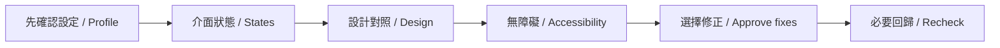

# 14 skills 圖解入口 / Illustrated skill guide

每個 skill 都有三步圖、使用時機、中英提示、輸出與合用方式。圖是教學示意，不表示已操作你的帳號或網站。

Every skill has a three-step diagram, use case, bilingual prompt, expected output and composition guidance. Diagrams are instructions, not evidence that your accounts or website were accessed.

## 第一次用 / First time

1. [下載與安裝 / Install](BEGINNER.en.md) · [繁中](BEGINNER.zh-TW.md)。
2. 先確認 AI 找到哪些 skill，再用下面的提示開始。 / Confirm discovered skills, then use a prompt below.
3. 選一項，或交 uiux-checks 組合。來源連接、程序終止、寄送與 Git push 仍須個別授權。 / Choose one or compose with uiux-checks; connections, process termination, sending and Git push still need scoped approval.

## 選你現在的工作 / Choose your task

| 想做什麼 / Goal | Skill + 圖解 / Guide |
|---|---|
| 選填偏好設定 / Optional preferences | [optional-skill-profile](../optional-skill-profile/references/quickstart.md) |
| 檢查介面狀態 / Preview UI states | [states-preview-loop](../states-preview-loop/references/quickstart.md) |
| 指認畫面元素 / Point at UI elements | [ui-element-inspector](../ui-element-inspector/references/quickstart.md) |
| 對照設計與實作 / Compare design and UI | [ui-design-review](../ui-design-review/references/quickstart.md) · [UX 準則 / principles](../ui-design-review/references/ux-principles.md) |
| 無障礙檢查 / Accessibility review | [a11y-review](../a11y-review/references/quickstart.md) |
| 安排整體品質檢查 / Coordinate UI quality | [uiux-checks](../uiux-checks/references/quickstart.md) |
| 無預覽時安全修補 / Fix without a preview | [audit-fix-loop-no-preview](../audit-fix-loop-no-preview/references/quickstart.md) |
| 比較設計方案 / Compare design directions | [variant-review-loop](../variant-review-loop/references/quickstart.md) |
| 修改 Figma 設計 / Edit Figma designs | [figma-write](../figma-write/references/quickstart.md) |
| 整套換品牌 / Rebrand workflows | [figma-workflow-rebrand](../figma-workflow-rebrand/references/quickstart.md) |
| 多 AI 安全交接 / Coordinate multiple agents | [multi-session-protocol](../multi-session-protocol/references/quickstart.md) |
| 整理內容進度 / Track content readiness | [content-pipeline-dashboard](../content-pipeline-dashboard/references/quickstart.md) |
| 每日工作對帳 / Reconcile daily work | [work-sync-daily](../work-sync-daily/references/quickstart.md) |
| 草擬週報 / Draft a weekly report | [work-report-weekly](../work-report-weekly/references/quickstart.md) |

## 常見合用路線 / Common combinations

- **改 UI：** optional-skill-profile → states-preview-loop → ui-design-review → a11y-review；由 uiux-checks 協調。
- **指給 AI 改：** ui-element-inspector → 指定範圍的實作 → ui-design-review。
- **設計探索：** variant-review-loop → 使用者選定 → figma-write → ui-design-review。
- **整理工作：** work-sync-daily → work-report-weekly；預設只讀與草稿，不自動寄送。

**UI:** profile → states → design → accessibility, coordinated by uiux-checks. **Point-and-change:** inspector → scoped implementation → review. **Explore:** variants → user choice → Figma → review. **Report:** daily reconciliation → weekly draft.

[UI Inspect 實際畫面圖解 / Inspector screenshots](VISUAL-GUIDE.md) · [統一設定與 runner / Settings and runner](USAGE.en.md) · [測試與限制 / Tests and limits](TESTING.md)

[English shortcuts](HOW-TO.en.md) · [繁中快捷索引](HOW-TO.zh-TW.md) · [Français](HOW-TO.fr.md) · [日本語](HOW-TO.ja.md)

[Every step in English](../README.md#step-by-step-pictures) · [每步繁中圖](../README.zh-TW.md#step-by-step-pictures) · [Videos / 影片](videos/README.md)
