# 圖解操作 / Visual walkthrough

## Current hover and RWD controls / 最新 Hover 與 RWD 操作

1. **Hover preview / 移到預覽** → identification and DOM tree open automatically. No Start/Resume click. / 自動開啟指認與 DOM 樹，不必按開始或繼續。
2. **Click to select / 點一下選取** → hover another element to see its name without losing the held selection or request. / Hover 其他元素只預覽名稱，保留選取與需求。
3. **Scope → Request → Copy / 範圍 → 需求 → 複製**. Optional Screenshot opens the change brief directly; no second Prepare click. / 選用截圖會直接開修改單，不需再準備一次。

Brand filters the model list; choosing a model applies immediately. Custom dimensions apply on blur or Enter. / 品牌篩選機型；選機型立即更新，自訂尺寸離開欄位或 Enter 更新。

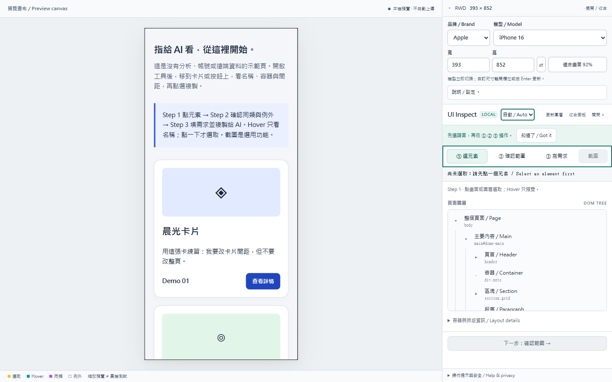

Narrow windows initially collapse RWD settings to preserve DOM tree space. Expand the RWD summary when needed. / 窄螢幕先收合 RWD，留下 DOM 樹空間，需要時可展開。

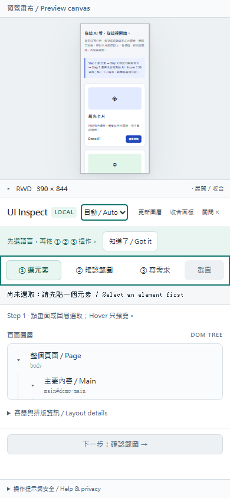

Actual synthetic local captures at 1440×900 and 390×844. Not real-device verification. The older step images and videos below retain the former RWD/Prepare controls; follow the current flow above. / 本機示範實拍，非真機驗證。下方舊步驟圖片與影片仍包含舊 RWD／準備截圖按鈕，操作以本節為準。


這是 **Skill + 本機網頁工具，不是 Chrome extension**。Skill 指導 AI 工作；瀏覽器工具讓你指出位置。以下截圖皆為工具自帶的假資料。

This is a **skill plus a local web tool, not a Chrome extension**. The skill guides an AI agent; the browser tool helps you point to elements. All screenshots use synthetic demo data.

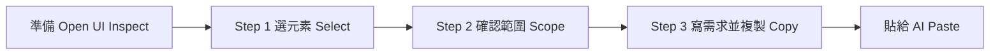

## 準備：啟動 / Before you start

在下載的工具包資料夾開終端機，指定未占用的 port。已啟動就不用重跑。

Open a terminal in the toolkit checkout. Choose a free port; do not start it twice.

```sh
# Windows
py -3 ui-element-inspector/scripts/preview_server.py --port 5173
# macOS / Linux
python3 ui-element-inspector/scripts/preview_server.py --port 5173
```

開啟 `http://127.0.0.1:5173/rwd-preview.html` → **UI Inspect**，圖層清單就會出現。終端機按 Ctrl+C 停止。

Open that local URL and click **UI Inspect** to open the layer list. Ctrl+C stops the server.

自己的網站：**說明／設定 → 換成自己的本機預覽**。先確認授權、假資料與分析停送。不同 port 是不同來源，只能預覽，不能由側欄直接讀 DOM；不繞過限制。

For your own site, use **說明／設定 → Use your local preview** after checking authorization, test data and analytics isolation. Different ports are different origins: preview is possible, but the sidebar cannot read their DOM directly.

## Step 1：選元素 / Select an element

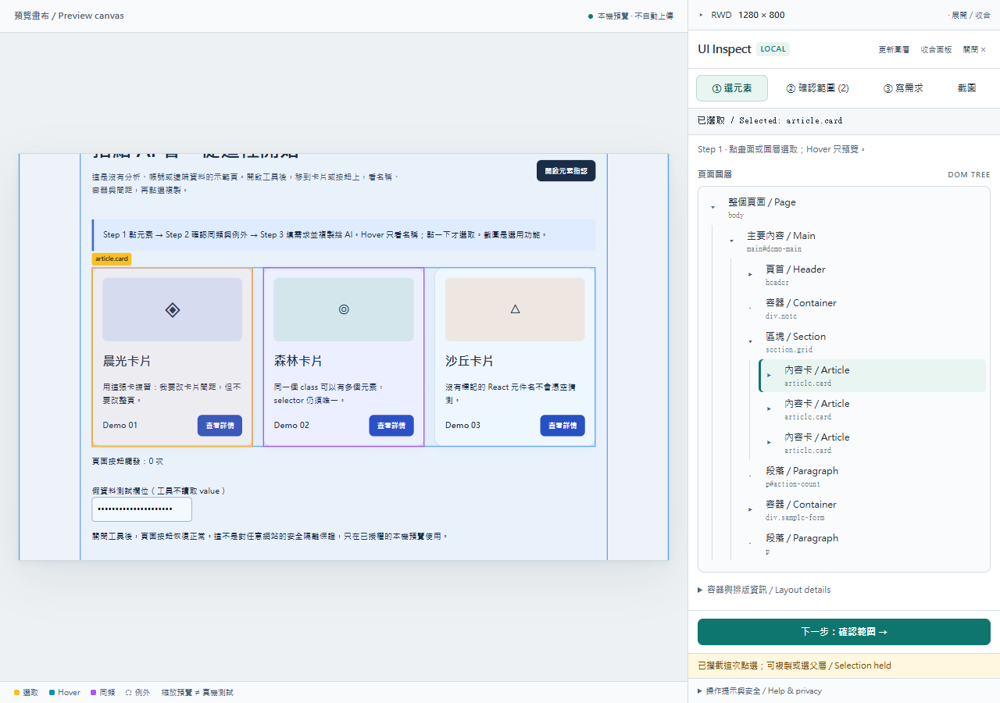

**右側上方 RWD**選尺寸 → **左側**點目標 → **右側「① 選元素」**看容器。

Hover 圖層列會在預覽顯示青色框線；小箭頭只展開／收合，點名稱才選取。面板保持位置與展開狀態；上下方向鍵換列、左右展開／返回、Enter 選取。點選後仍可 Hover 別處看名稱，不改掉已選內容。圖層是 DOM，不是 React 元件樹；每層最多 100 個子項。

**Sidebar top / RWD:** choose size. **Left:** click a target. **Right / ① 選元素:** inspect containers. Hover layer names to preview cyan highlights. Arrows expand; names select while keeping panel position and expansion state. Up/Down moves focus, Left/Right expands/collapses, Enter selects. Hover remains available without replacing your held selection. This is DOM structure, not a React component tree; up to 100 children per level.

| 視覺 / Visual | 意義 / Meaning |
|---|---|
| 黃色實線 / Yellow | 已選取目標 / Selected target |
| 青色實線 / Cyan | Hover 元素 / Hover target |
| 藍色實線 / Blue | 父容器 / Ancestor containers |
| 紫色實線 / Purple | 同類匹配 / Matches |
| 灰色虛線 / Gray dashed | 例外，不修改 / Excluded |

RWD 設定在右側面板上方，可收合為摘要；**工作區填滿目前視窗，不再限制 H600**。**適合畫面**只縮小顯示，不改測試 CSS 寬高；看細節切 **100%**。長頁、DOM 清單與工具內容各自捲動，步驟列和主要操作保持可見。短視窗先收合 RWD；窄螢幕改上下排列，分類列可左右滑。

RWD settings sit above the inspector and collapse to a summary. **The workspace fills the current viewport without a 600px cap.** Fit changes display scale, not the CSS viewport; use 100% for detail. The page, DOM tree and tool content scroll separately while step navigation and primary actions stay visible. Short windows start with collapsed RWD controls; narrow layouts stack preview above tools.

選好後按 **下一步：確認範圍 →**。沒有選取時按鈕停用，請先點元素；不要只 Hover。

After selecting, click **下一步：確認範圍 →**. Hover alone does not select, so Next stays disabled until you click.

## Step 2：確認範圍與例外 / Confirm scope and exceptions

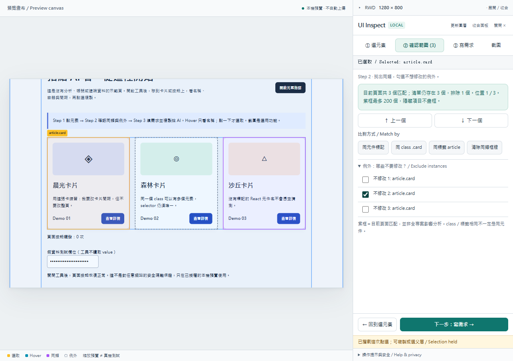

**② 確認範圍 (數量)** → 選 **同 class／同標籤／同元件標記** → 用 **↑ 上一個／↓ 下一個**跳到位置 → 展開 **例外**勾選不要改的項目。

Open **② 確認範圍 (count)**, choose class/tag/component annotation, navigate with Previous/Next, then check exceptions that must stay unchanged.

**這是目前頁面匹配，不是全專案影響分析。**同 tag 或 class 不保證來自同一 React 元件。隱藏元素計入數量但不畫框；清單最多 200 個。AI 修改前仍須查原始碼與使用位置。

**Matches cover this page, not the whole project.** Shared tags/classes do not prove shared React identity. Hidden matches count but have no boxes; the list is capped at 200. The AI must still inspect source and usages before editing.

檢查紫框、數量與例外後，按 **下一步：寫需求 →**。不確定就按 **← 回到選元素**。

After checking highlights, counts and exceptions, click **下一步：寫需求 →**. Use Back to select again.

## Step 3：寫需求、複製給 AI / Write and copy

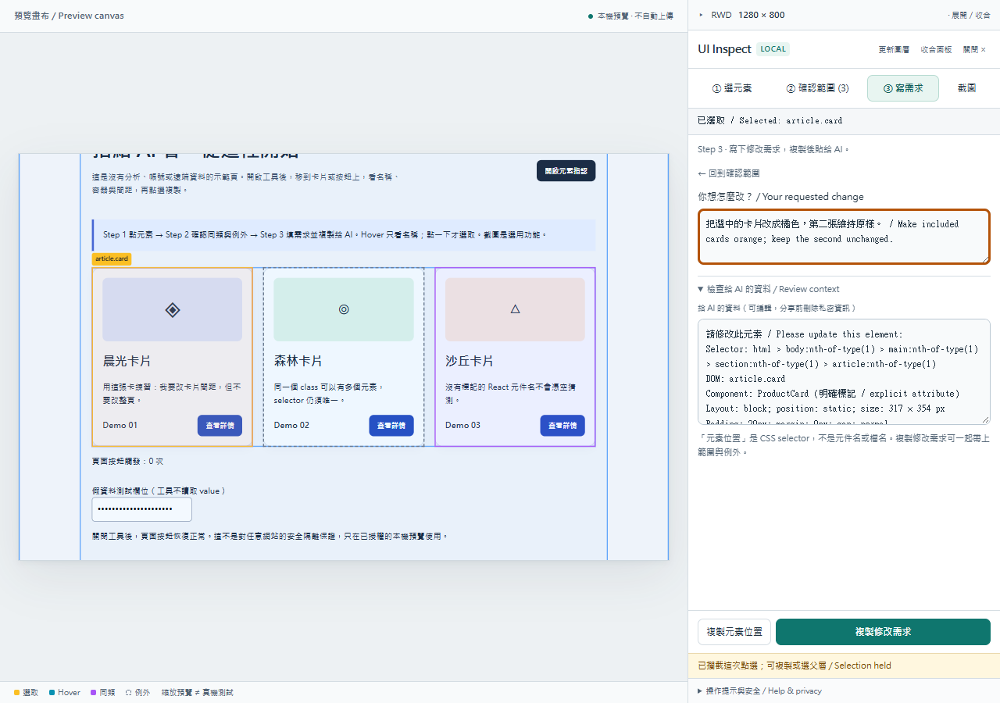

**③ 寫需求** → 寫想改什麼 → 檢查分享資料 → **複製修改需求** → 貼給 AI。

Open **③ 寫需求**, type your change, review shared information, then click **複製修改需求** and paste into your AI. This includes location, matching scope, exceptions and your request. If clipboard permission is denied, use the separate selected manual-copy field with Ctrl+C / Cmd+C.

**Selector／元素位置**是當下網頁的定位地址，不是檔名。換頁或排序後重新選取；分享前刪掉私人識別資訊。

A **selector** locates an element in the current DOM snapshot, not a source filename. Reselect after navigation or reordering; remove private identifiers before sharing.

複製成功後，切到 AI 對話貼上並送出；工具不會替你傳送或修改程式。返回 Step 2 會保留已輸入需求與例外設定。

After copying, switch to your AI chat and paste/send it yourself. The tool does not send messages or edit code. Returning to Step 2 preserves your request and exceptions.

## 選用：截圖畫記 / Optional screenshot annotation

**先選元素並填需求 → 截圖 → 直接顯示框線與修改單 → Win+Shift+S**。剪取、畫記後自行貼給 AI；Esc 恢復面板。Mac 用 Shift+Cmd+4。

For optional click-to-launch Windows support, start with `--enable-snipping`, click **開啟 Windows 剪取工具**, then choose New in the native app. Otherwise use the keyboard shortcut. This tool does not capture, read, upload or confirm delivery of screenshots.

[完整使用與安全限制 / Full usage and security limits](../ui-element-inspector/references/usage.md)

## 叫 AI 開啟 / Prompt to try

> 使用 ui-element-inspector。先檢查我的本機專案與測試授權，再開啟指認工具。我會把位置、例外和修改需求貼給你；請查原始碼，不猜元件檔名，也不要自動部署。

> Use ui-element-inspector. Inspect my local project and test authorization, then open the tool. I will paste locations, exceptions and requested changes. Verify source and usages; do not guess component filenames or deploy automatically.

## Four languages and first-use guidance / 四語與首次引導

[Start and shortcuts](HOW-TO.en.md) · [繁中快捷索引](HOW-TO.zh-TW.md) · [Français](HOW-TO.fr.md) · [日本語](HOW-TO.ja.md) · [Videos and transcript / 影片與步驟](videos/README.md)

Choose a language at the highlighted control, then follow Step 1 → 2 → 3. The brief glow can be dismissed and becomes static with reduced motion. It repeats after a page reload, not every time the inspector reopens in the same page session.

先在亮起的語言選單選語言，再走 Step 1 → 2 → 3。提示可關閉，減少動態效果時只顯示靜態框線；同頁重開不重複，重新載入頁面才重新提示。

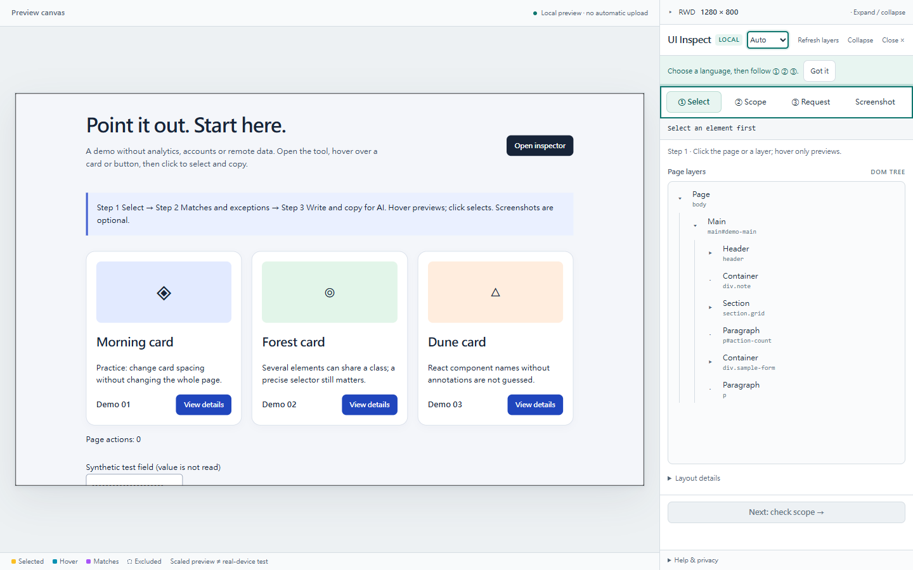
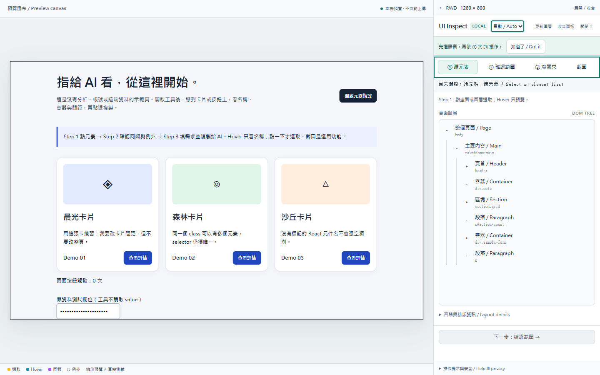

Before capture, select an element and enter the change. The capture brief retains the selector, exclusions and exact request beside the outlined target. The preview is at 100%; scroll to the target and use multiple captures for long content. Check for private information before sharing.

截圖前先選元素並填需求；修改單保留元素位置、例外與原文，和目標框線一起入鏡。預覽為 100%，長文或大範圍需分張，分享前檢查私密資料。


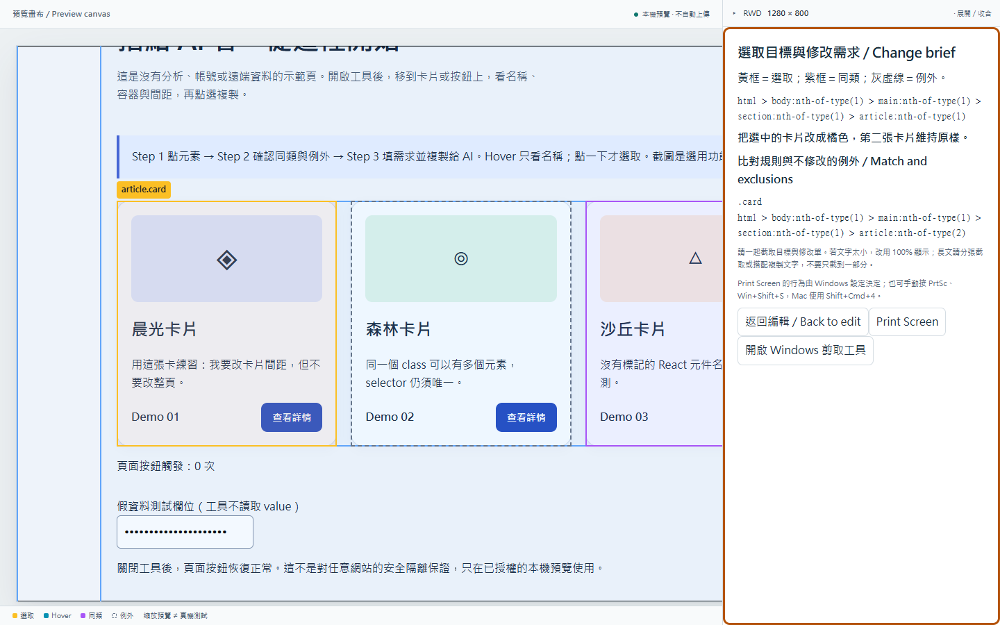

`--enable-printscreen` enables the explicit Print Screen button on Windows; `--enable-snipping` separately enables Snipping Tool. Both are off by default. Otherwise use your keyboard shortcuts. A successful launch request does not verify capture or paste.
# Current external panel and numbered matches / 新版外側面板與編號

The demo's launch button now opens the workspace. The panel sits outside the preview, with a Language selector and an amber Exclude instances control. Click a right-edge tick to jump to an instance. Switch Matches / To copy to inspect the complete group or included items. Numbers remain stable within that group.

示範頁啟動後進入工作區，面板在預覽外側。「語言」選單與琥珀色例外入口清楚可見。點右側刻度前往對應編號，切換「同類／本次」查看完整群組或這次修改項目，群組內編號保持一致。

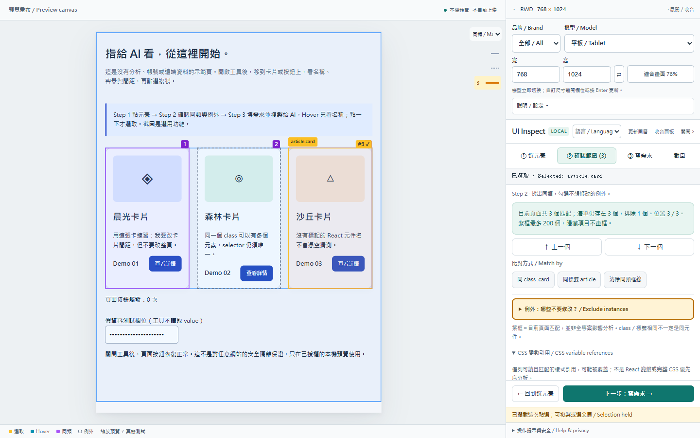

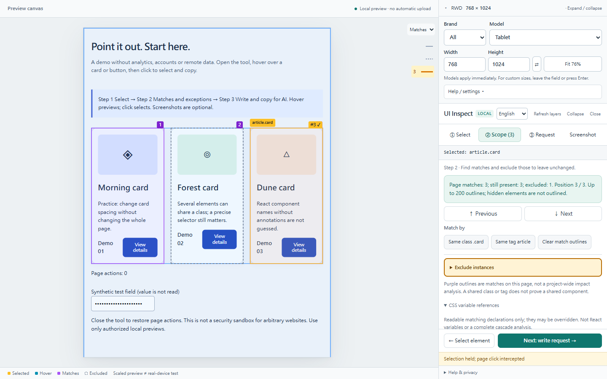

Synthetic local demo, not customer material. CSS references are candidates only. [Release status and remaining tests](RELEASE-STATUS.md).
