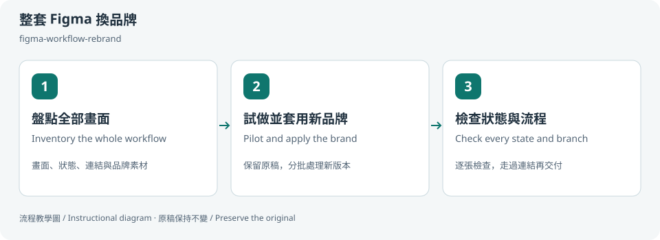
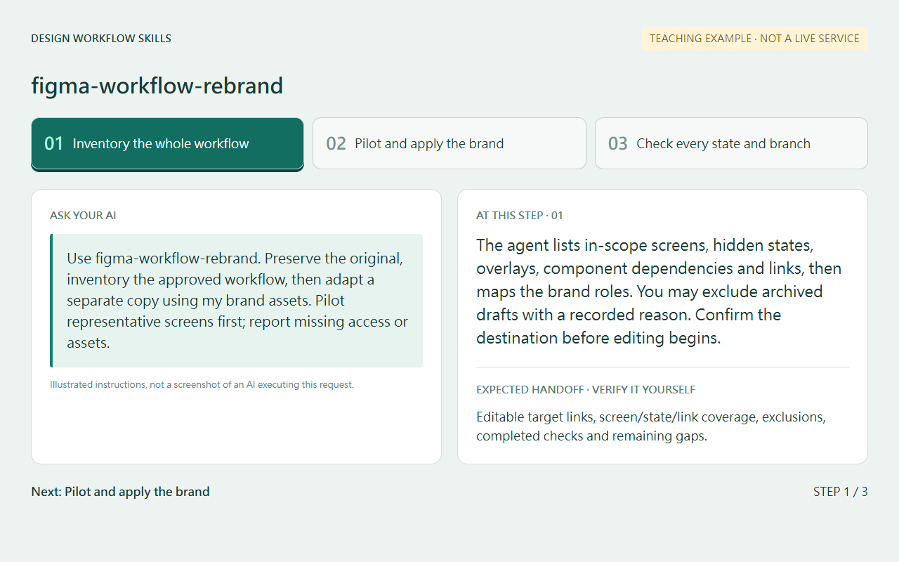
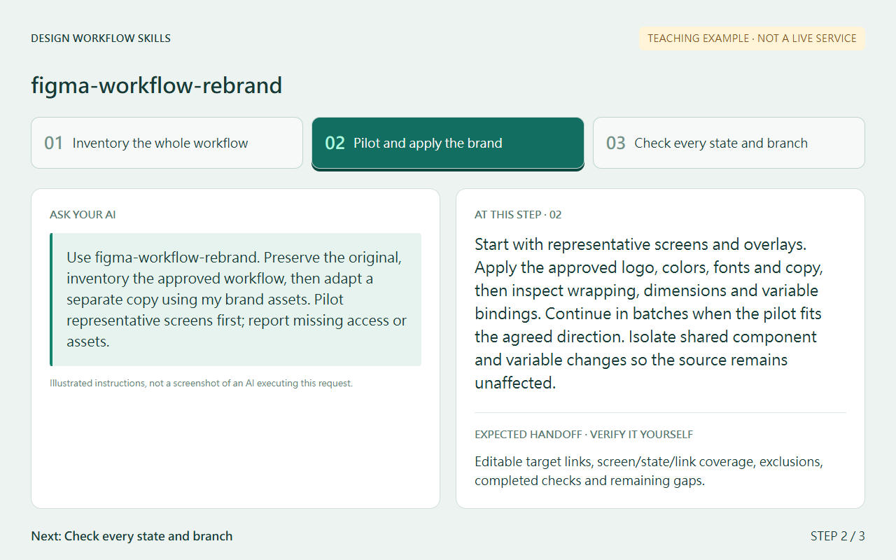
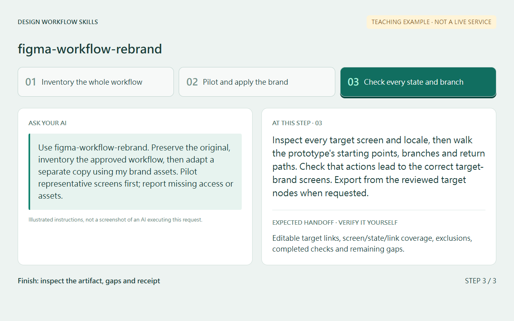
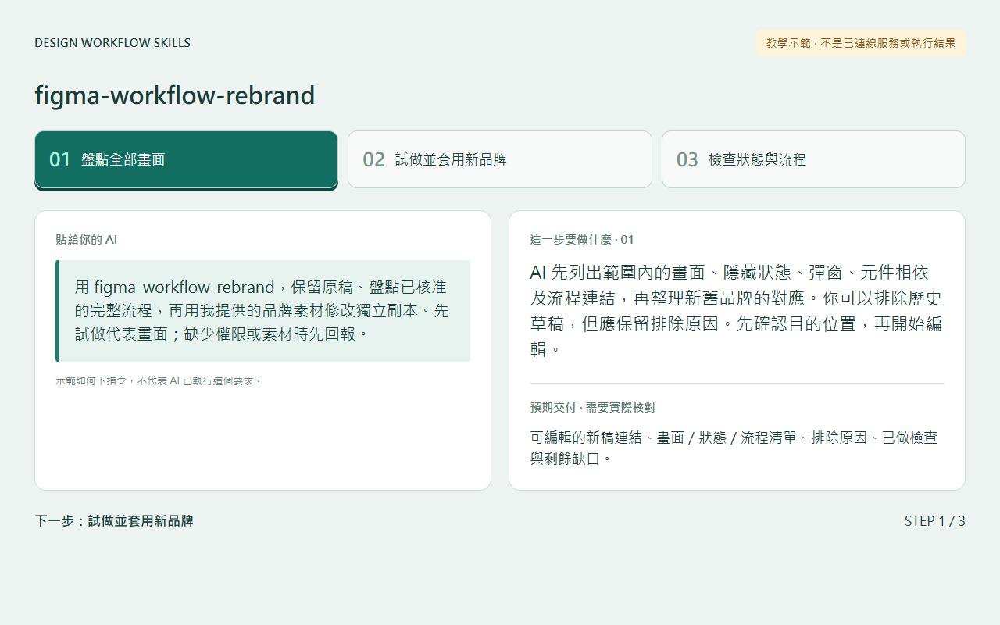
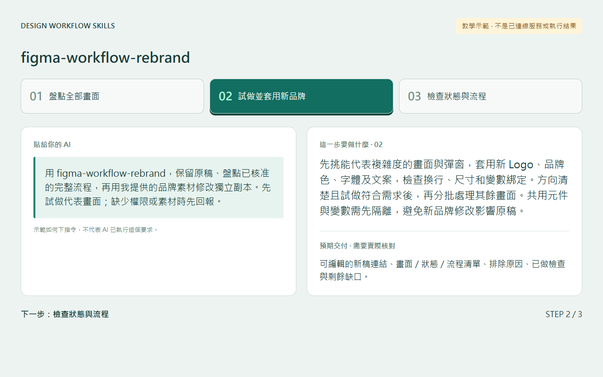
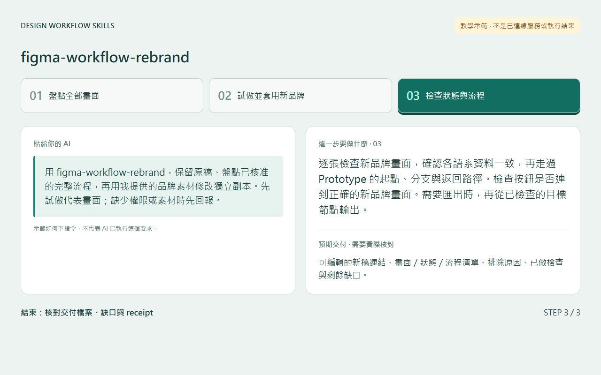

# 整套 Figma 換品牌 / Rebrand a complete Figma workflow

## 兩句優點 / Two benefits

一次整理整套畫面的品牌對應，保留原本的流程與設計細節。逐一追蹤畫面、狀態與連結，減少只改首頁或漏掉彈窗的情況。

Map the new brand across the complete frame set while preserving workflow and design details. Track screens, states and links individually to reduce missed overlays and partial rebrands.

## 適用專案與階段 / Projects and stages

| 項目 / Item | 繁體中文 | English |
| --- | --- | --- |
| 專案 / Projects | 多品牌產品、白牌介面、既有產品換品牌、提案原型。 | Multi-brand products, white-label interfaces, brand migrations and proposal prototypes. |
| 階段 / Stages | 已有 Figma 流程，準備套用另一個品牌，或交付前檢查完整度。 | Adapting an existing Figma workflow to another brand and checking coverage before delivery. |



這是流程教學圖，使用虛構情境，未呈現客戶設計或實際 Figma 操作結果。

This instructional diagram uses a fictional scenario. It contains no customer design or actual Figma execution result.

## 啟動前 / Before starting

提供以下資訊，敏感檔案只放在你允許使用的私人位置：

Prepare these inputs, keeping sensitive files in your approved private location:

| 準備 / Input | 內容 / Details |
| --- | --- |
| 原稿 / Source | Figma 檔案及要處理的 pages、sections、流程起點。 / The file, pages, sections and flow starting points. |
| 新品牌 / Target brand | 可使用的 Logo、色彩角色、字體與必要素材。 / Approved logos, color roles, fonts and relevant assets. |
| 目的位置 / Destination | 同意建立的獨立頁面或另一份 Figma 檔案。 / An approved separate page or target Figma file. |
| 語系與版本 / Variants | 需要的語言、裝置與模式，可包含 RTL。 / Requested languages, devices and modes, optionally RTL. |
| 保留項目 / Preserve | 原本互動、第三方標誌、必要文案及其他例外。 / Existing interactions, third-party marks, required copy and exceptions. |

請 AI 確認已讀到 `figma-workflow-rebrand/SKILL.md`，並列出實際可用的 Figma 工具。安裝 skill 不會提供 Figma 帳號或編輯權限。工具只有讀取能力時，先交盤點與修改計畫。

Ask the agent to confirm the loaded skill path and available Figma tools. Installing the skill does not provide an account or editing access. With read-only tools, start with an inventory and adaptation plan.

只用工作說明不需要 Node。選用流程清單檢查工具時，需要 Node.js，隨附工具以 Node 22 測試，沒有額外 npm 套件。

The instructions do not require Node. The optional coverage checker uses Node.js, is tested with Node 22, and needs no npm packages.

## Step 1 → 2 → 3

### Step 1 · 盤點全部畫面 / Inventory the whole workflow

AI 先列出範圍內的畫面、隱藏狀態、彈窗、元件相依及流程連結，再整理新舊品牌的對應。你可以排除歷史草稿，但應保留排除原因。先確認目的位置，再開始編輯。

The agent lists in-scope screens, hidden states, overlays, component dependencies and links, then maps the brand roles. You may exclude archived drafts with a recorded reason. Confirm the destination before editing begins.

例如一個虛構流程有「清單、詳情、錯誤彈窗」三個狀態，需要英文與阿拉伯文兩版，應追蹤六個目標畫面，並涵蓋每版的開啟詳情、顯示錯誤及重試連結。

For example, a fictional list, detail and error-overlay flow in English and Arabic has six target screen states. Each version includes its open-detail, show-error and retry links.

### Step 2 · 試做並套用新品牌 / Pilot and apply the brand

先挑能代表複雜度的畫面與彈窗，套用新 Logo、品牌色、字體及文案，檢查換行、尺寸和變數綁定。方向清楚且試做符合需求後，再分批處理其餘畫面。共用元件與變數需先隔離，避免新品牌修改影響原稿。

Start with representative screens and overlays. Apply the approved logo, colors, fonts and copy, then inspect wrapping, dimensions and variable bindings. Continue in batches when the pilot fits the agreed direction. Isolate shared component and variable changes so the source remains unaffected.

#### 完整度與消耗 / Completion and resource use

預設依你指定的範圍完成全部畫面、狀態與連結。AI 會保存盤點與品牌對應、按需讀取資料並分批持續處理，減少重複工作。除非你指定只做試稿，試做完成後會接著往下做。

By default, the agent completes all screens, states and links in your requested scope. It retains the inventory and brand mapping, reads data as needed and continues in batches to reduce repeated work. After the pilot, it proceeds with the rest unless you requested a pilot-only delivery.

你可以指定時間、費用或 token 預算。未指定時，AI 不自行設定上限或減少交付內容。真的遇到上下文限制、工具配額或限流時，會保存完成節點、剩餘工作與下一步，說明受限原因。恢復後先核對進度及目的稿，再繼續。必要的授權、相依問題與你的停止要求仍會優先處理。

You may specify a time, cost or token budget. Without one, the agent does not invent a limit or reduce the deliverable. If an actual context limit, tool quota or rate limit interrupts work, it saves completed nodes, remaining work and the next step, and explains the constraint. On resuming, it checks progress and the destination before continuing. Required permissions, dependency issues and your stop requests still take precedence.

### Step 3 · 檢查狀態與流程 / Check every state and branch

逐張檢查新品牌畫面，確認各語系資料一致，再走過 Prototype 的起點、分支與返回路徑。檢查按鈕是否連到正確的新品牌畫面。需要匯出時，再從已檢查的目標節點輸出。

Inspect every target screen and locale, then walk the prototype's starting points, branches and return paths. Check that actions lead to the correct target-brand screens. Export from the reviewed target nodes when requested.

選用清單工具時，請 AI 依 [manifest 格式](coverage-manifest.md) 建立本次私人清單，再執行：

For optional bookkeeping, ask the agent to prepare a private task manifest using [the schema](coverage-manifest.md), then run:

```sh
node <skill-directory>/scripts/check-coverage.mjs <private-task-manifest.json>
```

將兩個占位路徑換成實際檔案位置，含空格的路徑加上引號。工具只讀 JSON，檢查是否缺畫面、漏連結或有待完成項目，不會連接或修改 Figma。它無法代替實際畫面與互動檢查。

Replace both placeholder paths with actual locations and quote paths containing spaces. The tool reads JSON to find missing mappings, links and pending checks. It neither connects to nor modifies Figma, and cannot replace visual or interaction inspection.

## 可直接貼給 AI / Copy this prompt

> 使用 figma-workflow-rebrand。將［原稿檔案與 pages／sections］整套流程套用［新品牌］，包含畫面、彈窗、錯誤狀態和 Prototype 連結。使用我提供的品牌素材，原稿保持不變，目的位置是［我同意編輯的獨立頁面或檔案］。這次需要［語言／裝置／模式］。先列出完整清單與品牌對應，再試做代表畫面。缺少素材或權限時先告訴我，完成後交新稿連結與尚未完成的項目。

> Use figma-workflow-rebrand to adapt the complete workflow in [source file and pages/sections] to [target brand], including screens, overlays, error states and prototype links. Use my supplied brand assets and preserve the original. The approved destination is [separate page or file]. Include [languages/devices/modes]. Inventory the workflow and brand mapping first, then pilot representative screens. Tell me about missing assets or access. Deliver the target links and remaining items.

如果目前只想了解工作量，可加「這輪只讀盤點，不建立或修改任何 Figma 節點」。

For an estimate only, add: “Read-only inventory this time. Do not create or modify Figma nodes.”

## 你會拿到 / Expected output

- 可編輯的新品牌 Figma 連結，原稿保留。 / Editable target-brand Figma links with the source retained.
- 已完成畫面、版本與流程連結清單，包含排除原因。 / Screen, variant and link coverage with exclusions.
- 已完成檢查、待確認選項及未測互動。 / Completed checks, unresolved choices and untested interactions.
- 有要求時才附匯出圖片及對應節點。 / Requested exports with their source target-node references.

## 和其他 skill 合用 / Combine with others

`figma-workflow-rebrand` 負責整套流程的品牌對應與完整度。`figma-write` 可協助特定節點、元件或 token 的修改，由同一位協調者安排，避免兩邊重複改同一節點。`variant-review-loop` 適合先探索尚未決定的品牌方向。

`figma-workflow-rebrand` coordinates whole-workflow adaptation and coverage. `figma-write` can support scoped node, component or token changes under the same coordinator. `variant-review-loop` is useful when the brand direction still needs exploration. Avoid overlapping edits.

共用偏好只確認一次。缺少其他 skill 時，先確認本輪真正需要的能力，不自動安裝。

Share one preference preflight. If another skill is unavailable, identify the capabilities actually needed for this task without installing it automatically.

## 自訂與選填 / Customize and optional

可指定只處理某些流程、多品牌、多語、RTL、裝置版本、保留元件與匯出格式。品牌色、按鈕高度和畫面張數由你的專案決定。

Choose workflows, brands, languages, RTL, device variants, preserved components and export formats. Colors, button dimensions and screen counts come from your project.

已有 `optional-skill-profile` 時，可沿用它支援的共用偏好。品牌素材、節點清單及範例資料留在本輪私人工作文件，不寫進公開 skill 或未支援的設定欄位。可以說「這次不用保存設定」或「只做到試稿」。

Use supported shared preferences if `optional-skill-profile` is installed. Keep brand assets, node inventories and scenario data in private task notes, outside the public skill and unsupported profile fields. Say “do not save settings this time” or “stop after the pilot.”

## 結束與交接 / Finish and hand off

確認你拿到目標稿連結及本輪範圍。查看實際畫面與操作結果，並保留未完成項目。可以隨時要求停止並交目前清單，之後按已完成的節點繼續。

Confirm the target links and task scope. Review actual screens and interaction results, keeping unfinished items visible. You can stop and request the current coverage list, then resume from completed nodes later.

提供新品牌設計與公開素材是不同決定。公司來源、私人設定和客戶素材保持在原本的存取範圍。上傳、公開分享與 Git push 需另行指定範圍。

Design delivery and public distribution are separate choices. Keep company sources, private settings and customer assets within their existing access scope. Uploads, public sharing and Git pushes need their own scoped request.

[回到 skill 規則 / Skill instructions](../SKILL.md)

## 每步畫面 / Step pictures

本機排版的教學示範，不代表已連接帳號或完成操作。 / Locally rendered instructional examples, not live account or agent execution.

### English

| Step 1 | Step 2 | Step 3 |
|---|---|---|
| [](screenshots/step-01-en.png) | [](screenshots/step-02-en.png) | [](screenshots/step-03-en.png) |

### 繁體中文

| Step 1 | Step 2 | Step 3 |
|---|---|---|
| [](screenshots/step-01-zh-TW.png) | [](screenshots/step-02-zh-TW.png) | [](screenshots/step-03-zh-TW.png) |
