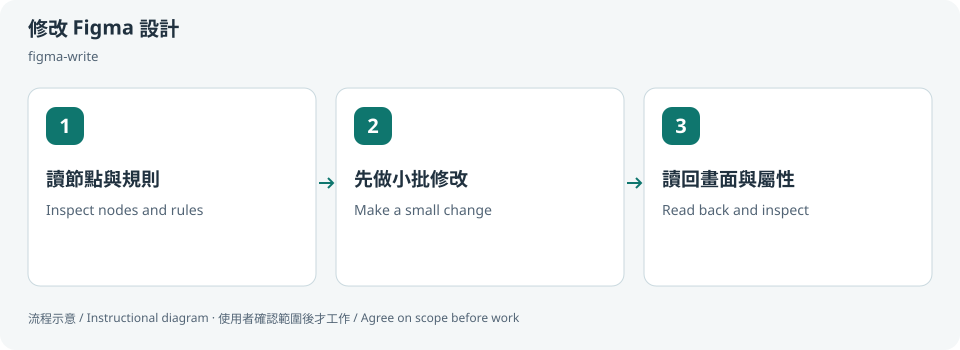
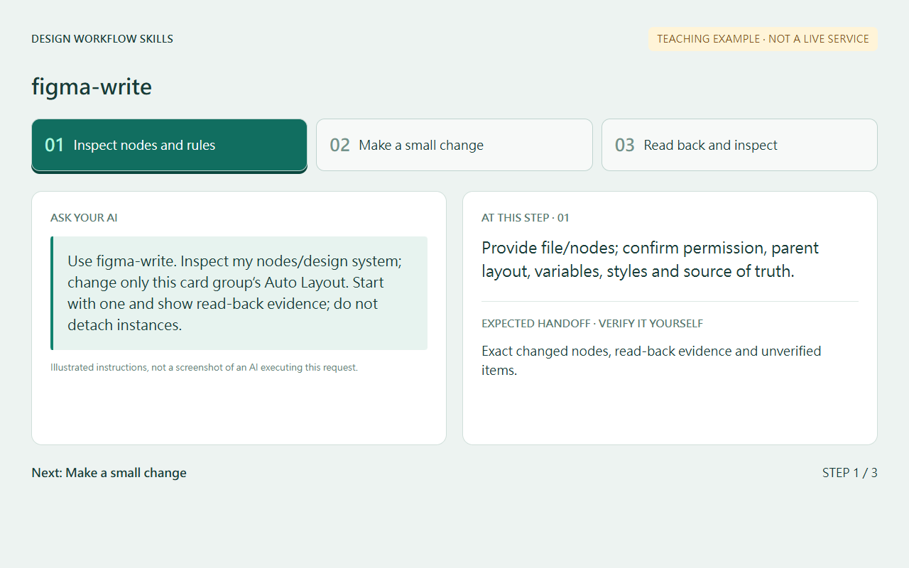
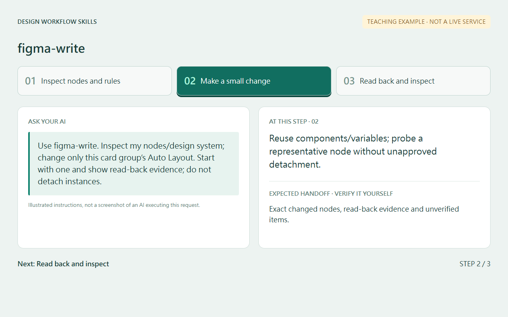
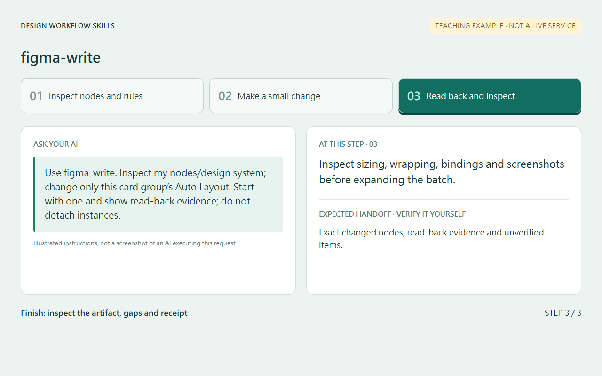
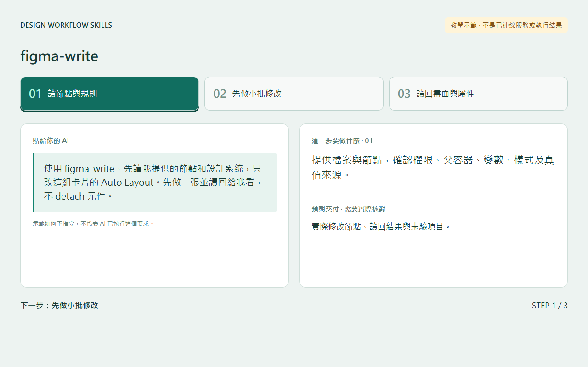
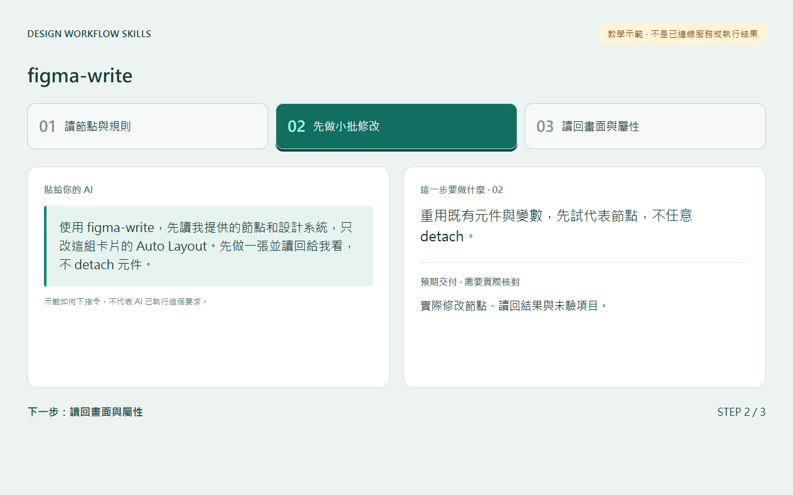
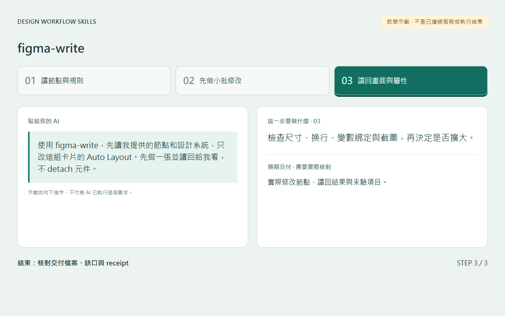

# 修改 Figma 設計 / Edit Figma designs

## 兩句優點 / Two benefits

先了解容器和變數再修改，較能保留既有設計系統的一致性。小批修改後讀回屬性與畫面，可提早發現尺寸或綁定錯誤。

Inspect containers and variables before editing to preserve design-system consistency. Small changes followed by property and screenshot checks help catch sizing or binding errors early.

## 適用專案與階段 / Projects and stages

| 項目 / Item | 繁體中文 | English |
|---|---|---|
| 專案 / Projects | 有授權 Figma 檔案與可用編輯工具的 UI 或設計系統專案。 | UI and design-system projects with authorized Figma files and available editing tools. |
| 階段 / Stages | 設計稿建置、排版調整、token 維護與核准方案落實。 | Design construction, layout changes, token maintenance and approved direction implementation. |

**流程示意圖，不是已執行的截圖或驗收證據。 / Instructional diagram, not an execution screenshot or acceptance result.**

**何時用 / When:** 需要 AI 在指定 Figma 節點調整排版或 token 時。 When asking AI to edit layout or tokens in specific Figma nodes.

## 啟動前 / Before starting

確認 AI 已載入本 skill，並請它回報實際 SKILL.md 路徑。需要本機檔案、瀏覽器或帳號工具時，先確認該 AI 環境真的提供；工具缺少就標未驗或採核准的只讀替代。

Confirm the agent has loaded this skill and reports its actual SKILL.md path. Check required file/browser/connector access in that host. Missing tools mean unverified work or an approved read-only alternative, not pretend execution.

## Step 1 → 2 → 3

### Step 1 · 讀節點與規則 / Inspect nodes and rules

提供檔案與節點，確認權限、父容器、變數、樣式及真值來源。

Provide file/nodes; confirm permission, parent layout, variables, styles and source of truth.

### Step 2 · 先做小批修改 / Make a small change

重用既有元件與變數，先試代表節點，不任意 detach。

Reuse components/variables; probe a representative node without unapproved detachment.

### Step 3 · 讀回畫面與屬性 / Read back and inspect

檢查尺寸、換行、變數綁定與截圖，再決定是否擴大。

Inspect sizing, wrapping, bindings and screenshots before expanding the batch.

## 可直接貼給 AI / Copy this prompt

> 使用 figma-write，先讀我提供的節點和設計系統，只改這組卡片的 Auto Layout。先做一張並讀回給我看，不 detach 元件。

> Use figma-write. Inspect my nodes/design system; change only this card group’s Auto Layout. Start with one and show read-back evidence; do not detach instances.

## 你會拿到 / Expected output

實際修改節點、讀回結果與未驗項目。

Exact changed nodes, read-back evidence and unverified items.

## 和其他 skill 合用 / Combine with others

可接 variant-review-loop 的核准方向；工具本身需另外連接。

Can implement an approved variant-review-loop direction; Figma tools must be connected separately.

共用一次設定確認；多 skill 不會把權限疊加，也不能讓兩個 writer 同時改同一檔。

Reuse one settings preflight. Combining skills does not accumulate permissions or permit overlapping writers.

## 自訂與選填 / Customize and optional

精確 file／node、設計真值來源、tokens、Auto Layout 或定位方式與批次大小；工具連線需另外具備。

Exact file/nodes, source of truth, tokens, layout approach and batch size; tool connection is a separate prerequisite.

可用自然語言說「這次修改設定」「只用這次，不保存」「停止在草稿」。共用偏好可由原工具包的 `scripts/settings.py` 選單修改；此選單不會替你編輯第三方 skill，也不執行 runner。

Say “change settings for this run,” “use once without saving,” or “stop at the draft.” The toolkit's `scripts/settings.py` edits shared preferences; it does not edit third-party skills or execute the runner.

個別任務的節點、比較尺寸、標準與方案 ID 等參數通常在當次對話指定，不全是 profile 可保存的欄位。保存格式只接受 [已定義欄位](../../optional-skill-profile/references/fields.md)；沒有相符欄位就保留在當次範圍，不把它偽裝成永久設定。

Task-specific nodes, comparison dimensions, standards and variant IDs are generally supplied in the current conversation, not all persisted profile fields. Save only [supported fields](../../optional-skill-profile/references/fields.md); otherwise keep the choice session-scoped.

## 結束與交接 / Finish and hand off

1. 對照上方「你會拿到」確認交付，要求列出本輪版本／範圍、已做、未做與阻擋。 / Check the expected output above and request scope/revision, completed work, gaps and blockers.
2. 看實際檔案或 receipt；不能把計畫、啟動程序或 ACK 當成工作完成。 / Inspect actual artifacts/receipts; a plan, process launch or ACK alone is not completion.
3. 可以說「到這裡停止，只交摘要」。若有臨時預覽或 overlay，說明還在運作的資源；只處理本輪且獲准的資源，不關別人的服務。 / Say “stop here and summarize.” Disclose remaining preview/overlay resources; only handle resources owned and authorized for this run.
4. Git push、發布、寄送、更新紀錄或未來排程，都需要另外指定本次範圍。 / Git push, publishing, sending, record updates and future schedules require separate task scope.

## 邊界 / Limits

這包不自帶 Figma 連線，不上傳私人來源圖到公開教學。

The bundle does not supply a Figma connection; private source images do not belong in public guides.

[回到 skill 規則 / Skill instructions](../SKILL.md)

## 每步畫面 / Step pictures

本機排版的教學示範，不代表已連接帳號或完成操作。 / Locally rendered instructional examples, not live account or agent execution.

### English

| Step 1 | Step 2 | Step 3 |
|---|---|---|
|  |  |  |

### 繁體中文

| Step 1 | Step 2 | Step 3 |
|---|---|---|
|  |  |  |
