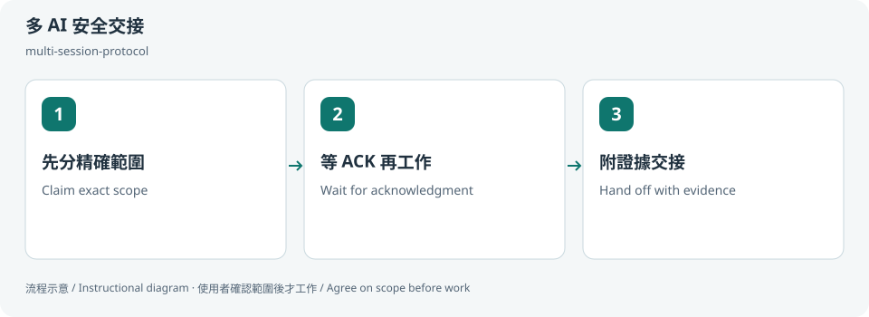
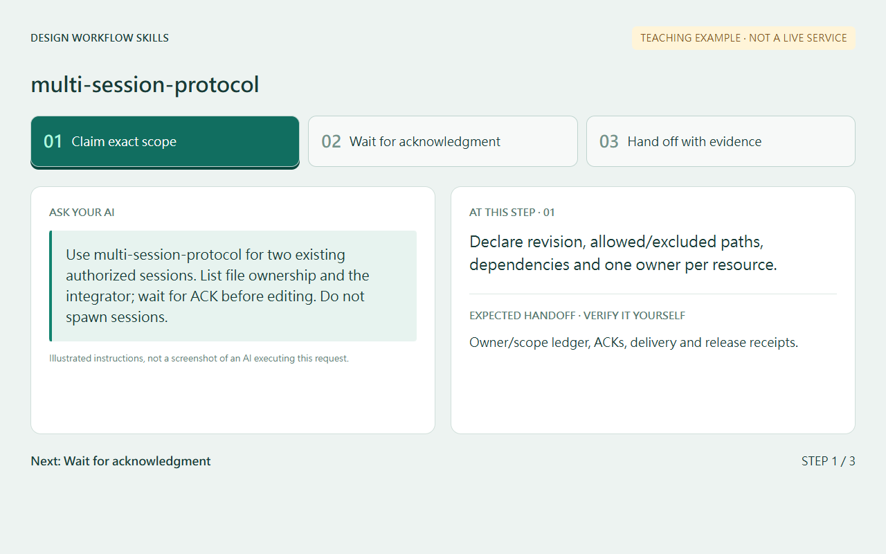
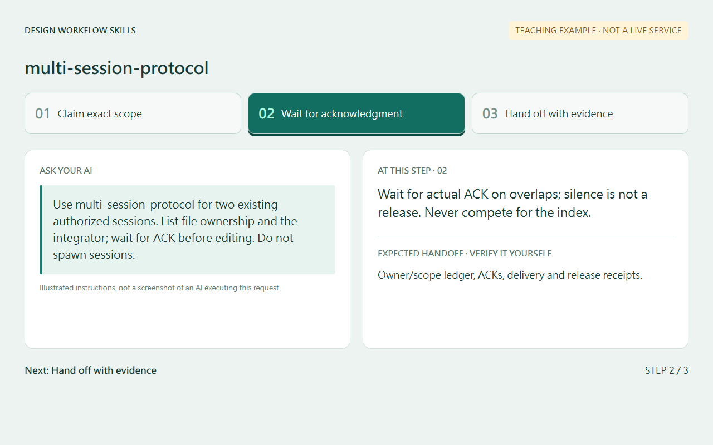
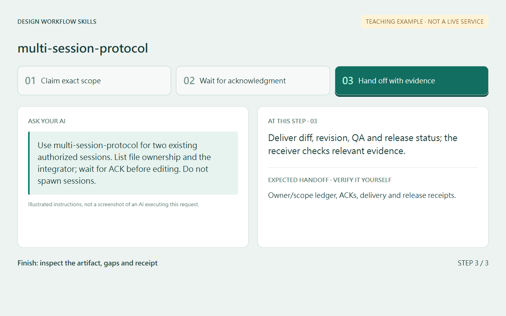
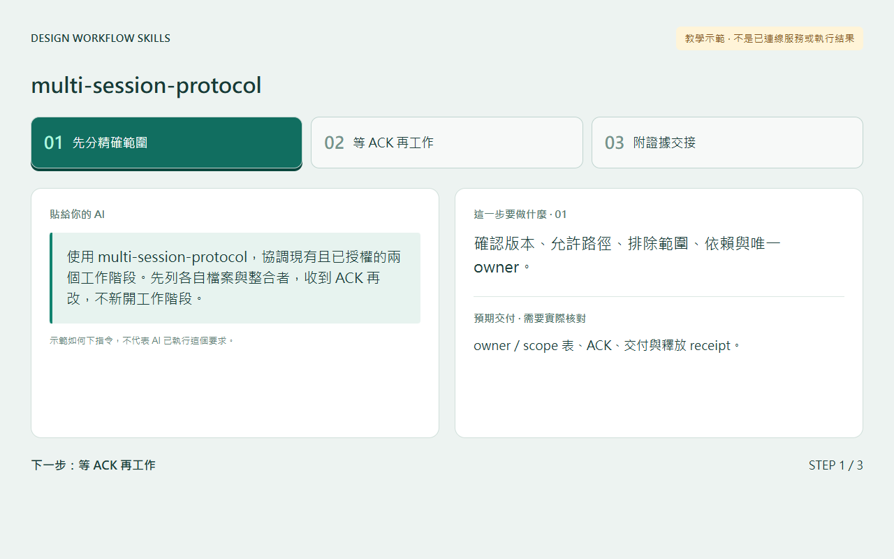
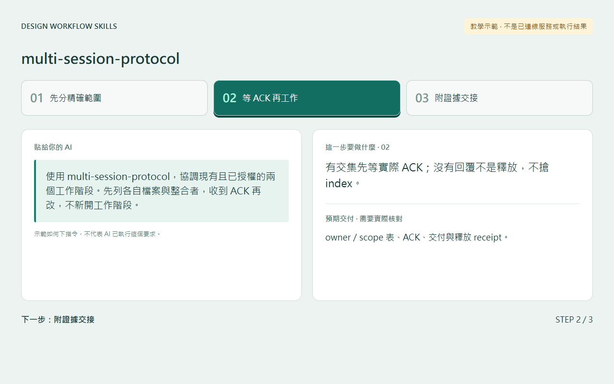
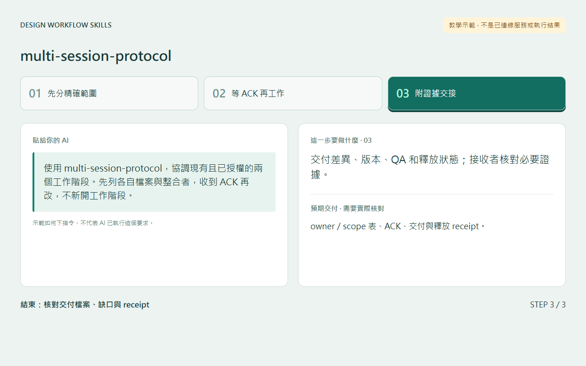

# 多 AI 安全交接 / Coordinate multiple agents

## 兩句優點 / Two benefits

精確劃分 owner 與檔案範圍，減少互相覆蓋工作的機會。交接附版本和驗證結果，讓接收者不必靠猜測理解進度。

Explicit owners and file scopes reduce accidental work overwrites. Revision and verification receipts make handoffs easier to assess without guessing progress.

## 適用專案與階段 / Projects and stages

| 項目 / Item | 繁體中文 | English |
|---|---|---|
| 專案 / Projects | 已有多個授權 agent 或人員共用 Git、檔案、Figma 節點或 port 的專案。 | Projects where authorized agents or people share Git, files, Figma nodes or ports. |
| 階段 / Stages | 分工前、共用修改、整合與交接。 | Before delegation, shared changes, integration and handoff. |

**流程示意圖，不是已執行的截圖或驗收證據。 / Instructional diagram, not an execution screenshot or acceptance result.**

**何時用 / When:** 已授權的多個工作階段需要共用檔案或資源時。 When authorized sessions need to share files or resources.

## 啟動前 / Before starting

確認 AI 已載入本 skill，並請它回報實際 SKILL.md 路徑。需要本機檔案、瀏覽器或帳號工具時，先確認該 AI 環境真的提供；工具缺少就標未驗或採核准的只讀替代。

Confirm the agent has loaded this skill and reports its actual SKILL.md path. Check required file/browser/connector access in that host. Missing tools mean unverified work or an approved read-only alternative, not pretend execution.

## Step 1 → 2 → 3

### Step 1 · 先分精確範圍 / Claim exact scope

確認版本、允許路徑、排除範圍、依賴與唯一 owner。

Declare revision, allowed/excluded paths, dependencies and one owner per resource.

### Step 2 · 等 ACK 再工作 / Wait for acknowledgment

有交集先等實際 ACK；沒有回覆不是釋放，不搶 index。

Wait for actual ACK on overlaps; silence is not a release. Never compete for the index.

### Step 3 · 附證據交接 / Hand off with evidence

交付差異、版本、QA 和釋放狀態；接收者核對必要證據。

Deliver diff, revision, QA and release status; the receiver checks relevant evidence.

## 可直接貼給 AI / Copy this prompt

> 使用 multi-session-protocol，協調現有且已授權的兩個工作階段。先列各自檔案與整合者，收到 ACK 再改，不新開工作階段。

> Use multi-session-protocol for two existing authorized sessions. List file ownership and the integrator; wait for ACK before editing. Do not spawn sessions.

## 你會拿到 / Expected output

owner／scope 表、ACK、交付與釋放 receipt。

Owner/scope ledger, ACKs, delivery and release receipts.

## 和其他 skill 合用 / Combine with others

與其他 skill 共用同一份 ownership；不是自動派 agent 功能。

Shares ownership with other skills; it does not automatically create agents.

共用一次設定確認；多 skill 不會把權限疊加，也不能讓兩個 writer 同時改同一檔。

Reuse one settings preflight. Combining skills does not accumulate permissions or permit overlapping writers.

## 常見搭配平台 / Works well with

常見搭配：**GitHub, Figma, Supabase, Vercel, Cloudflare**。這些名稱用來說明常見工作情境與提高 discoverability，不代表官方合作、內建 connector、預設帳號權限或已完成整合。

Common workflow companions: **GitHub, Figma, Supabase, Vercel, Cloudflare**. These names describe common use cases and improve discoverability; they do not imply endorsement, bundled integrations, account access or verified connectivity.

## 自訂與選填 / Customize and optional

現有 session、base revision、owner、允許／禁止路徑、依賴與驗收者；不自動建立 agent。

Existing sessions, base revision, owners, allowed/excluded paths, dependencies and reviewer; no automatic agent creation.

可用自然語言說「這次修改設定」「只用這次，不保存」「停止在草稿」。共用偏好可由原工具包的 `scripts/settings.py` 選單修改；此選單不會替你編輯第三方 skill，也不執行 runner。

Say “change settings for this run,” “use once without saving,” or “stop at the draft.” The toolkit's `scripts/settings.py` edits shared preferences; it does not edit third-party skills or execute the runner.

個別任務的節點、比較尺寸、標準與方案 ID 等參數通常在當次對話指定，不全是 profile 可保存的欄位。保存格式只接受 [已定義欄位](../../optional-skill-profile/references/fields.md)；沒有相符欄位就保留在當次範圍，不把它偽裝成永久設定。

Task-specific nodes, comparison dimensions, standards and variant IDs are generally supplied in the current conversation, not all persisted profile fields. Save only [supported fields](../../optional-skill-profile/references/fields.md); otherwise keep the choice session-scoped.

## 結束與交接 / Finish and hand off

1. 對照上方「你會拿到」確認交付，要求列出本輪版本／範圍、已做、未做與阻擋。 / Check the expected output above and request scope/revision, completed work, gaps and blockers.
2. 看實際檔案或 receipt；不能把計畫、啟動程序或 ACK 當成工作完成。 / Inspect actual artifacts/receipts; a plan, process launch or ACK alone is not completion.
3. 可以說「到這裡停止，只交摘要」。若有臨時預覽或 overlay，說明還在運作的資源；只處理本輪且獲准的資源，不關別人的服務。 / Say “stop here and summarize.” Disclose remaining preview/overlay resources; only handle resources owned and authorized for this run.
4. Git push、發布、寄送、更新紀錄或未來排程，都需要另外指定本次範圍。 / Git push, publishing, sending, record updates and future schedules require separate task scope.

## 邊界 / Limits

訊息不是原子鎖，不能保證跨機全域排他。

Messages are not atomic locks and do not guarantee cross-machine exclusivity.

[回到 skill 規則 / Skill instructions](../SKILL.md)

## 每步畫面 / Step pictures

本機排版的教學示範，不代表已連接帳號或完成操作。 / Locally rendered instructional examples, not live account or agent execution.

### English

| Step 1 | Step 2 | Step 3 |
|---|---|---|
|  |  |  |

### 繁體中文

| Step 1 | Step 2 | Step 3 |
|---|---|---|
|  |  |  |
