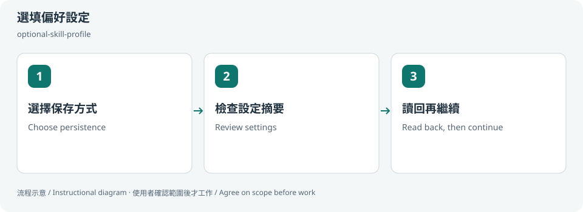
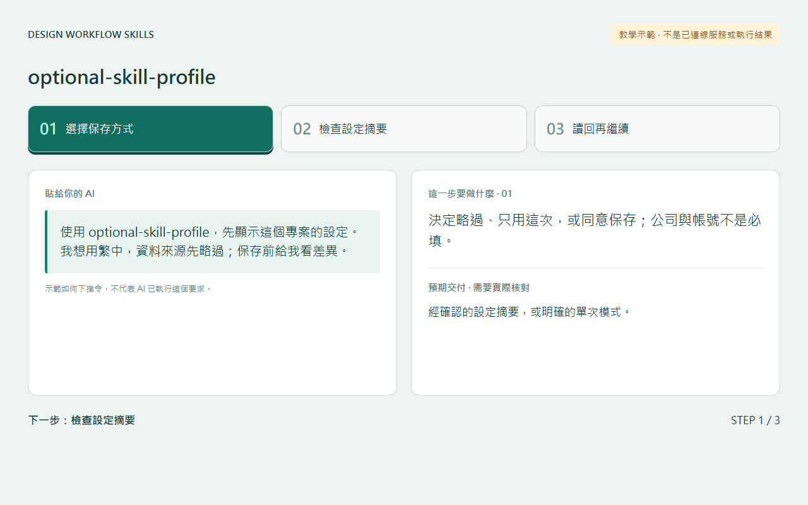
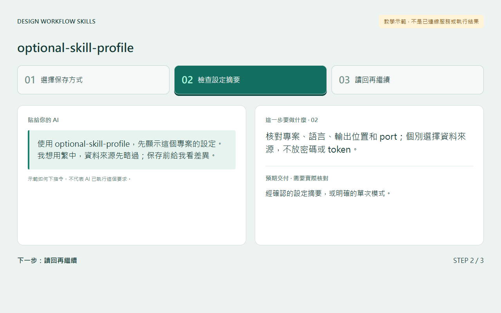
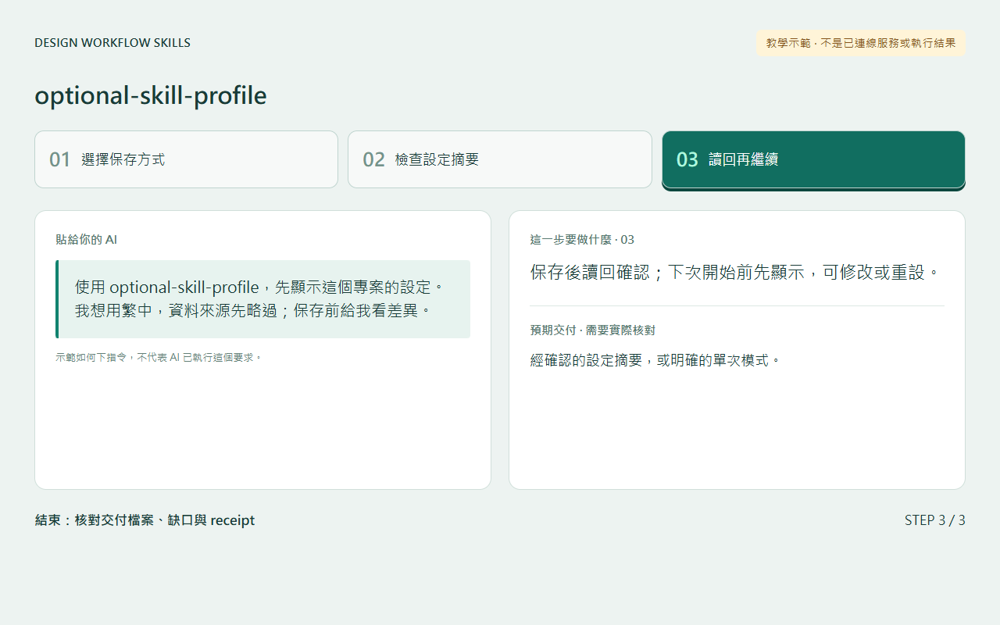

# 選填偏好設定 / Optional preferences

## 兩句優點 / Two benefits

不用每次重複交代專案偏好，開始前仍能檢查與修改。個人設定留在專案外，降低誤把帳號或私人資訊公開的風險。

Avoid repeating project preferences while keeping them reviewable before each run. Keeping personal settings outside the project reduces accidental public disclosure.

## 適用專案與階段 / Projects and stages

| 項目 / Item | 繁體中文 | English |
|---|---|---|
| 專案 / Projects | 所有本機設計、前端、內容與工作整理專案。 | Any local design, frontend, content or work-report project. |
| 階段 / Stages | 首次開始、換專案、執行前調整。 | Onboarding, workspace changes and preflight. |

**流程示意圖，不是已執行的截圖或驗收證據。 / Instructional diagram, not an execution screenshot or acceptance result.**

**何時用 / When:** 第一次使用、換專案或想修改設定時。 First use, switching workspaces, or changing preferences.

## 啟動前 / Before starting

確認 AI 已載入本 skill，並請它回報實際 SKILL.md 路徑。需要本機檔案、瀏覽器或帳號工具時，先確認該 AI 環境真的提供；工具缺少就標未驗或採核准的只讀替代。

Confirm the agent has loaded this skill and reports its actual SKILL.md path. Check required file/browser/connector access in that host. Missing tools mean unverified work or an approved read-only alternative, not pretend execution.

## Step 1 → 2 → 3

### Step 1 · 選擇保存方式 / Choose persistence

決定略過、只用這次，或同意保存；公司與帳號不是必填。

Skip, use this session only, or agree to save. Company and account are optional.

### Step 2 · 檢查設定摘要 / Review settings

核對專案、語言、輸出位置和 port；個別選擇資料來源，不放密碼或 token。

Check workspace, language, output and port. Choose sources separately; never store secrets.

### Step 3 · 讀回再繼續 / Read back, then continue

保存後讀回確認；下次開始前先顯示，可修改或重設。

Read back saved values. Show them before the next run; allow change or reset.

## 可直接貼給 AI / Copy this prompt

> 使用 optional-skill-profile，先顯示這個專案的設定。我想用繁中，資料來源先略過；保存前給我看差異。

> Use optional-skill-profile. Show this workspace’s settings. Use Traditional Chinese and skip sources; show changes before saving.

## 你會拿到 / Expected output

經確認的設定摘要，或明確的單次模式。

A confirmed preference summary or explicit session-only mode.

## 和其他 skill 合用 / Combine with others

所有其他 skill；同一輪只確認一次共用設定。

All other skills; reuse one preflight per run.

共用一次設定確認；多 skill 不會把權限疊加，也不能讓兩個 writer 同時改同一檔。

Reuse one settings preflight. Combining skills does not accumulate permissions or permit overlapping writers.

## 常見搭配平台 / Works well with

常見搭配：**Codex, Claude Code, GitHub, Figma, Google Calendar, Jira**。這些名稱用來說明常見工作情境與提高 discoverability，不代表官方合作、內建 connector、預設帳號權限或已完成整合。

Common workflow companions: **Codex, Claude Code, GitHub, Figma, Google Calendar, Jira**. These names describe common use cases and improve discoverability; they do not imply endorsement, bundled integrations, account access or verified connectivity.

## 自訂與選填 / Customize and optional

語言、時區、輸出位置、port、專案標籤、獨立來源開關；可略過、單次使用或同意後保存。

Language, timezone, output, port, context labels and separate source toggles; skip, use once, or agree to save.

可用自然語言說「這次修改設定」「只用這次，不保存」「停止在草稿」。共用偏好可由原工具包的 `scripts/settings.py` 選單修改；此選單不會替你編輯第三方 skill，也不執行 runner。

Say “change settings for this run,” “use once without saving,” or “stop at the draft.” The toolkit's `scripts/settings.py` edits shared preferences; it does not edit third-party skills or execute the runner.

個別任務的節點、比較尺寸、標準與方案 ID 等參數通常在當次對話指定，不全是 profile 可保存的欄位。保存格式只接受 [已定義欄位](../../optional-skill-profile/references/fields.md)；沒有相符欄位就保留在當次範圍，不把它偽裝成永久設定。

Task-specific nodes, comparison dimensions, standards and variant IDs are generally supplied in the current conversation, not all persisted profile fields. Save only [supported fields](../../optional-skill-profile/references/fields.md); otherwise keep the choice session-scoped.

## 結束與交接 / Finish and hand off

1. 對照上方「你會拿到」確認交付，要求列出本輪版本／範圍、已做、未做與阻擋。 / Check the expected output above and request scope/revision, completed work, gaps and blockers.
2. 看實際檔案或 receipt；不能把計畫、啟動程序或 ACK 當成工作完成。 / Inspect actual artifacts/receipts; a plan, process launch or ACK alone is not completion.
3. 可以說「到這裡停止，只交摘要」。若有臨時預覽或 overlay，說明還在運作的資源；只處理本輪且獲准的資源，不關別人的服務。 / Say “stop here and summarize.” Disclose remaining preview/overlay resources; only handle resources owned and authorized for this run.
4. Git push、發布、寄送、更新紀錄或未來排程，都需要另外指定本次範圍。 / Git push, publishing, sending, record updates and future schedules require separate task scope.

Profile：儲存後讀回值與 revision；重設只清本機 profile，不撤銷 OAuth，也不刪工作檔。 / Read back saved values/revision; reset only clears the local profile, not OAuth or work artifacts.

## 邊界 / Limits

保存帳號不等於連線，保存偏好不等於授權寫入。

Saved identity is not OAuth; preferences do not grant write permission.

[回到 skill 規則 / Skill instructions](../SKILL.md)

## 每步畫面 / Step pictures

本機排版的教學示範，不代表已連接帳號或完成操作。 / Locally rendered instructional examples, not live account or agent execution.

### English

| Step 1 | Step 2 | Step 3 |
|---|---|---|
|  |  |  |

### 繁體中文

| Step 1 | Step 2 | Step 3 |
|---|---|---|
|  |  |  |
