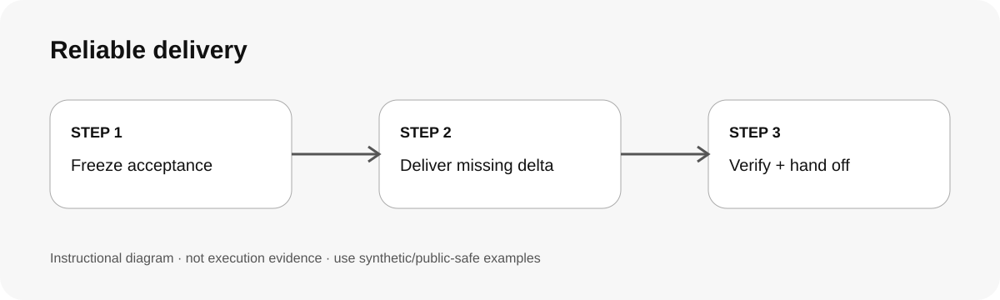

# 可靠交付 / Continue work to real acceptance

## 兩句優點 / Two benefits

把原始驗收條件帶過中斷與交接，避免「有回覆、有 commit」被誤判成完成。用精確版本、差異與 QA receipt，讓下一位接手者知道真正剩什麼。

Carry original acceptance criteria through interruptions and handoffs so an acknowledgement or commit is not mistaken for completion. Exact revisions, diffs and QA receipts show the next owner what actually remains.

## 適用專案與階段 / Projects and stages

| 項目 / Item | 繁體中文 | English |
|---|---|---|
| 專案 / Projects | 長任務、多 agent、跨 session、需 code/doc/design handoff 的工作。 | Long tasks, multi-agent work, cross-session work and code/doc/design handoffs. |
| 階段 / Stages | 中斷恢復、接手、整合、驗收與 release 前。 | Resume, takeover, integration, acceptance and pre-release. |

**流程示意圖，不是已執行的截圖或驗收證據。 / Instructional diagram, not an execution screenshot or acceptance result.**

**何時用 / When:** 你最在意的是「原任務到底有沒有真正做完」。 / When the key question is whether the original deliverable is genuinely complete.

## 啟動前 / Before starting

先讀 original scope、acceptance、owner、revision 與現有 artifacts。不要因為看到 checkpoint 就自行擴 scope 或搶 active owner。  
Read original scope, acceptance, owner, revision and artifacts. A checkpoint is not permission to expand scope or take over an active owner.

## Step 1 → 2 → 3

### Step 1 · 固定 acceptance / Freeze acceptance
列出真正剩下的驗收條件，不把 status update 當完成。  
List remaining acceptance criteria; status updates are not completion.

### Step 2 · 只補 missing delta / Deliver the missing delta
核對實際 diff/artifact，做仍缺且已授權的範圍。  
Inspect the real diff/artifact and perform only missing authorized work.

### Step 3 · QA＋receipt / Verify and hand off
跑最小必要 QA，回報 revision、changed scope、done/remaining/blocker。  
Run the smallest relevant QA and report revision, changed scope, done/remaining/blocker.

## 可直接貼給 AI / Copy this prompt

> 使用 reliable-delivery 接續這個已授權任務。先重述 original acceptance、目前 owner/revision 和剩餘 deliverable；只做 missing delta。不要把 ACK、claim、process start 或 partial commit 當完成。最後給我精確 handoff receipt。

> Use reliable-delivery to continue this authorized task. Restate the original acceptance, current owner/revision and remaining deliverable, then work only on the missing delta. Do not treat ACKs, claims, process starts or partial commits as completion. Finish with an exact handoff receipt.

## 你會拿到 / Expected output

Acceptance、owner/scope、base/result revision、changed artifacts、QA、done/remaining/blocked、release status。  
Acceptance, owner/scope, base/result revision, changed artifacts, QA, done/remaining/blocked and release status.

## 和其他 skill 合用 / Combine with others

搭配 multi-session-protocol 管 ownership；搭配專項 audit skill 定義要修的 bounded findings。  
Use multi-session-protocol for ownership and specialist audit skills for bounded findings.

## 常見搭配平台 / Works well with

常見搭配：**GitHub, Vercel, Cloudflare, Supabase, Jira, Codex, Claude Code**。這些名稱用來說明常見工作情境與提高 discoverability，不代表官方合作、內建 connector、預設帳號權限或已完成整合。

Common workflow companions: **GitHub, Vercel, Cloudflare, Supabase, Jira, Codex, Claude Code**. These names describe common use cases and improve discoverability; they do not imply endorsement, bundled integrations, account access or verified connectivity.

## 自訂與選填 / Customize and optional

可指定 acceptance IDs、handoff owner、驗收者與 release policy。公開模板不要寫入私人 issue/repo/branch/person identifier。  
Specify acceptance IDs, handoff owner, reviewer and release policy. Keep private issue/repo/branch/person identifiers out of public templates.

## 結束與交接 / Finish and hand off

1. 報 exact revision。 / Report the exact revision.
2. 列 changed scope 與實際 QA。 / List changed scope and actual QA.
3. 仍缺就標 remaining/blocker。 / Keep gaps as remaining/blocker.
4. 不自行宣稱 release/publish。 / Do not claim release/publish without evidence.

## 邊界 / Limits

本 skill 不提供真正的 lock、reviewer independence、CI、deploy 或 background continuation；平台沒有的能力不能靠文案創造。  
This skill does not create locks, reviewer independence, CI, deployment or background continuation; instructions cannot invent platform capabilities.

[回到 skill 規則 / Skill instructions](../SKILL.md)

## 每步畫面 / Step pictures

v0.1 先提供流程圖。實際 screenshots 需等 synthetic fixture 驗證後再補。  
v0.1 starts with the workflow diagram. Add screenshots only after a real synthetic-fixture validation.
