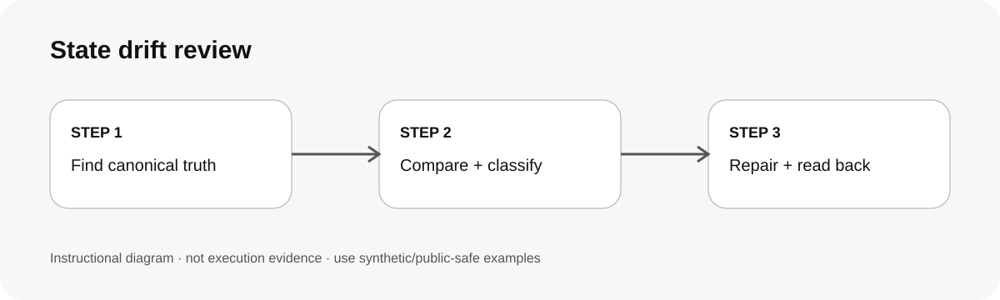

# 狀態漂移檢查 / Review state drift

## 兩句優點 / Two benefits

先分清 canonical source 和 mirror，避免為了修畫面反而破壞真正資料。用固定 drift 類型和 read-back evidence，讓跨系統狀態差異更容易定位。

Separate canonical truth from mirrors before changing anything, avoiding repairs that corrupt the real source. Stable drift classes and read-back evidence make cross-system mismatches easier to diagnose.

## 適用專案與階段 / Projects and stages

| 項目 / Item | 繁體中文 | English |
|---|---|---|
| 專案 / Projects | 有 dashboard、index、cache、mirror 或多來源狀態的系統。 | Systems with dashboards, indexes, caches, mirrors or multiple state views. |
| 階段 / Stages | 線上問題診斷、資料同步、狀態修復前後。 | Incident diagnosis, synchronization and pre/post repair checks. |

**流程示意圖，不是已執行的截圖或驗收證據。 / Instructional diagram, not an execution screenshot or acceptance result.**

**何時用 / When:** 兩個地方對同一件事顯示不同狀態。 / When two surfaces disagree about the same state.

## 啟動前 / Before starting

先列出候選 sources，找出每個欄位最窄的 source of truth。預設只讀；真實修復要另外核准。  
List candidate sources and identify the narrowest source of truth for each field. Default to read-only; real repairs need separate approval.

## Step 1 → 2 → 3

### Step 1 · 找 canonical / Find canonical truth
先確認 authoritative state，不用 UI 顯示猜。  
Identify authoritative state instead of guessing from the UI.

### Step 2 · 比 mirror 並分類 / Compare and classify
比 stable ID、revision、time、status，標 stale / duplicate / wrong-status 等。  
Compare stable IDs, revisions, time and status; classify stale, duplicate, wrong-status and similar drift.

### Step 3 · 最小修復＋讀回 / Smallest repair + read-back
只修 bridge/mirror 必要範圍，再讀回確認。  
Repair the smallest bridge/mirror scope and read it back.

## 可直接貼給 AI / Copy this prompt

> 使用 state-drift-review。先找每個 disputed field 的 canonical source，再比 mirror/index/dashboard。預設只讀，分類 drift，提出最小修復；沒有授權不要寫。公開輸出請遮蔽內部 URL、ID、collection、host 與 raw payload。

> Use state-drift-review. Find the canonical source for each disputed field, then compare the mirror/index/dashboard. Stay read-only by default, classify the drift and propose the smallest repair; do not write without authorization. Redact internal URLs, IDs, collections, hosts and raw payloads in public output.

## 你會拿到 / Expected output

Canonical/mirror 對照、drift class、證據、最小修復與 read-back/未驗狀態。  
Canonical/mirror comparison, drift class, evidence, smallest repair and read-back/unverified status.

## 和其他 skill 合用 / Combine with others

可把已確認 drift 交 reliable-delivery 做 bounded 修復與驗收。  
Hand confirmed drift to reliable-delivery for bounded repair and acceptance.

## 自訂與選填 / Customize and optional

可自訂 drift taxonomy 與 source registry，但 public 版只用抽象名稱。  
Customize drift taxonomy and source registry; public examples use abstract names only.

## 結束與交接 / Finish and hand off

1. 列出 source 與 revision。 / Record sources and revisions.
2. 把 observed 與 inferred 分開。 / Separate observed from inferred.
3. 寫入後必須 read back。 / Read back after approved writes.
4. 未修完保持 partial/blocked。 / Keep incomplete work partial/blocked.

## 邊界 / Limits

Heartbeat、ACK、queued 狀態都不能單獨證明整條流程健康或完成。 / Heartbeats, ACKs and queued states do not by themselves prove health or completion.

[回到 skill 規則 / Skill instructions](../SKILL.md)

## 每步畫面 / Step pictures

v0.1 不放真實 production 截圖；後續只可使用 synthetic fixture 或完整去識別化畫面。  
v0.1 includes no real production captures; future images must use synthetic fixtures or fully redacted views.
