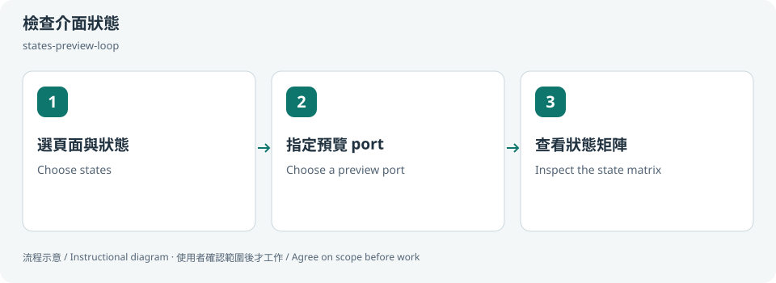

# 檢查介面狀態 / Preview UI states

## 兩句優點 / Two benefits

把正常、空白、載入與錯誤狀態放在同一份檢查流程，較不容易漏掉邊界。明確確認 port 與程序，可減少誤停其他開發服務的風險。

Check normal, empty, loading and error states in one workflow to reduce omissions. Explicit port and process checks reduce the risk of interrupting another development service.

## 適用專案與階段 / Projects and stages

| 項目 / Item | 繁體中文 | English |
|---|---|---|
| 專案 / Projects | React／Next.js、Vue、靜態 HTML、設計系統與可在本機預覽的 Web 介面。 | React/Next.js, Vue, static HTML, design systems and locally previewable web UIs. |
| 階段 / Stages | 開發中、狀態補齊、RWD 與交付前檢查。 | Implementation, state completion, responsive review and pre-delivery. |

**流程示意圖，不是已執行的截圖或驗收證據。 / Instructional diagram, not an execution screenshot or acceptance result.**

**何時用 / When:** 想知道 loading、空資料、錯誤和小螢幕是否正常時。 When checking loading, empty, error and responsive states.

## 啟動前 / Before starting

確認 AI 已載入本 skill，並請它回報實際 SKILL.md 路徑。需要本機檔案、瀏覽器或帳號工具時，先確認該 AI 環境真的提供；工具缺少就標未驗或採核准的只讀替代。

Confirm the agent has loaded this skill and reports its actual SKILL.md path. Check required file/browser/connector access in that host. Missing tools mean unverified work or an approved read-only alternative, not pretend execution.

## Step 1 → 2 → 3

### Step 1 · 選頁面與狀態 / Choose states

提供元件或頁面，列出狀態、語系及想看的寬度。

Choose a component/page, states, locales and viewport widths.

### Step 2 · 指定預覽 port / Choose a preview port

指定 port；若已占用，先確認程序和影響，選重用或換 port。

Choose a port. If occupied, identify the listener and decide whether to reuse or choose another.

### Step 3 · 查看狀態矩陣 / Inspect the state matrix

先確認資料與分析停送門檻，再看各狀態截圖和實際操作，區分未驗。

Pass data/analytics gates, then inspect screenshots and interactions. Mark untested items.

## 可直接貼給 AI / Copy this prompt

> 使用 states-preview-loop 檢查我的卡片元件：normal、loading、empty、error，寬度 390 和 1280。先問我 port，不使用真實資料。

> Use states-preview-loop on my card: normal, loading, empty and error at 390 and 1280. Ask for a port first; use synthetic data.

## 你會拿到 / Expected output

狀態 × 尺寸覆蓋表、截圖與待修項目。

A state/viewport matrix, screenshots and findings.

## 和其他 skill 合用 / Combine with others

接 ui-design-review，再視需要交 a11y-review。

Follow with ui-design-review and, when relevant, a11y-review.

共用一次設定確認；多 skill 不會把權限疊加，也不能讓兩個 writer 同時改同一檔。

Reuse one settings preflight. Combining skills does not accumulate permissions or permit overlapping writers.

## 自訂與選填 / Customize and optional

指定 port、狀態、語系、尺寸與輸出位置；既有預覽可重用，不必每次開新 server。

Port, states, locales, viewports and output; reuse an appropriate existing preview.

可用自然語言說「這次修改設定」「只用這次，不保存」「停止在草稿」。共用偏好可由原工具包的 `scripts/settings.py` 選單修改；此選單不會替你編輯第三方 skill，也不執行 runner。

Say “change settings for this run,” “use once without saving,” or “stop at the draft.” The toolkit's `scripts/settings.py` edits shared preferences; it does not edit third-party skills or execute the runner.

個別任務的節點、比較尺寸、標準與方案 ID 等參數通常在當次對話指定，不全是 profile 可保存的欄位。保存格式只接受 [已定義欄位](../../optional-skill-profile/references/fields.md)；沒有相符欄位就保留在當次範圍，不把它偽裝成永久設定。

Task-specific nodes, comparison dimensions, standards and variant IDs are generally supplied in the current conversation, not all persisted profile fields. Save only [supported fields](../../optional-skill-profile/references/fields.md); otherwise keep the choice session-scoped.

## 結束與交接 / Finish and hand off

1. 對照上方「你會拿到」確認交付，要求列出本輪版本／範圍、已做、未做與阻擋。 / Check the expected output above and request scope/revision, completed work, gaps and blockers.
2. 看實際檔案或 receipt；不能把計畫、啟動程序或 ACK 當成工作完成。 / Inspect actual artifacts/receipts; a plan, process launch or ACK alone is not completion.
3. 可以說「到這裡停止，只交摘要」。若有臨時預覽或 overlay，說明還在運作的資源；只處理本輪且獲准的資源，不關別人的服務。 / Say “stop here and summarize.” Disclose remaining preview/overlay resources; only handle resources owned and authorized for this run.
4. Git push、發布、寄送、更新紀錄或未來排程，都需要另外指定本次範圍。 / Git push, publishing, sending, record updates and future schedules require separate task scope.

## 邊界 / Limits

不自動 kill 程序，也不把示範頁當正式網站驗收。

Never kill a process automatically or label a synthetic demo as production verification.

[回到 skill 規則 / Skill instructions](../SKILL.md)

## 每步畫面 / Step pictures

本機排版的教學示範，不代表已連接帳號或完成操作。 / Locally rendered instructional examples, not live account or agent execution.

### English

| Step 1 | Step 2 | Step 3 |
|---|---|---|
|  |  |  |

### 繁體中文

| Step 1 | Step 2 | Step 3 |
|---|---|---|
|  |  |  |
