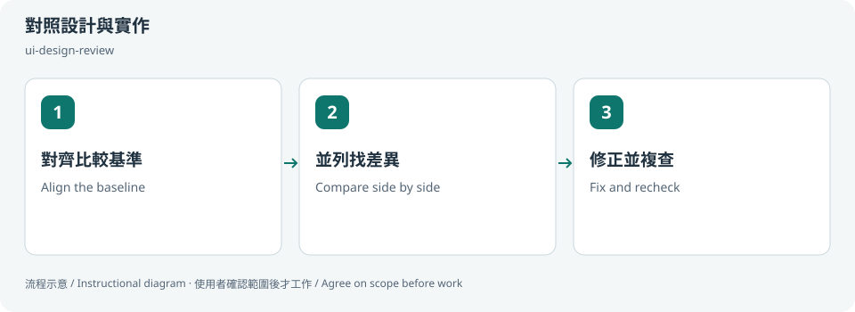
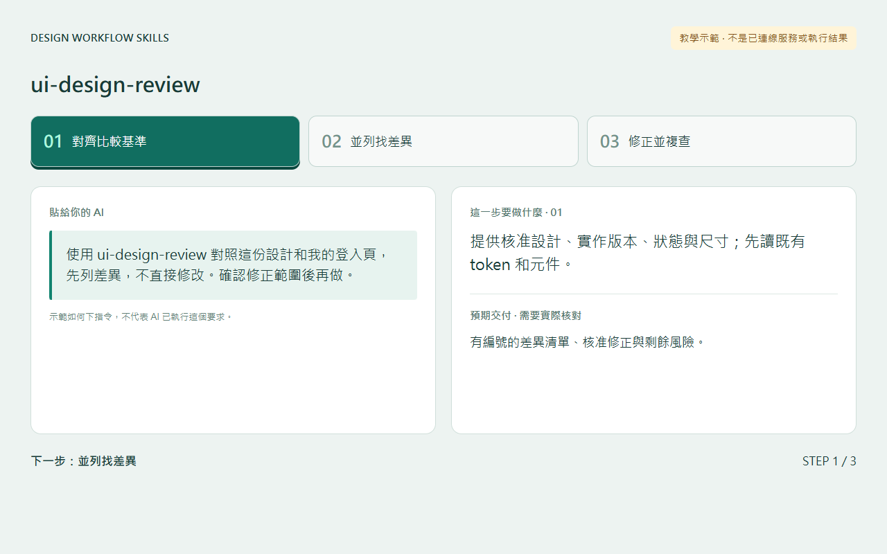
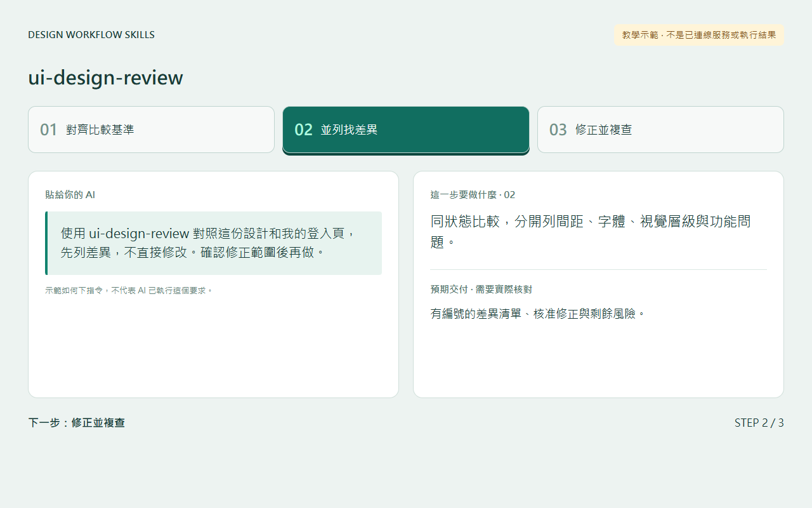
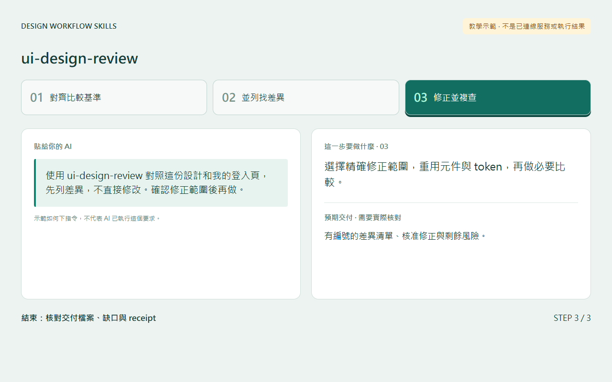

# 對照設計與實作 / Compare design and UI

## 兩句優點 / Two benefits

把視覺差異和功能問題分開，能更快決定先修哪裡。沿用既有元件和 token，減少修一處卻讓其他畫面變樣的風險。

Separate visual differences from functional problems to prioritize corrections. Reusing components and tokens reduces unintended inconsistency across screens.

## 適用專案與階段 / Projects and stages

| 項目 / Item | 繁體中文 | English |
|---|---|---|
| 專案 / Projects | 有核准設計參考的網站、Web App、元件庫與設計系統。 | Websites, web apps, component libraries and design systems with an approved reference. |
| 階段 / Stages | 實作後、設計還原、修正與交付前。 | After implementation, design fidelity review, fixes and pre-delivery. |

**流程示意圖，不是已執行的截圖或驗收證據。 / Instructional diagram, not an execution screenshot or acceptance result.**

**何時用 / When:** 有設計參考，想確認實作還原程度時。 When comparing an implementation with an approved design.

## 啟動前 / Before starting

確認 AI 已載入本 skill，並請它回報實際 SKILL.md 路徑。需要本機檔案、瀏覽器或帳號工具時，先確認該 AI 環境真的提供；工具缺少就標未驗或採核准的只讀替代。

Confirm the agent has loaded this skill and reports its actual SKILL.md path. Check required file/browser/connector access in that host. Missing tools mean unverified work or an approved read-only alternative, not pretend execution.

## Step 1 → 2 → 3

### Step 1 · 對齊比較基準 / Align the baseline

提供核准設計、實作版本、狀態與尺寸；先讀既有 token 和元件。

Provide the approved design, implementation revision, state and viewport; inspect existing tokens/components.

### Step 2 · 並列找差異 / Compare side by side

同狀態比較，分開列間距、字體、視覺層級與功能問題。同時對照[作者的 UX 準則清單](ux-principles.md)：相關內容上下排、正向按鈕在右、驗證與密碼訊息、元件與 token。

Compare the same state; separate spacing, type and hierarchy issues from behavioral defects. Also check the [author's UX principles](ux-principles.md): related content stacked vertically, the positive action on the right, verification and password rules, components and tokens.

### Step 3 · 修正並複查 / Fix and recheck

選擇精確修正範圍，重用元件與 token，再做必要比較。

Approve the exact fixes, reuse components/tokens, and repeat affected comparisons.

## 可直接貼給 AI / Copy this prompt

> 使用 ui-design-review 對照這份設計和我的登入頁，先列差異，不直接修改。確認修正範圍後再做。

> Use ui-design-review to compare this design with my login page. List differences first; wait for the correction scope before editing.

## 你會拿到 / Expected output

有編號的差異清單（視覺、功能與 KUX 準則項目）、核准修正與剩餘風險。

Numbered differences (visual, functional and KUX principle findings), approved corrections and remaining risks.

## 和其他 skill 合用 / Combine with others

先 states-preview-loop；功能修正後接 a11y-review。

Use states-preview-loop first; follow relevant fixes with a11y-review.

共用一次設定確認；多 skill 不會把權限疊加，也不能讓兩個 writer 同時改同一檔。

Reuse one settings preflight. Combining skills does not accumulate permissions or permit overlapping writers.

## 自訂與選填 / Customize and optional

比較頁面、狀態、尺寸、參考版本、修正檔案與優先順序；可只 review 不修。

Pages, states, viewports, reference revision, fix files and priorities; review-only is allowed.

可用自然語言說「這次修改設定」「只用這次，不保存」「停止在草稿」。共用偏好可由原工具包的 `scripts/settings.py` 選單修改；此選單不會替你編輯第三方 skill，也不執行 runner。

Say “change settings for this run,” “use once without saving,” or “stop at the draft.” The toolkit's `scripts/settings.py` edits shared preferences; it does not edit third-party skills or execute the runner.

個別任務的節點、比較尺寸、標準與方案 ID 等參數通常在當次對話指定，不全是 profile 可保存的欄位。保存格式只接受 [已定義欄位](../../optional-skill-profile/references/fields.md)；沒有相符欄位就保留在當次範圍，不把它偽裝成永久設定。

Task-specific nodes, comparison dimensions, standards and variant IDs are generally supplied in the current conversation, not all persisted profile fields. Save only [supported fields](../../optional-skill-profile/references/fields.md); otherwise keep the choice session-scoped.

## 結束與交接 / Finish and hand off

1. 對照上方「你會拿到」確認交付，要求列出本輪版本／範圍、已做、未做與阻擋。 / Check the expected output above and request scope/revision, completed work, gaps and blockers.
2. 看實際檔案或 receipt；不能把計畫、啟動程序或 ACK 當成工作完成。 / Inspect actual artifacts/receipts; a plan, process launch or ACK alone is not completion.
3. 可以說「到這裡停止，只交摘要」。若有臨時預覽或 overlay，說明還在運作的資源；只處理本輪且獲准的資源，不關別人的服務。 / Say “stop here and summarize.” Disclose remaining preview/overlay resources; only handle resources owned and authorized for this run.
4. Git push、發布、寄送、更新紀錄或未來排程，都需要另外指定本次範圍。 / Git push, publishing, sending, record updates and future schedules require separate task scope.

## 邊界 / Limits

未取到瀏覽器畫面就標視覺未驗，不捏造像素差異。準則項目是通常建議，例外要寫明原因，不能默默放過。

Without browser evidence, mark visual checks unverified; never invent pixel measurements. Principle items are recommendations; an exception is recorded with its reason, never waived silently.

[額外檢查的 UX 準則 / UX principles checked here](ux-principles.md)

[回到 skill 規則 / Skill instructions](../SKILL.md)

## 每步畫面 / Step pictures

本機排版的教學示範，不代表已連接帳號或完成操作。 / Locally rendered instructional examples, not live account or agent execution.

### English

| Step 1 | Step 2 | Step 3 |
|---|---|---|
|  |  |  |

### 繁體中文

| Step 1 | Step 2 | Step 3 |
|---|---|---|
|  |  |  |
