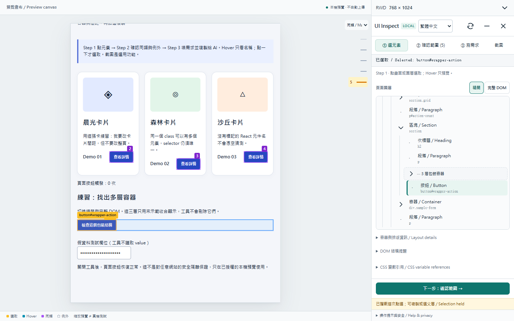
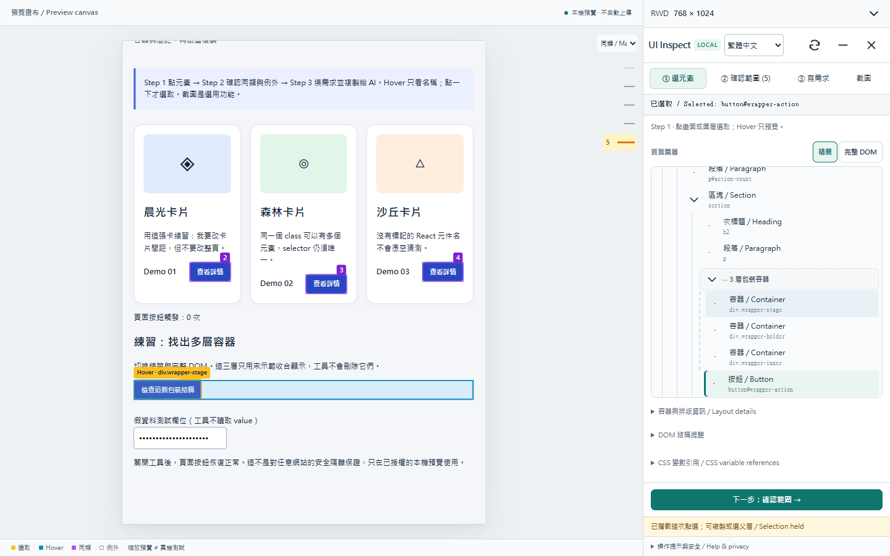
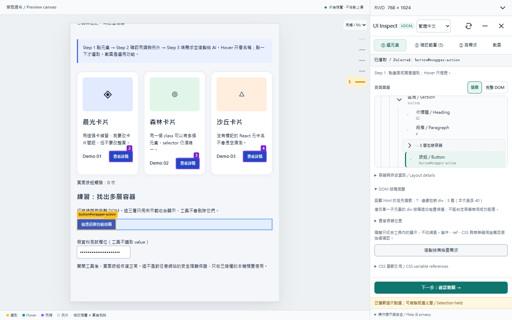
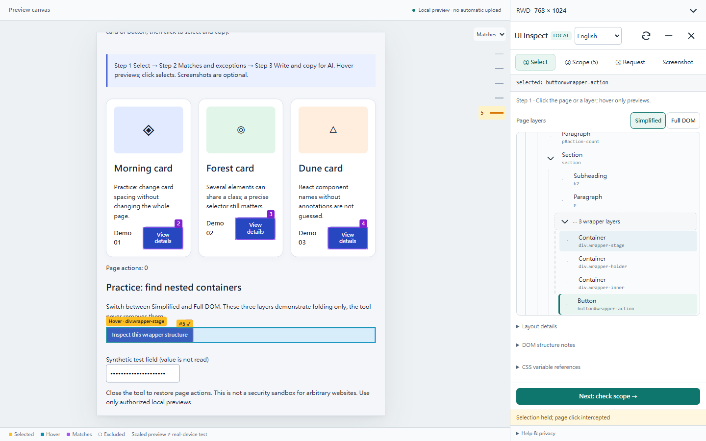
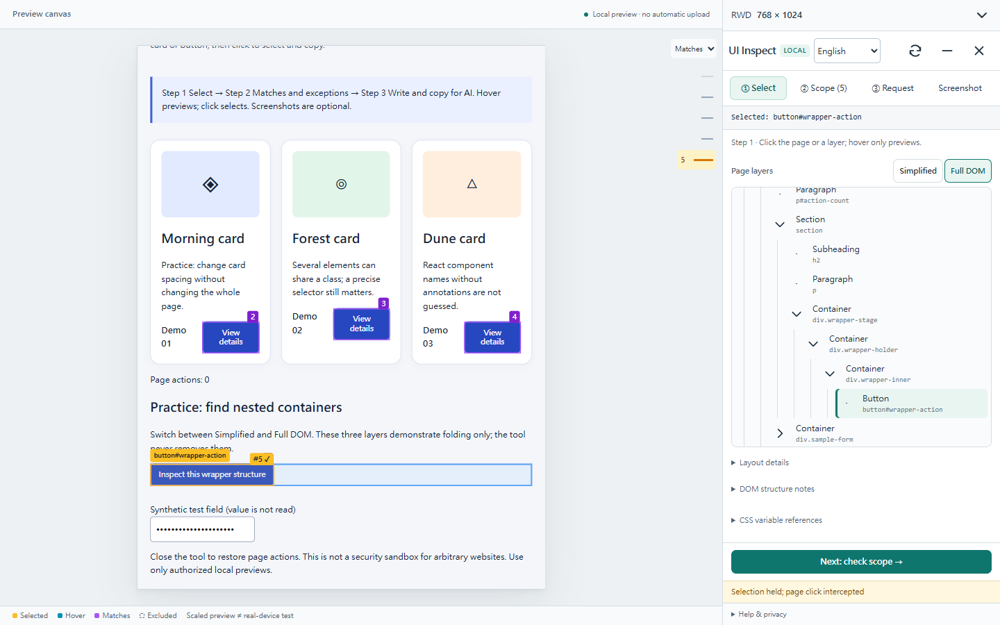
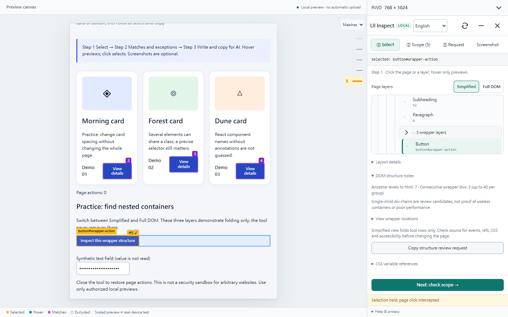

# DOM wrapper review / DOM 包裝層檢查

## 繁體中文：開始、檢查、交給 AI

適用於已授權的本機 HTML、React、Vue 等 DOM 網頁，主要用在溝通修改與重構前的盤點。沿用 [啟動方式](usage.md)，在「① 選元素」操作。這是 DOM 檢視，不會讀取 React 元件樹。

### Step 1：先用精簡模式找到內容

預設「精簡」把連續的單一子元素 div 顯示成「⋯ 3 層包裝容器」。按鈕、標題等內容仍顯示，原本的網頁結構與排版完全保留。選元素後 RWD 自動收合，Hover 不會收合。

### Step 2：展開個別容器，或切完整 DOM

點包裝列的箭頭，或用 Tab 移到該列後按右方向鍵，可看每一層。Hover／鍵盤焦點會 Highlight 對應容器，點名稱或按 Enter 才選取。上下鍵移動，左鍵收合或回父層。「完整 DOM」恢復原有的階層排列，不丟失選取、同類例外、報告與手寫需求。

### Step 3：複製檢查需求，再由 AI 讀原始碼

選一個容器或其內容，打開「DOM 結構提醒」。查看祖先層數、連續包裝候選，需要時展開「查看容器位置」。按「複製結構檢查需求」會帶上選取位置、候選位置、檢查限制，以及你在「③ 寫需求」輸入的原文。成功會顯示已複製通知，拒絕時提供手動複製。

審閱後自行貼給 AI，請它搜尋實際來源與使用位置，確認排版、RWD、事件、ref、CSS selector、焦點及無障礙用途。純粹分組才考慮 Fragment，必要容器保留。AI 修改後另驗證外觀與互動。工具不會刪除容器、不會自動送出、不會從層數推斷速度。結束時關閉工具，依啟動方式移除暫時接線。

## English: start, inspect, hand off

Use this on an authorised local DOM page such as HTML, React or Vue, while describing changes or preparing a refactor. Follow [activation](usage.md), then open **① Select**. This is a DOM view, not a React component tree.

### Step 1: find the content in Simplified view

The default **Simplified** view groups consecutive single-child divs into a row such as **⋯ 3 wrapper layers**. Content remains selectable. The inspected page's markup and layout are unchanged. Selecting collapses RWD settings, while hovering does not.

### Step 2: expand layers or switch to Full DOM

Click the group arrow, or Tab to it and press ArrowRight. Each layer can be previewed with hover/focus and selected with a click or Enter. ArrowUp/Down navigates, ArrowLeft collapses or returns to the parent. **Full DOM** restores the nested outline. Switching views preserves selection, matches, exceptions, the editable report and your request.

### Step 3: copy a source-review request

Select a wrapper or its content, open **DOM structure notes**, and inspect ancestor depth and candidate wrappers. **View wrapper locations** reveals their selectors. **Copy structure review request** includes the selected locator, candidate locators, source-review precautions and your original text from **③ Request**. Success shows a notification. Denied clipboard access offers manual copying.

Review and paste into your chosen AI chat. Ask the AI to find source and usage sites, then check layout, RWD, events, refs, selectors, focus and accessibility. Consider Fragment only for pure grouping, retain necessary containers, and verify visuals and interactions after any authorised change. The tool does not delete nodes, send automatically or infer speed from depth. Close it and remove temporary integration when finished.

## Rules and limits / 規則與限制

- **Conservative display rule:** a div with one element child, no non-whitespace direct text, no open shadow root, and no attributes other than class/style. Two or more consecutive matches can fold. ID, role, aria, component annotation, focus and event attributes keep a node visible. This does not detect all event listeners or CSS dependencies.
- **保守顯示規則：** div 只有一個元素子節點、沒有直接文字、沒有可見 shadow root，而且屬性只有 class／style，連續兩層以上才收合。這不代表沒有事件監聽、CSS 或其他必要用途。
- Each folded group stops at 40 wrappers and continues lazily. Both views retain the existing first-100-children-per-parent limit and omit script/style/meta/link nodes. Ancestor-depth display stops at 200 and uses `+` when truncated. Neither mode claims a complete source or whole-project audit.
- 每組最多 40 層，後續按需展開。兩種模式每層最多顯示 100 個子元素，略過 script／style／meta／link；深度最多計到 200，超出顯示 `+`。「完整」指不折疊包裝列，不代表無限制的全專案盤點。
- View preference lasts for the active inspector session. Refresh the tree after structural changes. Missing candidates are not a clean bill of health, and no severity threshold or performance grade is assigned.
- 偏好只保留在目前工具 session；網頁結構變更後按更新圖層。沒有候選不代表沒有可優化內容，也不會按層數打分數。

All pictures use the bundled synthetic demo, not customer data. These updated screenshots cover the new controls; earlier videos do not yet show them. / 截圖皆為工具內建假資料，舊影片尚未包含本功能。

[React Fragment](https://react.dev/reference/react/Fragment) explains grouping without adding a DOM wrapper. [Chrome DOM-size guidance](https://developer.chrome.com/docs/performance/insights/dom-size) explains performance investigation. A source review must still establish whether a particular wrapper can be removed safely.
