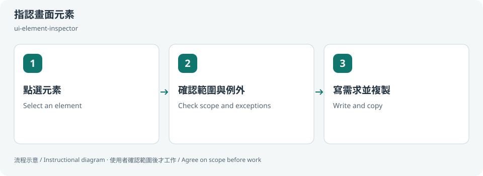
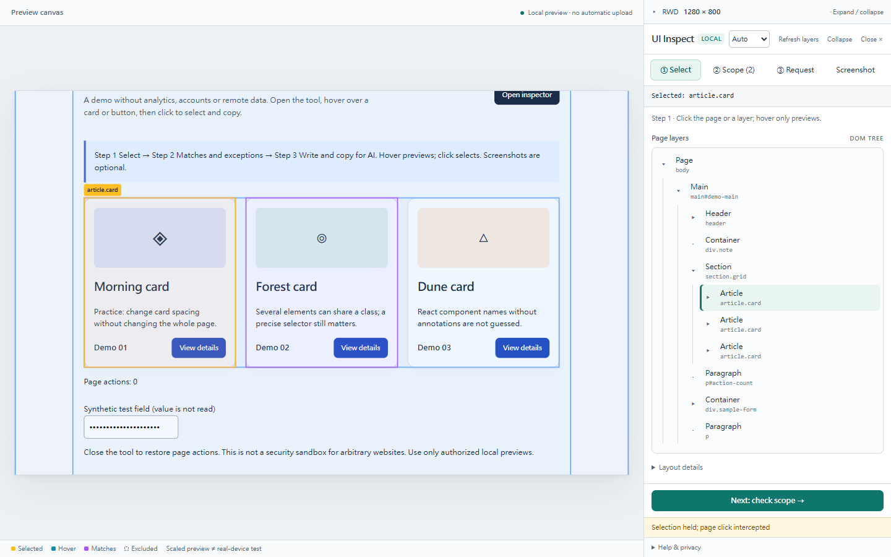
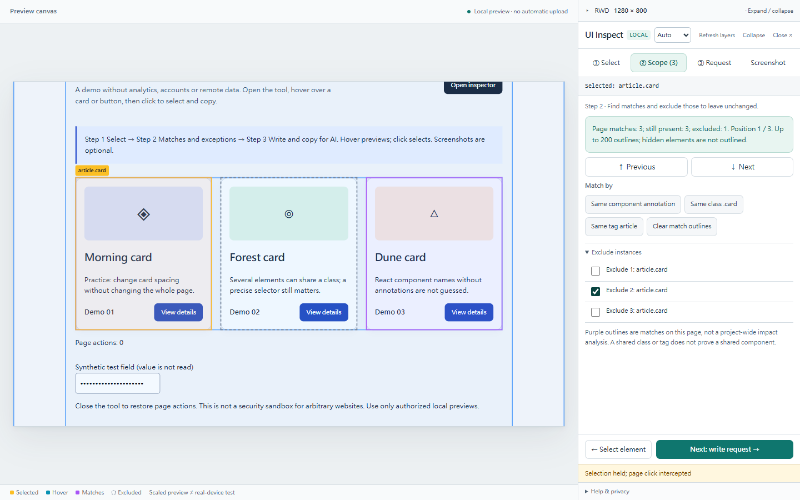
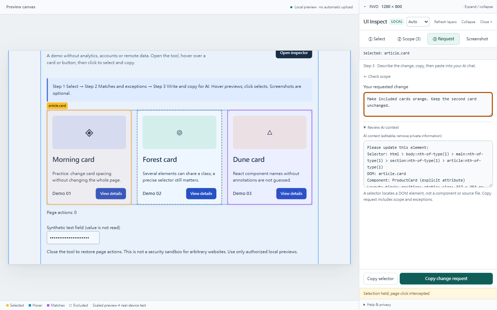
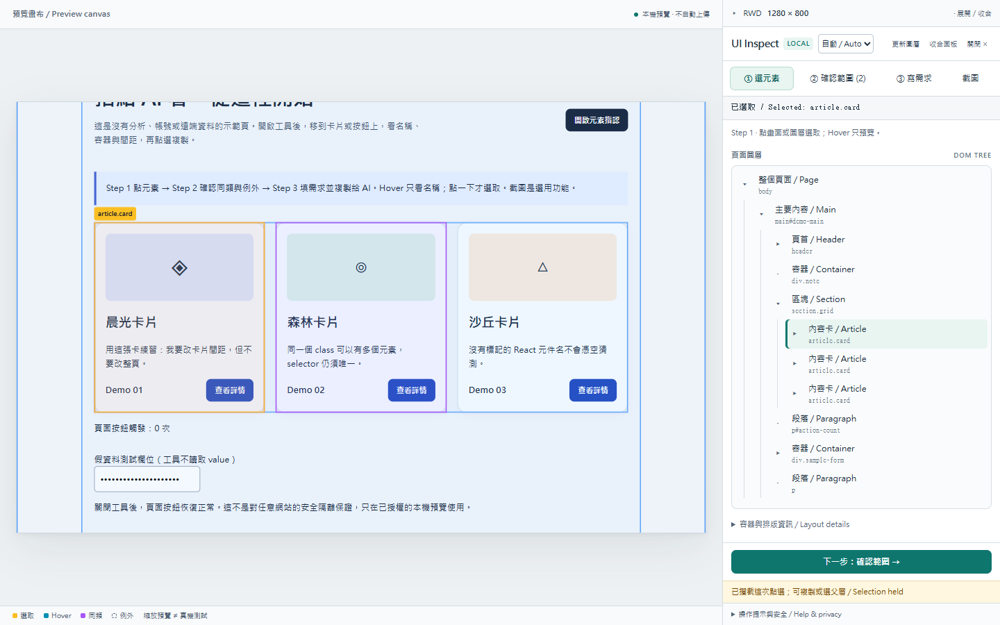
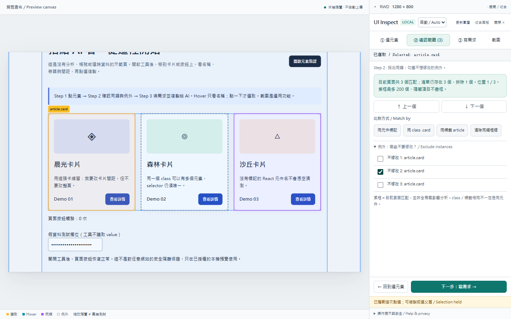
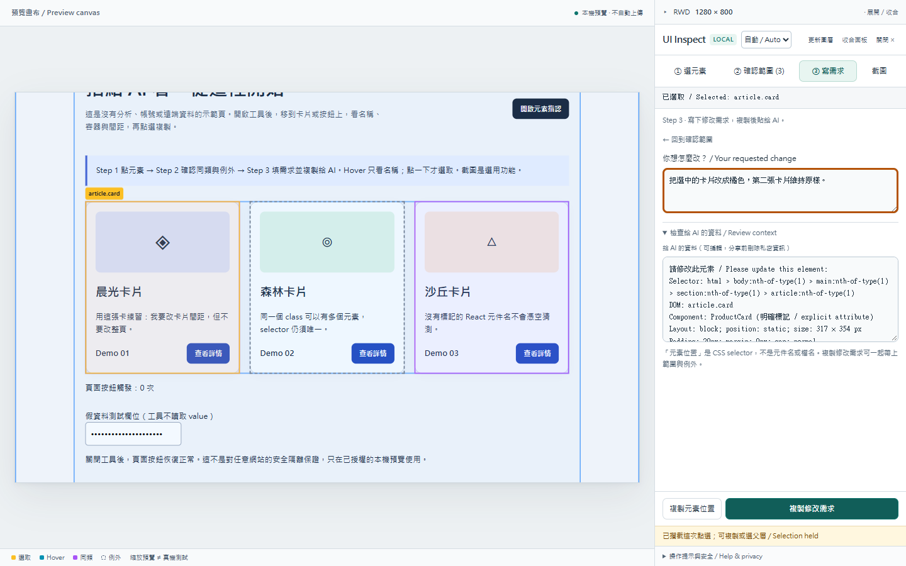

# 指認畫面元素 / Point at UI elements

**DOM 太多層？ / Too many DOM layers?** [精簡 → 展開／完整 DOM → 複製結構檢查需求，含中英逐步截圖 / Illustrated wrapper review](dom-structure.md).

## 兩句優點 / Two benefits

直接點畫面就能取得元素位置與容器，不必先學會寫 selector。把同類位置、例外和修改需求一起複製，讓交辦範圍更清楚。

Point at the page to identify an element and its containers without writing a selector. Copy matches, exceptions and the requested change together for a clearer handoff.

## 適用專案與階段 / Projects and stages

| 項目 / Item | 繁體中文 | English |
|---|---|---|
| 專案 / Projects | 本機可讀 DOM 的 Web 專案；外框指認需要同來源，不能直接讀原生 App 或 canvas 內部。 | Local DOM-based web projects; docked inspection needs same origin, not native apps or canvas internals. |
| 階段 / Stages | 溝通修改、設計 review、RWD 檢查與缺陷回報。 | Change requests, design review, responsive checks and defect reporting. |

**流程示意圖，不是已執行的截圖或驗收證據。 / Instructional diagram, not an execution screenshot or acceptance result.**

**何時用 / When:** 不知道 class、容器或元素名稱，想精準告訴 AI 要改哪裡。 When you need to identify a UI element or container for an AI change request.

## 啟動前 / Before starting

確認 AI 已載入本 skill，並請它回報實際 SKILL.md 路徑。需要本機檔案、瀏覽器或帳號工具時，先確認該 AI 環境真的提供；工具缺少就標未驗或採核准的只讀替代。

Confirm the agent has loaded this skill and reports its actual SKILL.md path. Check required file/browser/connector access in that host. Missing tools mean unverified work or an approved read-only alternative, not pretend execution.

## Step 1 → 2 → 3

### Step 1 · 點選元素 / Select an element

移到已核准的同來源工作區預覽，自動開啟 UI Inspect 與 DOM 樹；點畫面或 DOM 名稱選取。Hover 只預覽，不改選取與需求。

Hover the approved same-origin workspace preview to open UI Inspect and its DOM tree automatically. Click the page or a DOM name to select. Hover preserves the selected element and request.

### Step 2 · 確認範圍與例外 / Check scope and exceptions

看同類數量，點右側編號刻度或上下一個找位置，勾選不修改的例外。「本次」只顯示要修改的項目；沒有清單就不顯示刻度。

Review matches, jump with numbered ticks or previous/next, and exclude items you want to keep. To copy shows included items only; an empty list hides the rail.

### Step 3 · 寫需求並複製 / Write and copy

輸入需求，檢查內容，再複製貼給 AI；截圖是選用。

Write the change, review the context and copy/paste it into AI. Screenshots are optional.

## 可直接貼給 AI / Copy this prompt

> 使用 ui-element-inspector，在已核准的本機預覽開 DOM 圖層。我想選卡片、排除第二張，再複製修改需求。

> Use ui-element-inspector in an approved local preview. I want to select cards, exclude the second, and copy the change request.

## 你會拿到 / Expected output

元素定位、影響清單、例外與修改需求的合併文案。

Combined locator, current-page matches, exclusions and requested change.

## 和其他 skill 合用 / Combine with others

接 ui-design-review 或已授權的實作流程；AI 仍需查原始碼。

Hand off to ui-design-review or an authorized implementation workflow; source lookup is still required.

共用一次設定確認；多 skill 不會把權限疊加，也不能讓兩個 writer 同時改同一檔。

Reuse one settings preflight. Combining skills does not accumulate permissions or permit overlapping writers.

## 常見搭配平台 / Works well with

常見搭配：**GitHub, Vercel, Cloudflare Pages, React, Next.js, Vite**。這些名稱用來說明常見工作情境與提高 discoverability，不代表官方合作、內建 connector、預設帳號權限或已完成整合。

Common workflow companions: **GitHub, Vercel, Cloudflare Pages, React, Next.js, Vite**. These names describe common use cases and improve discoverability; they do not imply endorsement, bundled integrations, account access or verified connectivity.

## 自訂與選填 / Customize and optional

預設或自訂 CSS 尺寸、橫直、Fit／100%、同類方式、例外、需求文案；Windows launcher 另選用。

Preset/custom CSS size, rotation, Fit/100%, matching method, exclusions and request text; Windows launcher is optional.

可用自然語言說「這次修改設定」「只用這次，不保存」「停止在草稿」。共用偏好可由原工具包的 `scripts/settings.py` 選單修改；此選單不會替你編輯第三方 skill，也不執行 runner。

Say “change settings for this run,” “use once without saving,” or “stop at the draft.” The toolkit's `scripts/settings.py` edits shared preferences; it does not edit third-party skills or execute the runner.

個別任務的節點、比較尺寸、標準與方案 ID 等參數通常在當次對話指定，不全是 profile 可保存的欄位。保存格式只接受 [已定義欄位](../../optional-skill-profile/references/fields.md)；沒有相符欄位就保留在當次範圍，不把它偽裝成永久設定。

Task-specific nodes, comparison dimensions, standards and variant IDs are generally supplied in the current conversation, not all persisted profile fields. Save only [supported fields](../../optional-skill-profile/references/fields.md); otherwise keep the choice session-scoped.

## 結束與交接 / Finish and hand off

1. 對照上方「你會拿到」確認交付，要求列出本輪版本／範圍、已做、未做與阻擋。 / Check the expected output above and request scope/revision, completed work, gaps and blockers.
2. 看實際檔案或 receipt；不能把計畫、啟動程序或 ACK 當成工作完成。 / Inspect actual artifacts/receipts; a plan, process launch or ACK alone is not completion.
3. 可以說「到這裡停止，只交摘要」。若有臨時預覽或 overlay，說明還在運作的資源；只處理本輪且獲准的資源，不關別人的服務。 / Say “stop here and summarize.” Disclose remaining preview/overlay resources; only handle resources owned and authorized for this run.
4. Git push、發布、寄送、更新紀錄或未來排程，都需要另外指定本次範圍。 / Git push, publishing, sending, record updates and future schedules require separate task scope.

UI Inspect：按「關閉 ×」或 Esc 移除 overlay；截圖模式先按一次 Esc 恢復，再按一次關閉。 / Close or Escape removes the inspector; in screenshot mode, Escape first restores the panel and a second Escape closes it.

## 邊界 / Limits

只比對目前 DOM，不能證明全專案使用位置或 React 原始檔名。

Current DOM matches do not prove all project usages or React source filenames.

[回到 skill 規則 / Skill instructions](../SKILL.md)

## 每步畫面 / Step pictures

實際本機示範畫面 / Actual local demo captures.

### English

| Step 1 | Step 2 | Step 3 |
|---|---|---|
|  |  |  |

### 繁體中文

| Step 1 | Step 2 | Step 3 |
|---|---|---|
|  |  |  |
