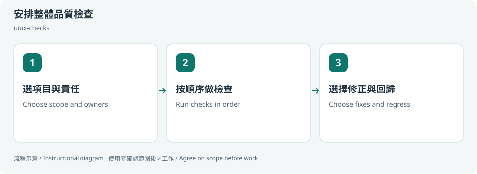

# 安排整體品質檢查 / Coordinate UI quality

## 兩句優點 / Two benefits

用一個協調流程串起多個檢查，避免相同設定與測試重複處理。依需求選範圍，讓小修改不必每次都變成整站重驗。

Coordinate several checks without repeating the same setup and evidence gathering. Scope selection keeps small changes from turning into unnecessary whole-site audits.

## 適用專案與階段 / Projects and stages

| 項目 / Item | 繁體中文 | English |
|---|---|---|
| 專案 / Projects | 已有介面或原始碼的 Web 專案、設計系統與多頁網站。 | Web projects, design systems and multi-page sites with UI or source to inspect. |
| 階段 / Stages | 規劃驗收、開發檢查、交付與回歸。 | Acceptance planning, development review, delivery and regression. |

**流程示意圖，不是已執行的截圖或驗收證據。 / Instructional diagram, not an execution screenshot or acceptance result.**

**何時用 / When:** 想組合多個 skill，有順序地驗 RWD、設計與工程品質。 When combining skills for responsive, design and engineering checks.

## 啟動前 / Before starting

確認 AI 已載入本 skill，並請它回報實際 SKILL.md 路徑。需要本機檔案、瀏覽器或帳號工具時，先確認該 AI 環境真的提供；工具缺少就標未驗或採核准的只讀替代。

Confirm the agent has loaded this skill and reports its actual SKILL.md path. Check required file/browser/connector access in that host. Missing tools mean unverified work or an approved read-only alternative, not pretend execution.

## Step 1 → 2 → 3

### Step 1 · 選項目與責任 / Choose scope and owners

只選相關頁面與項目；確認各 skill 實際存在並指定 owner。

Select relevant pages/checks, resolve installed skills and assign owners.

### Step 2 · 按順序做檢查 / Run checks in order

先來源、狀態預覽、設計對照，再無障礙與必要工程檢查。

Inspect source, preview states, compare design, then check accessibility and relevant engineering behavior.

### Step 3 · 選擇修正與回歸 / Choose fixes and regress

合併證據與問題，選修正範圍後才做必要回歸。

Consolidate evidence/findings, agree on fixes and run scoped regressions.

## 可直接貼給 AI / Copy this prompt

> 使用 uiux-checks，組合 states-preview-loop、ui-design-review、a11y-review，只看這個頁面。先列計畫與必要指令，勿自動部署。

> Use uiux-checks with states-preview-loop, ui-design-review and a11y-review for this page only. Show the plan and required commands; do not deploy.

## 你會拿到 / Expected output

共用覆蓋表、問題清單與分階段交付狀態。

A shared coverage ledger, issue list and phased delivery status.

## 和其他 skill 合用 / Combine with others

統一協調其他專項；不可循環呼叫自己。

Coordinates specialists; do not recursively invoke the coordinator.

共用一次設定確認；多 skill 不會把權限疊加，也不能讓兩個 writer 同時改同一檔。

Reuse one settings preflight. Combining skills does not accumulate permissions or permit overlapping writers.

## 自訂與選填 / Customize and optional

品質項目、階段順序、skill 組合、check ID、argv 與 timeout；預設只列計畫，選定後才執行。

Categories, phase order, skills, check IDs, argv and timeout; planning is the default before approved execution.

可用自然語言說「這次修改設定」「只用這次，不保存」「停止在草稿」。共用偏好可由原工具包的 `scripts/settings.py` 選單修改；此選單不會替你編輯第三方 skill，也不執行 runner。

Say “change settings for this run,” “use once without saving,” or “stop at the draft.” The toolkit's `scripts/settings.py` edits shared preferences; it does not edit third-party skills or execute the runner.

個別任務的節點、比較尺寸、標準與方案 ID 等參數通常在當次對話指定，不全是 profile 可保存的欄位。保存格式只接受 [已定義欄位](../../optional-skill-profile/references/fields.md)；沒有相符欄位就保留在當次範圍，不把它偽裝成永久設定。

Task-specific nodes, comparison dimensions, standards and variant IDs are generally supplied in the current conversation, not all persisted profile fields. Save only [supported fields](../../optional-skill-profile/references/fields.md); otherwise keep the choice session-scoped.

## 結束與交接 / Finish and hand off

1. 對照上方「你會拿到」確認交付，要求列出本輪版本／範圍、已做、未做與阻擋。 / Check the expected output above and request scope/revision, completed work, gaps and blockers.
2. 看實際檔案或 receipt；不能把計畫、啟動程序或 ACK 當成工作完成。 / Inspect actual artifacts/receipts; a plan, process launch or ACK alone is not completion.
3. 可以說「到這裡停止，只交摘要」。若有臨時預覽或 overlay，說明還在運作的資源；只處理本輪且獲准的資源，不關別人的服務。 / Say “stop here and summarize.” Disclose remaining preview/overlay resources; only handle resources owned and authorized for this run.
4. Git push、發布、寄送、更新紀錄或未來排程，都需要另外指定本次範圍。 / Git push, publishing, sending, record updates and future schedules require separate task scope.

## 邊界 / Limits

runner 的 skill 計畫是待辦，並非 AI 已完成審查。

A runner skill plan is a queue, not completed AI review.

[回到 skill 規則 / Skill instructions](../SKILL.md)
