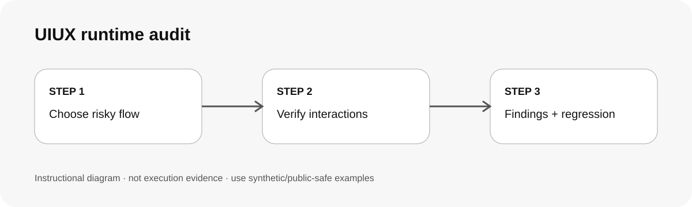

# UIUX 執行期檢查 / Audit runtime UI/UX

## 兩句優點 / Two benefits

把「看起來差不多」拆成可點擊、狀態清楚、手機可用、鍵盤可達與隱私不外露等實際證據。沒有 browser/runtime 時明確標未驗，避免把 source review 冒充完整 UX QA。

Turn "looks fine" into evidence about reachability, state clarity, mobile use, keyboard access and privacy. When runtime access is missing, mark behavior unverified instead of presenting source review as complete UX QA.

## 適用專案與階段 / Projects and stages

| 項目 / Item | 繁體中文 | English |
|---|---|---|
| 專案 / Projects | Web app、dashboard、表單、mobile web 與互動型介面。 | Web apps, dashboards, forms, mobile web and interactive interfaces. |
| 階段 / Stages | 開發中、回歸、交付前與線上問題調查。 | Development, regression, pre-delivery and issue investigation. |

**流程示意圖，不是已執行的截圖或驗收證據。 / Instructional diagram, not an execution screenshot or acceptance result.**

**何時用 / When:** 需要確認使用者實際操作是否受阻，而不是只做視覺 fidelity review。 / When actual interaction quality matters beyond visual fidelity.

## 啟動前 / Before starting

確認可安全存取的環境、viewport、測試帳號/假資料與禁止動作。沒有安全 preview 就 source-only 並標 unverified。  
Confirm a safe environment, viewport, synthetic/test data and prohibited actions. Without a safe preview, stay source-only and mark behavior unverified.

## Step 1 → 2 → 3

### Step 1 · 先走最高風險路徑 / Start with the highest-risk path
先看主要決策、錯誤恢復、表單或核心任務。  
Review primary decisions, recovery, forms or the core task first.

### Step 2 · 驗互動與狀態 / Verify interaction and states
檢查 reachability、overlay、mobile、keyboard、loading/error/partial 與 privacy。  
Check reachability, overlays, mobile, keyboard, loading/error/partial states and privacy.

### Step 3 · 寫 finding＋必要回歸 / Record findings and regress
每項附 ID、證據、impact、修正建議和 verified/inferred/unverified。  
Give each finding an ID, evidence, impact, correction and verification status.

## 可直接貼給 AI / Copy this prompt

> 使用 uiux-runtime-audit，只檢查［頁面/流程］。用假資料，先驗主要操作、手機、鍵盤、loading/error/partial 狀態與隱私暴露。沒有 browser 證據就標未驗；不要提交真實表單、污染 analytics 或聲稱合規。

> Use uiux-runtime-audit for [page/flow] only. Use synthetic data and verify the primary action, mobile, keyboard, loading/error/partial states and privacy exposure. Mark behavior unverified without browser evidence; do not submit real forms, pollute analytics or claim compliance.

## 你會拿到 / Expected output

Finding IDs、page/state/viewport、證據、impact、修正建議、verified/inferred/unverified。  
Finding IDs, page/state/viewport, evidence, impact, correction and verified/inferred/unverified status.

## 和其他 skill 合用 / Combine with others

可在 ui-design-review 後補 runtime evidence，或把確認問題交 reliable-delivery。  
Use after ui-design-review for runtime evidence or hand confirmed findings to reliable-delivery.

## 常見搭配平台 / Works well with

常見搭配：**Vercel, Cloudflare Pages, Supabase, GitHub, Figma, React, Next.js**。這些名稱用來說明常見工作情境與提高 discoverability，不代表官方合作、內建 connector、預設帳號權限或已完成整合。

Common workflow companions: **Vercel, Cloudflare Pages, Supabase, GitHub, Figma, React, Next.js**. These names describe common use cases and improve discoverability; they do not imply endorsement, bundled integrations, account access or verified connectivity.

## 自訂與選填 / Customize and optional

可指定 viewport、核心 flow、browser/tool、測試資料與禁止動作。 / Specify viewports, core flow, browser/tool, test data and prohibited actions.

## 結束與交接 / Finish and hand off

1. 分開 source evidence 與 browser evidence。 / Separate source and browser evidence.
2. 記錄未測 state。 / Record untested states.
3. 修正後只重驗受影響範圍。 / Recheck the affected scope after fixes.
4. 真實 write/send/deploy 另需授權。 / Real writes/sends/deploys need separate approval.

## 邊界 / Limits

這不是 WCAG、資安、隱私或法規認證。 / This is not WCAG, security, privacy or legal certification.

[回到 skill 規則 / Skill instructions](../SKILL.md)

## 每步畫面 / Step pictures

v0.1 不公開真實工作介面；後續截圖必須用 synthetic fixture 或經完整去識別化。  
v0.1 publishes no real work interface; future captures require synthetic fixtures or full redaction.
