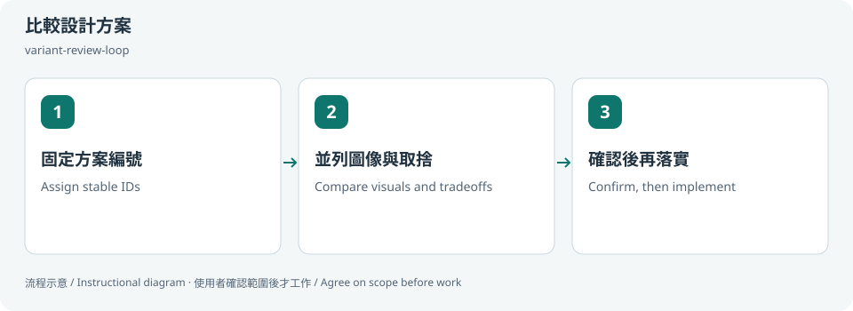

# 比較設計方案 / Compare design directions

## 兩句優點 / Two benefits

穩定編號加上並列圖像，能清楚知道正在討論哪個方案。保留取捨與決策理由，減少反覆改回舊方向的混亂。

Stable IDs and side-by-side visuals make each alternative easy to reference. Recording tradeoffs and decisions reduces confusion when revisiting earlier directions.

## 適用專案與階段 / Projects and stages

| 項目 / Item | 繁體中文 | English |
|---|---|---|
| 專案 / Projects | 網站、App 介面概念、品牌頁面、元件或設計系統的方案探索。 | Website, app UI, brand page, component or design-system exploration. |
| 階段 / Stages | 發想、概念比較與方向收斂，正式實作前。 | Ideation, comparison and convergence before implementation. |

**流程示意圖，不是已執行的截圖或驗收證據。 / Instructional diagram, not an execution screenshot or acceptance result.**

**何時用 / When:** 有多種方向，需要清楚比較、選擇並保留決策紀錄時。 When comparing alternatives and recording a design decision.

## 啟動前 / Before starting

確認 AI 已載入本 skill，並請它回報實際 SKILL.md 路徑。需要本機檔案、瀏覽器或帳號工具時，先確認該 AI 環境真的提供；工具缺少就標未驗或採核准的只讀替代。

Confirm the agent has loaded this skill and reports its actual SKILL.md path. Check required file/browser/connector access in that host. Missing tools mean unverified work or an approved read-only alternative, not pretend execution.

## Step 1 → 2 → 3

### Step 1 · 固定方案編號 / Assign stable IDs

先約定方向數量，為各方案保留永久 ID，不因排序而改號。

Agree on directions and assign permanent IDs that do not change with sorting.

### Step 2 · 並列圖像與取捨 / Compare visuals and tradeoffs

附縮圖、理由與狀態，分清候選、核准與淘汰。

Show thumbnails, rationale and status; separate candidate, approved and retired options.

### Step 3 · 確認後再落實 / Confirm, then implement

使用者決定後，只移植選定特徵，保留理由與修訂紀錄。

After the user decides, apply only chosen properties and retain reasons/revisions.

## 可直接貼給 AI / Copy this prompt

> 使用 variant-review-loop，提供三個真正不同的卡片版面方向，永久 ID A、B、C，並列圖像與取捨。我選定前不要實作。

> Use variant-review-loop for three materially different card layouts with permanent IDs A, B, C. Show visuals and tradeoffs; wait for my choice before implementation.

## 你會拿到 / Expected output

方案圖、穩定編號、選定方向及決策歷史。

Visual alternatives, stable IDs, chosen direction and decision history.

## 和其他 skill 合用 / Combine with others

選定後接 figma-write 或實作，再 ui-design-review。

After selection use figma-write or implementation, then ui-design-review.

共用一次設定確認；多 skill 不會把權限疊加，也不能讓兩個 writer 同時改同一檔。

Reuse one settings preflight. Combining skills does not accumulate permissions or permit overlapping writers.

## 自訂與選填 / Customize and optional

方案數、永久 ID、比較維度、輸出格式、修訂與選擇性封存；只有使用者選定才落實。

Number of variants, stable IDs, comparison criteria, format, revisions and optional archiving; implement after user choice.

可用自然語言說「這次修改設定」「只用這次，不保存」「停止在草稿」。共用偏好可由原工具包的 `scripts/settings.py` 選單修改；此選單不會替你編輯第三方 skill，也不執行 runner。

Say “change settings for this run,” “use once without saving,” or “stop at the draft.” The toolkit's `scripts/settings.py` edits shared preferences; it does not edit third-party skills or execute the runner.

個別任務的節點、比較尺寸、標準與方案 ID 等參數通常在當次對話指定，不全是 profile 可保存的欄位。保存格式只接受 [已定義欄位](../../optional-skill-profile/references/fields.md)；沒有相符欄位就保留在當次範圍，不把它偽裝成永久設定。

Task-specific nodes, comparison dimensions, standards and variant IDs are generally supplied in the current conversation, not all persisted profile fields. Save only [supported fields](../../optional-skill-profile/references/fields.md); otherwise keep the choice session-scoped.

## 結束與交接 / Finish and hand off

1. 對照上方「你會拿到」確認交付，要求列出本輪版本／範圍、已做、未做與阻擋。 / Check the expected output above and request scope/revision, completed work, gaps and blockers.
2. 看實際檔案或 receipt；不能把計畫、啟動程序或 ACK 當成工作完成。 / Inspect actual artifacts/receipts; a plan, process launch or ACK alone is not completion.
3. 可以說「到這裡停止，只交摘要」。若有臨時預覽或 overlay，說明還在運作的資源；只處理本輪且獲准的資源，不關別人的服務。 / Say “stop here and summarize.” Disclose remaining preview/overlay resources; only handle resources owned and authorized for this run.
4. Git push、發布、寄送、更新紀錄或未來排程，都需要另外指定本次範圍。 / Git push, publishing, sending, record updates and future schedules require separate task scope.

## 邊界 / Limits

評審意見不等於使用者同意，persona 投票不是可用性證據。

Reviewer suggestions are not user approval; persona votes are not usability evidence.

[回到 skill 規則 / Skill instructions](../SKILL.md)
