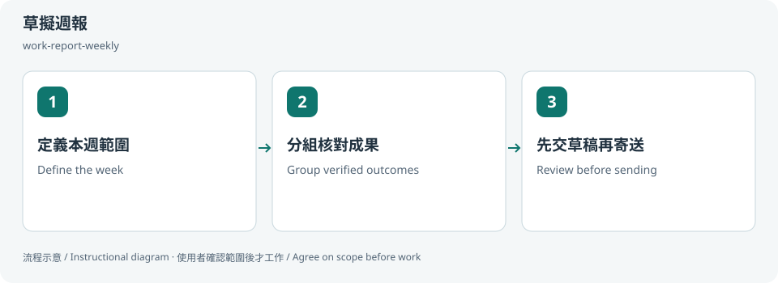
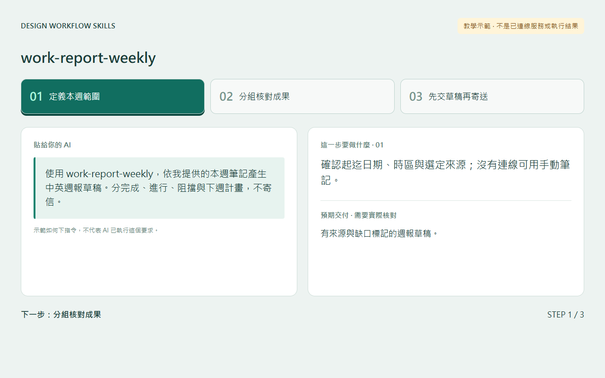
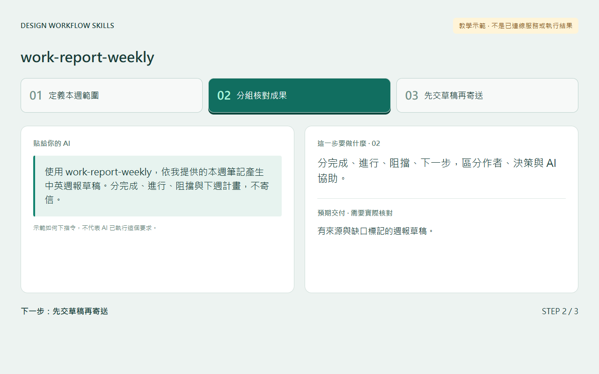
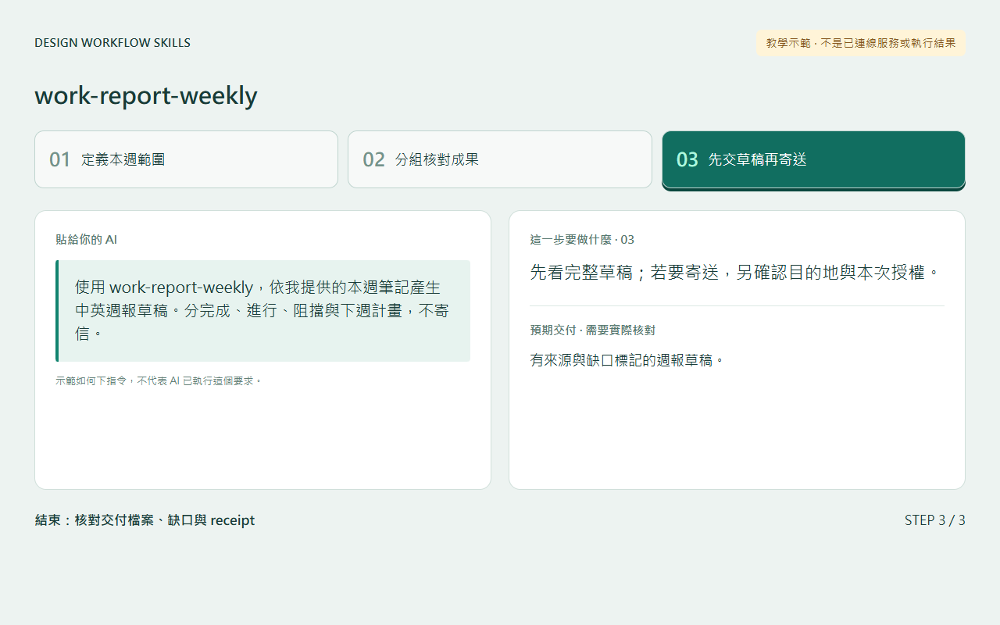

# 草擬週報 / Draft a weekly report

## 兩句優點 / Two benefits

依完成證據整理一週成果，減少從零回想與重寫的負擔。先交草稿再決定寄送，可降低未確認內容或收件對象就外傳的風險。

Draft a week’s outcomes from evidence instead of reconstructing everything from memory. Reviewing the draft before sending reduces the risk of sharing unconfirmed content or using the wrong recipient.

## 適用專案與階段 / Projects and stages

| 項目 / Item | 繁體中文 | English |
|---|---|---|
| 專案 / Projects | 個人工作週報、團隊專案回顧與內容進度彙整。 | Personal weekly reports, team project recaps and content progress summaries. |
| 階段 / Stages | 每週回顧、交接與下週規劃。 | Weekly review, handoff and next-week planning. |

**流程示意圖，不是已執行的截圖或驗收證據。 / Instructional diagram, not an execution screenshot or acceptance result.**

**何時用 / When:** 需要根據有證據的工作紀錄整理一週成果時。 When drafting a weekly summary from evidence-backed records.

## 啟動前 / Before starting

確認 AI 已載入本 skill，並請它回報實際 SKILL.md 路徑。需要本機檔案、瀏覽器或帳號工具時，先確認該 AI 環境真的提供；工具缺少就標未驗或採核准的只讀替代。

Confirm the agent has loaded this skill and reports its actual SKILL.md path. Check required file/browser/connector access in that host. Missing tools mean unverified work or an approved read-only alternative, not pretend execution.

## Step 1 → 2 → 3

### Step 1 · 定義本週範圍 / Define the week

確認起迄日期、時區與選定來源；沒有連線可用手動筆記。

Confirm start/end, timezone and selected sources; use manual notes without a connection.

### Step 2 · 分組核對成果 / Group verified outcomes

分完成、進行、阻擋、下一步，區分作者、決策與 AI 協助。

Group completed/in-progress/blocked/next items; distinguish authorship, decisions and AI help.

### Step 3 · 先交草稿再寄送 / Review before sending

先看完整草稿；若要寄送，另確認目的地與本次授權。

Review the full draft; sending requires a separate destination and task-specific approval.

## 可直接貼給 AI / Copy this prompt

> 使用 work-report-weekly，依我提供的本週筆記產生中英週報草稿。分完成、進行、阻擋與下週計畫，不寄信。

> Use work-report-weekly to draft an English/Traditional Chinese report from my notes. Group completed, in progress, blockers and next week. Do not send email.

## 你會拿到 / Expected output

有來源與缺口標記的週報草稿。

A weekly draft with sources and missing-evidence notes.

## 和其他 skill 合用 / Combine with others

接 work-sync-daily 的核對結果，或內容狀態表。

Consumes work-sync-daily reconciliation or content status matrices.

共用一次設定確認；多 skill 不會把權限疊加，也不能讓兩個 writer 同時改同一檔。

Reuse one settings preflight. Combining skills does not accumulate permissions or permit overlapping writers.

## 自訂與選填 / Customize and optional

起迄日期、時區、專案、語言、輸出位置與個別來源；可不連帳號，寄送與排程不是預設。

Date range, timezone, projects, language, output and separate sources; accounts are optional, sending/scheduling are not defaults.

可用自然語言說「這次修改設定」「只用這次，不保存」「停止在草稿」。共用偏好可由原工具包的 `scripts/settings.py` 選單修改；此選單不會替你編輯第三方 skill，也不執行 runner。

Say “change settings for this run,” “use once without saving,” or “stop at the draft.” The toolkit's `scripts/settings.py` edits shared preferences; it does not edit third-party skills or execute the runner.

個別任務的節點、比較尺寸、標準與方案 ID 等參數通常在當次對話指定，不全是 profile 可保存的欄位。保存格式只接受 [已定義欄位](../../optional-skill-profile/references/fields.md)；沒有相符欄位就保留在當次範圍，不把它偽裝成永久設定。

Task-specific nodes, comparison dimensions, standards and variant IDs are generally supplied in the current conversation, not all persisted profile fields. Save only [supported fields](../../optional-skill-profile/references/fields.md); otherwise keep the choice session-scoped.

## 結束與交接 / Finish and hand off

1. 對照上方「你會拿到」確認交付，要求列出本輪版本／範圍、已做、未做與阻擋。 / Check the expected output above and request scope/revision, completed work, gaps and blockers.
2. 看實際檔案或 receipt；不能把計畫、啟動程序或 ACK 當成工作完成。 / Inspect actual artifacts/receipts; a plan, process launch or ACK alone is not completion.
3. 可以說「到這裡停止，只交摘要」。若有臨時預覽或 overlay，說明還在運作的資源；只處理本輪且獲准的資源，不關別人的服務。 / Say “stop here and summarize.” Disclose remaining preview/overlay resources; only handle resources owned and authorized for this run.
4. Git push、發布、寄送、更新紀錄或未來排程，都需要另外指定本次範圍。 / Git push, publishing, sending, record updates and future schedules require separate task scope.

## 邊界 / Limits

安裝 skill 不會每週自動執行，也不代表可寄信。

Installing a skill does not schedule weekly runs or authorize email.

[回到 skill 規則 / Skill instructions](../SKILL.md)

## 每步畫面 / Step pictures

本機排版的教學示範，不代表已連接帳號或完成操作。 / Locally rendered instructional examples, not live account or agent execution.

### English

| Step 1 | Step 2 | Step 3 |
|---|---|---|
|  |  |  |

### 繁體中文

| Step 1 | Step 2 | Step 3 |
|---|---|---|
|  |  |  |
