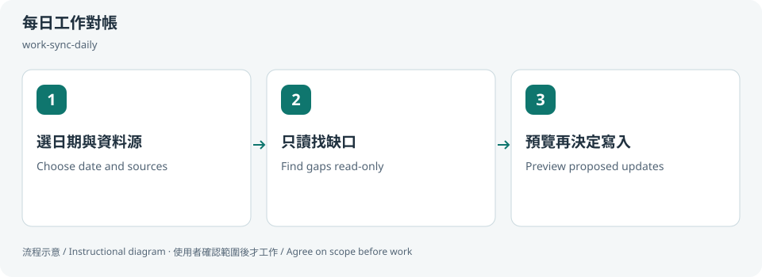

# 每日工作對帳 / Reconcile daily work

## 兩句優點 / Two benefits

先只讀對帳，能看出遺漏與重複，而不立即改動原始紀錄。用明確 before／after 表格批准更新，讓同步結果更可追蹤。

Read-only reconciliation reveals gaps and duplicates before changing records. Explicit before/after approvals make updates easier to trace.

## 適用專案與階段 / Projects and stages

| 項目 / Item | 繁體中文 | English |
|---|---|---|
| 專案 / Projects | 個人、多專案或團隊的工作紀錄；可用手動筆記或選擇性日曆／Jira。 | Personal, multi-project or team work records using notes or optional Calendar/Jira. |
| 階段 / Stages | 每日整理、同步前與週報準備。 | Daily reconciliation, before updates and weekly-report preparation. |

**流程示意圖，不是已執行的截圖或驗收證據。 / Instructional diagram, not an execution screenshot or acceptance result.**

**何時用 / When:** 想把當日紀錄、日曆或 Jira 缺口整理清楚時。 When reconciling daily notes with optional Calendar or Jira records.

## 啟動前 / Before starting

確認 AI 已載入本 skill，並請它回報實際 SKILL.md 路徑。需要本機檔案、瀏覽器或帳號工具時，先確認該 AI 環境真的提供；工具缺少就標未驗或採核准的只讀替代。

Confirm the agent has loaded this skill and reports its actual SKILL.md path. Check required file/browser/connector access in that host. Missing tools mean unverified work or an approved read-only alternative, not pretend execution.

## Step 1 → 2 → 3

### Step 1 · 選日期與資料源 / Choose date and sources

指定日期、時區與各別授權來源，也可只用手動筆記。

Choose date/timezone and separately authorized sources; manual notes are sufficient.

### Step 2 · 只讀找缺口 / Find gaps read-only

先核對 ID、重複和實際交付，日曆時段不當工作完成證明。

Match IDs, duplicates and deliverables; calendar duration is not completion evidence.

### Step 3 · 預覽再決定寫入 / Preview proposed updates

列 before/after 和證據；只有精確批准的更新才能寫入並讀回。

Show before/after and evidence; apply and read back only explicitly approved updates.

## 可直接貼給 AI / Copy this prompt

> 使用 work-sync-daily，只用我貼的今天筆記對帳。先產只讀缺口表，不連帳號、不改日曆或 Jira。

> Use work-sync-daily with today’s pasted notes only. Produce a read-only gap report; do not connect accounts or change Calendar/Jira.

## 你會拿到 / Expected output

配對結果、缺口及待批准的更新表。

Matched records, gaps and a proposed update table.

## 和其他 skill 合用 / Combine with others

結果可交 work-report-weekly；來源設定共用 optional-skill-profile。

Can feed work-report-weekly; share source preferences through optional-skill-profile.

共用一次設定確認；多 skill 不會把權限疊加，也不能讓兩個 writer 同時改同一檔。

Reuse one settings preflight. Combining skills does not accumulate permissions or permit overlapping writers.

## 自訂與選填 / Customize and optional

日期、時區、included／excluded projects、各來源開關、日曆 ID 與私人事件排除；更新需另批。

Date, timezone, included/excluded projects, source toggles, calendar IDs and private-event exclusions; approve writes separately.

可用自然語言說「這次修改設定」「只用這次，不保存」「停止在草稿」。共用偏好可由原工具包的 `scripts/settings.py` 選單修改；此選單不會替你編輯第三方 skill，也不執行 runner。

Say “change settings for this run,” “use once without saving,” or “stop at the draft.” The toolkit's `scripts/settings.py` edits shared preferences; it does not edit third-party skills or execute the runner.

個別任務的節點、比較尺寸、標準與方案 ID 等參數通常在當次對話指定，不全是 profile 可保存的欄位。保存格式只接受 [已定義欄位](../../optional-skill-profile/references/fields.md)；沒有相符欄位就保留在當次範圍，不把它偽裝成永久設定。

Task-specific nodes, comparison dimensions, standards and variant IDs are generally supplied in the current conversation, not all persisted profile fields. Save only [supported fields](../../optional-skill-profile/references/fields.md); otherwise keep the choice session-scoped.

## 結束與交接 / Finish and hand off

1. 對照上方「你會拿到」確認交付，要求列出本輪版本／範圍、已做、未做與阻擋。 / Check the expected output above and request scope/revision, completed work, gaps and blockers.
2. 看實際檔案或 receipt；不能把計畫、啟動程序或 ACK 當成工作完成。 / Inspect actual artifacts/receipts; a plan, process launch or ACK alone is not completion.
3. 可以說「到這裡停止，只交摘要」。若有臨時預覽或 overlay，說明還在運作的資源；只處理本輪且獲准的資源，不關別人的服務。 / Say “stop here and summarize.” Disclose remaining preview/overlay resources; only handle resources owned and authorized for this run.
4. Git push、發布、寄送、更新紀錄或未來排程，都需要另外指定本次範圍。 / Git push, publishing, sending, record updates and future schedules require separate task scope.

## 邊界 / Limits

Calendar、Gmail、Jira 各自授權；不自動寄送或建立排程。

Calendar, Gmail and Jira require separate scope; no automatic sending or scheduling.

[回到 skill 規則 / Skill instructions](../SKILL.md)
